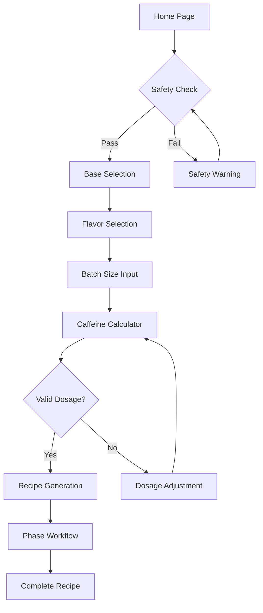
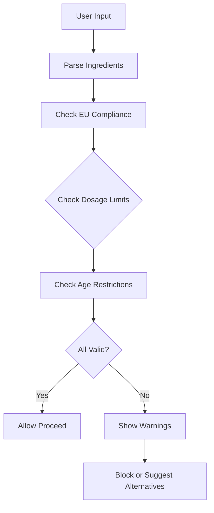
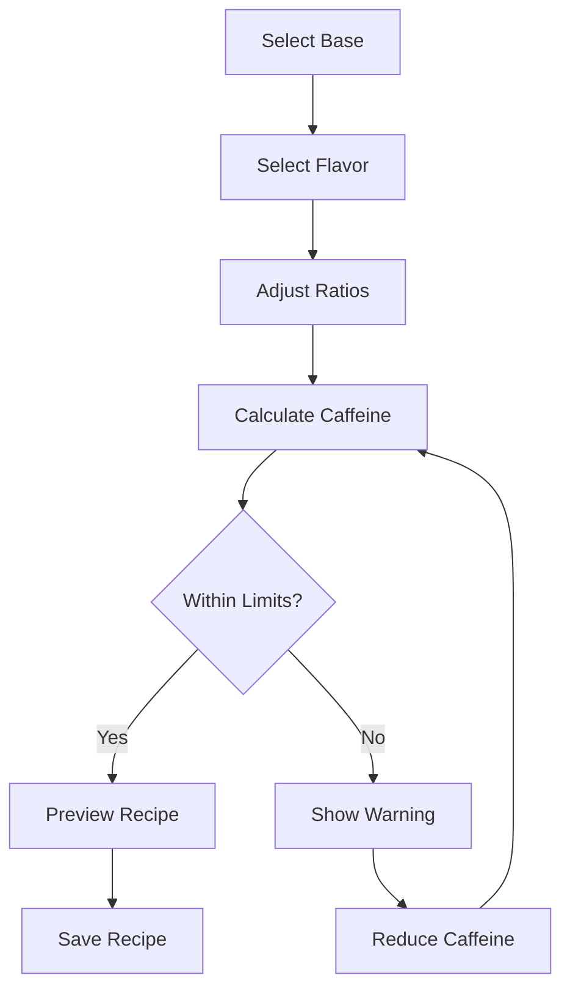

# Interactive Energy Drink Guide Webapp Design Document

## Overview
This document outlines the design for an interactive Next.js + Shadcn web application that transforms the Ultimate DIY Energy Drink Guide into a user-friendly, safety-focused application. The app will emphasize safety, Netherlands localization, and EU compliance while providing interactive features for recipe calculation, validation, and guided workflows.

## App Architecture

### Technology Stack
- **Framework**: Next.js 14+ with App Router
- **UI Library**: Shadcn/ui with Tailwind CSS
- **Language**: TypeScript
- **Data Storage**: JSON files for modularity (recipes, bases, flavors)
- **Localization**: Dutch (nl) with English fallback
- **Deployment**: Vercel (Netherlands region for compliance)

### Page Structure
```
/
├── / (Landing/Home)
├── /guide (Main guide overview)
├── /safety (Safety warnings and validators)
├── /calculator (Recipe calculator)
├── /recipes (Recipe browser and selector)
├── /phases (Phase-by-phase workflow)
├── /equipment (Equipment checklist)
├── /shopping (Shopping list with NL suppliers)
└── /troubleshooting (Interactive troubleshooting)
```

### Component Architecture
- **Layout Components**: Header, Footer, Navigation, Sidebar
- **Safety Components**: WarningModal, SafetyValidator, DosageChecker
- **Recipe Components**: RecipeCard, FlavorSelector, BaseSelector
- **Calculator Components**: AmountCalculator, CaffeineCalculator, DilutionCalculator
- **Workflow Components**: PhaseStepper, ProgressIndicator, InstructionModal
- **Data Components**: IngredientTable, SupplierCard, MeasurementConverter

## Data Structures

### Base Data Models

#### Ingredient Interface
```typescript
interface Ingredient {
  id: string;
  name: string;
  nameNl: string; // Dutch name
  category: 'caffeine' | 'sweetener' | 'acid' | 'preservative' | 'flavor';
  unit: 'g' | 'ml' | 'mg';
  safety: {
    maxDaily: number;
    warningThreshold: number;
    euCompliant: boolean;
    banned: boolean;
  };
  suppliers: Supplier[];
}
```

#### Base Recipe Interface
```typescript
interface BaseRecipe {
  id: string;
  name: string;
  nameNl: string;
  type: 'classic' | 'zero';
  yield: {
    syrup: number; // ml
    drink: number; // ml
  };
  ingredients: BaseIngredient[];
  instructions: Instruction[];
  safetyChecks: SafetyCheck[];
}
```

#### Flavor Recipe Interface
```typescript
interface FlavorRecipe {
  id: string;
  name: string;
  nameNl: string;
  profile: string;
  profileNl: string;
  ingredients: FlavorIngredient[];
  color: ColorSpec;
  compatibleBases: string[]; // base IDs
  aging: {
    recommended: number; // hours
    optional: boolean;
  };
}
```

#### Complete Recipe Interface
```typescript
interface CompleteRecipe {
  base: BaseRecipe;
  flavor: FlavorRecipe;
  dilution: DilutionRatio;
  caffeineContent: number; // mg per serving
}
```

### Data Organization
- **Modular Structure**: All recipes stored in `/data/recipes/` as separate JSON files
- **Base Recipes**: `/data/bases/classic.json`, `/data/bases/zero.json`
- **Flavor Recipes**: `/data/flavors/` directory with individual flavor JSON files
- **Ingredients**: `/data/ingredients/` with categorized JSON files
- **Suppliers**: `/data/suppliers/netherlands.json` with NL-specific suppliers
- **Safety Data**: `/data/safety/limits.json` with EU regulatory limits

## Interactive Features

### 1. Recipe Calculator
- **Caffeine Calculator**: Input desired caffeine amount, calculate required syrup
- **Batch Calculator**: Scale recipes for different batch sizes
- **Dilution Calculator**: Calculate syrup-to-water ratios for different serving sizes
- **Cost Calculator**: Estimate ingredient costs based on NL suppliers

### 2. Safety Validators
- **Dosage Validator**: Real-time validation against safe limits
- **Ingredient Checker**: EU compliance validation (no banned ingredients)
- **Age Verification**: Required for accessing high-caffeine recipes
- **Storage Warnings**: Reminders for proper chemical storage

### 3. Flavor Selector
- **Visual Flavor Browser**: Card-based interface with flavor profiles
- **Compatibility Matrix**: Shows which flavors work with which bases
- **Custom Blend Builder**: Allow users to create custom flavor combinations
- **Taste Profile Matching**: Recommend flavors based on user preferences

### 4. Phase-by-Phase Workflow
- **Interactive Stepper**: Guided workflow with progress tracking
- **Timer Integration**: Built-in timers for dissolving, cooling, aging
- **Photo Upload**: Allow users to document their process
- **Checkpoint Validation**: Ensure each phase is completed safely

## User Flows

### Primary User Flow: Create Custom Drink


### Safety Validation Flow


### Recipe Customization Flow


## Safety and Compliance Features

### EU Compliance
- **Banned Ingredient Detection**: Automatic flagging of E171 (TiO2) and other banned substances
- **Regulatory Limits**: Enforce EU maximum limits for caffeine, preservatives
- **Labeling Requirements**: Generate compliant ingredient labels
- **Age Restrictions**: 18+ verification for high-caffeine recipes

### Netherlands Localization
- **Dutch Interface**: All text in Dutch with English toggle
- **Local Suppliers**: Prioritize Dutch suppliers (Bol.com, AH, etc.)
- **Metric Units**: All measurements in grams/ml/liters
- **Local Regulations**: Netherlands-specific safety guidelines

### Safety Emphasis
- **Prominent Warnings**: Modal dialogs for critical safety information
- **Precision Requirements**: Force use of 0.001g scales for caffeine
- **Storage Guidelines**: Digital checklists for safe storage
- **Emergency Contacts**: Quick access to Dutch poison control

## Component Details

### Key Components

#### SafetyValidator Component
- Real-time validation of ingredient amounts
- Visual indicators (green/yellow/red) for safety levels
- Detailed explanations for any warnings

#### RecipeCalculator Component
- Dynamic calculation based on user inputs
- Support for multiple serving sizes
- Cost estimation integration

#### PhaseWorkflow Component
- Step-by-step guided interface
- Progress tracking with completion checkboxes
- Integrated timers and reminders

#### FlavorSelector Component
- Grid layout with flavor cards
- Filter by base compatibility
- Preview of final drink appearance

## Data Flow

### Recipe Generation Process
1. User selects base recipe
2. User selects flavor recipe
3. System validates compatibility
4. User inputs batch size
5. System calculates scaled amounts
6. System validates safety limits
7. System generates complete recipe with instructions

### Safety Validation Process
1. Parse all ingredients in recipe
2. Check against EU banned substances list
3. Validate dosages against regulatory limits
4. Check user age verification if required
5. Generate safety warnings or approvals

## Performance Considerations

### Data Loading
- Lazy load recipe data on demand
- Cache supplier information locally
- Preload critical safety data

### Calculation Optimization
- Client-side calculations for instant feedback
- Server-side validation for security
- Memoized calculations to prevent unnecessary re-computation

## Accessibility and UX

### Inclusive Design
- High contrast mode for safety warnings
- Screen reader support for all instructions
- Keyboard navigation for all interactive elements
- Clear, simple language avoiding jargon

### Mobile-First Design
- Responsive design for mobile mixing
- Touch-friendly controls for calculators
- Offline capability for recipe access

## Future Extensibility

### Modular Data Structure
- Easy addition of new flavors via JSON files
- Plugin system for custom bases
- API integration for supplier price updates
- User-generated recipe sharing system

### Advanced Features
- AI-powered flavor recommendations
- Integration with smart scales
- Barcode scanning for ingredient verification
- Social features for recipe sharing

This design provides a comprehensive, safe, and user-friendly platform for creating custom energy drinks while maintaining strict compliance with EU regulations and emphasizing Netherlands-specific requirements.