# Ultimate DIY Energy Drink Guide (Netherlands Edition)

> [!CAUTION] > **SAFETY FIRST: FATAL DANGER**
> Read this entire section before buying or mixing anything. A single mistake with pure caffeine can be fatal.

## 📚 Table of Contents

1.  [Critical Safety Warnings](#1-critical-safety-warnings)
2.  [Equipment Checklist](#2-equipment-checklist)
3.  [Shopping List](#3-shopping-list-netherlands-suppliers)
4.  [Phase 1: The Master Base](#4-phase-1-the-master-base)
5.  [Phase 2: The Flavor Library](#5-phase-2-the-flavor-library)
6.  [Phase 3: Serving & Quick Mix](#6-phase-3-serving--quick-mix)
7.  [Troubleshooting](#7-troubleshooting)

---

## 1. Critical Safety Warnings

### ☠️ Pure Caffeine is Lethal

> [!CAUTION]
> A single teaspoon (approx. 3-5g) of pure caffeine powder can be **FATAL**. Treat it like a dangerous chemical, not a food ingredient.

- **NEVER** "eyeball" caffeine.
- **NEVER** use a standard kitchen scale (they are not precise enough).
- **ALWAYS** use a 0.001g precision scale.

### 🚫 Banned Ingredients

> [!WARNING] > **Titanium Dioxide (E171)** is **BANNED** in the EU for food use as of 2022 due to genotoxicity concerns.
> **DO NOT USE IT**. If you have old stock, dispose of it immediately.

### ⚠️ Chemical Safety

> [!IMPORTANT] > **Flavor Concentrates** are potent chemicals. Overdosing (e.g., Ethyl Butyrate) won't just taste bad; it can be irritating. Follow the reduced ratios in this guide strictly.

- **Storage**: Keep pure caffeine and chemical concentrates **LOCKED AWAY** from children and pets. Label every bottle clearly with "HIGH CAFFEINE".

---

## 2. Equipment Checklist

> [!TIP]
> You cannot proceed safely without these items. Ensure you have the precision scale before handling any caffeine.

| Item                       | Purpose                                       | Recommended                                                                  |
| :------------------------- | :-------------------------------------------- | :--------------------------------------------------------------------------- |
| **0.001g Precision Scale** | **MANDATORY** for weighing caffeine safely.   | [Bol.com](https://www.bol.com/nl/nl/s/?searchtext=precisieweegschaal+0.001g) |
| **SodaStream**             | For carbonating the final drink.              | Any model                                                                    |
| **1 Liter Bottles**        | For storing your syrup base.                  | Glass or BPA-free plastic                                                    |
| **Small Glass Beakers**    | For mixing flavor concentrates (10ml - 50ml). | Lab supply / Bol.com                                                         |
| **Pipettes / Droppers**    | For measuring liquids (1ml, 3ml).             | Plastic transfer pipettes                                                    |
| **Nitrile Gloves**         | Protection when handling caffeine/chemicals.  | Supermarket                                                                  |

---

## 3. Shopping List (Netherlands Suppliers)

### A. The "Energy Base" (The Engine)

| Ingredient                   | Function             | Recommended Supplier (NL)                  |
| :--------------------------- | :------------------- | :----------------------------------------- |
| **Caffeine Anhydrous**       | Energy               | ietsGezond, Buxtrade                       |
| **Taurine Powder**           | "Wings"              | Bulk.com, BodySupplies                     |
| **Citric Acid** (Food Grade) | Sourness             | Laboratorium Discounter, Holland & Barrett |
| **Sodium Citrate**           | Smoothness/Buffer    | Laboratorium Discounter                    |
| **Sugar**                    | Sweetness            | AH, Jumbo, Lidl                            |
| **Erythritol** (Zero Sugar)  | Sweetener            | Sweetener Store, Steviala                  |
| **Sodium Benzoate** (E211)   | Preservative (Yeast) | Laboratorium Discounter                    |
| **Potassium Sorbate** (E202) | Preservative (Mold)  | Laboratorium Discounter                    |

### B. The "Flavor Library" (The Soul)

| Ingredient              | Used In           | Supplier (NL)           |
| :---------------------- | :---------------- | :---------------------- |
| **Ethyl Butyrate**      | Red Bull, Monster | Agridient, Hekserij     |
| **Ethyl Vanillin**      | Red Bull          | Brenntag, Hekserij      |
| **Methyl Cinnamate**    | Red Bull          | Sigma-Aldrich, Hekserij |
| **Orange Oil**          | Red Bull, Mango   | Hekserij                |
| **Lime Oil**            | Monster, Ultra    | Hekserij                |
| **Lemon Oil**           | Blue, Ultra       | Hekserij                |
| **Mango Extract**       | Mango Loco        | Frutoria, Ubuy          |
| **Pineapple Extract**   | Monster, Mango    | Baking/Flavor Shop      |
| **Blueberry Extract**   | Blue Edition      | Frutoria                |
| **Green Apple Extract** | Monster           | Baking/Flavor Shop      |
| **Panax Ginseng**       | Monster           | Holland & Barrett       |

---

## 4. Phase 1: The Master Base

Choose **ONE** base to make. This creates 1 Liter of unflavored, caffeinated syrup.

### ⚗️ The Process Flow

```mermaid
graph TD
    A[Start: 200ml Warm Water] -->|Add| B(Caffeine, Taurine, Acids)
    B -->|Add| C(Preservatives)
    C -->|Stir until Clear| D{Choose Base}
    D -->|Classic| E[Add Sugar + 400ml Water]
    D -->|Zero| F[Add Erythritol + 700ml Water]
    E --> G[Heat to Dissolve]
    F --> G
    G --> H[COOL DOWN < 30°C]
    H -->|Ready for Flavor| I[Master Base Complete]
```

### Option A: The "Classic" Base (Full Sugar)

_Yield: 1L Syrup (Makes 5L Drink)_

1.  **Water**: 600 ml
2.  **Sugar**: 550 g
3.  **Caffeine**: 1.600 g (**WEIGH CAREFULLY**)
4.  **Taurine**: 20 g
5.  **Citric Acid**: 25 g
6.  **Sodium Citrate**: 5 g
7.  **Preservatives**: 0.5g Sodium Benzoate + 0.5g Potassium Sorbate

### Option B: The "Zero Ultra" Base (Sugar Free)

_Yield: 1L Syrup (Makes 5L Drink)_

1.  **Water**: 900 ml
2.  **Erythritol**: 150 g (Dissolve in warm water)
3.  **Liquid Sucralose**: ~10-15ml (To taste)
4.  **Xanthan Gum**: 0.5 g (Optional, for texture)
5.  **Caffeine**: 1.600 g (**WEIGH CAREFULLY**)
6.  **Taurine**: 20 g
7.  **Citric Acid**: 25 g
8.  **Sodium Citrate**: 5 g
9.  **Preservatives**: 0.5g Sodium Benzoate + 0.5g Potassium Sorbate

### 🥣 Mixing Instructions (For Both Bases)

1.  **Prep**: Dissolve the preservatives in 20ml of warm water separately.
2.  **Heat**: Heat 200ml of water to ~60°C (do not boil).
3.  **Dissolve Actives**: Add Caffeine, Taurine, Citric Acid, and Sodium Citrate to the hot water. Stir until crystal clear.
4.  **Add Preservatives**: Pour in the dissolved preservative mix.
5.  **Make Syrup**:
    - _Classic_: Dissolve the Sugar in the remaining water with gentle heat.
    - _Zero_: Dissolve Erythritol in the remaining water.
6.  **Combine**: Mix the "Active Water" with the "Syrup".
7.  **Cool**: Let it cool to room temperature (<30°C) before adding flavors.

---

## 5. Phase 2: The Flavor Library

Once your base is cool, add **ONE** of these flavor blends to the entire 1L batch.

> [!NOTE]
> Ratios have been adjusted for safety and better taste. Aging the syrup for 24h helps flavors meld.

### 1. The "Red Bull" (Classic Tutti Frutti)

_Profile: Crisp, tart, candy-like._

- **Ethyl Butyrate**: 0.25 ml (Reduced from 1.0ml)
- **Ethyl Vanillin**: 0.05 g (Reduced from 0.1g)
- **Methyl Cinnamate**: 0.05 ml (Reduced from 0.2ml)
- **Orange Oil**: 1.0 ml
- **Color**: Caramel (E150a)

### 2. The "Green Beast" (Monster Original)

_Profile: Sweet, heavy, green apple & pineapple notes._

- **Green Apple Extract**: 5 ml
- **Pineapple Extract**: 5 ml
- **Ethyl Butyrate**: 0.15 ml (Reduced from 0.5ml)
- **Lime Oil**: 1.0 ml
- **Vanilla Extract**: 1 tsp
- **Panax Ginseng**: 2 g (Dissolve in base)
- **Color**: Yellow + Blue (Green)

### 3. The "Tropical Chaos" (Mango Loco)

_Profile: Juicy mango, citrus punch._

- **Mango Extract**: 10 ml
- **Orange Oil**: 1.5 ml
- **Pineapple Extract**: 3 ml
- **Citric Acid**: Add extra 5g to base for "juice" tartness.
- **Color**: Orange + Yellow

### 4. The "Blue Voltage" (Blue Edition)

_Profile: Sweet blueberry, mild herbal finish._

- **Blueberry Extract**: 12 ml
- **Ethyl Vanillin**: 0.05 g
- **Lemon Oil**: 1 ml
- **Color**: Blue (E133)

### 5. The "Ultra White" (Zero Citrus)

_Profile: Dry, crisp citrus. Best with Zero Base._

- **Lemon Oil**: 1.5 ml
- **Lime Oil**: 1.0 ml
- **Grapefruit Extract**: 2 ml
- **Color**: Clear (Cloudy emulsion optional, **NO TiO2**)

---

## 6. Phase 3: Serving & Quick Mix

**Standard Ratio**: 1 Part Syrup + 4 Parts Sparkling Water.

### 🥤 Quick Mix Table

| Drink Size                | Syrup Needed | Sparkling Water | Caffeine Content |
| :------------------------ | :----------- | :-------------- | :--------------- |
| **250 ml** (Small Can)    | 50 ml        | 200 ml          | 80 mg            |
| **330 ml** (Standard Can) | 66 ml        | 264 ml          | 105 mg           |
| **500 ml** (Large Can)    | 100 ml       | 400 ml          | 160 mg           |

### Instructions

1.  Pour syrup into glass.
2.  Top with cold sparkling water.
3.  Stir gently (don't kill the bubbles).
4.  Add ice.

---

## 7. Troubleshooting

| Problem                    | Cause                                 | Solution                                               |
| :------------------------- | :------------------------------------ | :----------------------------------------------------- |
| **Syrup is Cloudy**        | Undissolved solids or oil separation. | Heat gently to redissolve. Shake oils before pouring.  |
| **Chemical / Harsh Taste** | Too much Ethyl Butyrate or Vanillin.  | Use less next time. Let syrup "age" for 24h to mellow. |
| **Not Sour Enough**        | Low Citric Acid.                      | Add 5-10g more Citric Acid per liter.                  |
| **Flat Carbonation**       | Water not cold enough.                | Chill water to 4°C before carbonating.                 |
