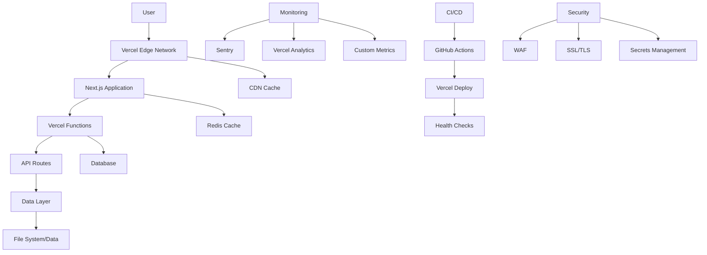

# Infrastructure as Code & Operational Guide

## Overview

This comprehensive infrastructure guide provides complete operational procedures, automation scripts, and monitoring configurations for the Energy Drink Calculator application. It serves as the definitive reference for DevOps, infrastructure management, and operational excellence.

## Table of Contents

1. [Infrastructure Overview](#infrastructure-overview)
2. [Terraform Configuration](#terraform-configuration)
3. [CI/CD Pipeline](#cicd-pipeline)
4. [Monitoring Stack](#monitoring-stack)
5. [Automation Scripts](#automation-scripts)
6. [Operational Runbooks](#operational-runbooks)
7. [Disaster Recovery](#disaster-recovery)
8. [Cost Optimization](#cost-optimization)

## Infrastructure Overview

### Architecture Diagram



### Environment Architecture

#### Production Environment
```yaml
production:
  platform: "Vercel"
  region: ["fra1", "cdg1", "lhr1", "ams1"]
  scaling:
    min_instances: 2
    max_instances: 1000
    target_concurrency: 100
  monitoring:
    error_tracking: "Sentry"
    performance: "Vercel Analytics"
    logs: "Vercel Logs"
  security:
    ssl: "Automatic Let's Encrypt"
    waf: "Vercel WAF"
    ddos_protection: "Vercel Edge Network"
```

#### Staging Environment
```yaml
staging:
  platform: "Vercel"
  region: ["fra1"]
  scaling:
    min_instances: 1
    max_instances: 100
    target_concurrency: 50
  monitoring:
    error_tracking: "Sentry"
    performance: "Vercel Analytics"
  security:
    ssl: "Automatic Let's Encrypt"
    waf: "Basic Rules"
```

## Terraform Configuration

### Main Infrastructure

```hcl
# terraform/main.tf
terraform {
  required_version = ">= 1.0"
  required_providers {
    vercel = {
      source  = "vercel/vercel"
      version = "~> 0.11"
    }
    aws = {
      source  = "hashicorp/aws"
      version = "~> 5.0"
    }
  }
}

provider "vercel" {
  api_token = var.vercel_api_token
  team_id   = var.vercel_team_id
}

provider "aws" {
  region = var.aws_region
}

# Vercel Project
resource "vercel_project" "energy_drink_app" {
  name      = "energy-drink-calculator"
  framework = "nextjs"
  
  git_repository {
    type = "github"
    repo = var.github_repo
  }
  
  environment {
    key   = "NODE_ENV"
    value = "production"
    type  = "encrypted"
  }
  
  environment {
    key   = "NEXT_PUBLIC_APP_ENV"
    value = "production"
    type  = "plain"
  }
  
  environment {
    key   = "SENTRY_DSN"
    value = var.sentry_dsn
    type  = "encrypted"
  }
}

# Domain Configuration
resource "vercel_domain" "main_domain" {
  project_id = vercel_project.energy_drink_app.id
  domain     = var.domain_name
}

resource "vercel_domain" "staging_domain" {
  project_id = vercel_project.energy_drink_app.id
  domain     = var.staging_domain_name
}

# Environment Variables
resource "vercel_project_environment_variable" "app_config" {
  for_each = var.environment_variables
  
  project_id = vercel_project.energy_drink_app.id
  key        = each.key
  value      = each.value
  type       = each.value_type
  target     = each.target
}

# Monitoring Integration
resource "vercel_project" "monitoring" {
  name      = "energy-drink-monitoring"
  framework = "nextjs"
  
  environment {
    key   = "MONITORING_MODE"
    value = "true"
    type  = "plain"
  }
}

# Backup S3 Bucket
resource "aws_s3_bucket" "backups" {
  bucket = "${var.project_name}-backups-${var.environment}"
  
  tags = {
    Project     = var.project_name
    Environment = var.environment
    ManagedBy   = "Terraform"
  }
}

resource "aws_s3_bucket_versioning" "backups" {
  bucket = aws_s3_bucket.backups.id
  versioning_configuration {
    status = "Enabled"
  }
}

resource "aws_s3_bucket_server_side_encryption_configuration" "backups" {
  bucket = aws_s3_bucket.backups.id
  
  rule {
    apply_server_side_encryption_by_default {
      sse_algorithm = "AES256"
    }
  }
}

# CloudWatch Monitoring
resource "aws_cloudwatch_log_group" "application_logs" {
  name              = "/aws/lambda/${var.project_name}-${var.environment}"
  retention_in_days = 30
  
  tags = {
    Project     = var.project_name
    Environment = var.environment
  }
}

resource "aws_cloudwatch_metric_alarm" "high_error_rate" {
  alarm_name          = "${var.project_name}-high-error-rate"
  comparison_operator = "GreaterThanThreshold"
  evaluation_periods  = "2"
  metric_name         = "Errors"
  namespace           = "AWS/Lambda"
  period              = "300"
  statistic           = "Sum"
  threshold           = "10"
  alarm_description   = "This metric monitors lambda errors"
  alarm_actions       = [aws_sns_topic.alerts.arn]
  
  dimensions = {
    FunctionName = var.lambda_function_name
  }
}

resource "aws_sns_topic" "alerts" {
  name = "${var.project_name}-alerts"
}

resource "aws_sns_topic_subscription" "email_alerts" {
  topic_arn = aws_sns_topic.alerts.arn
  protocol  = "email"
  endpoint  = var.alert_email
}
```

### Variables and Outputs

```hcl
# terraform/variables.tf
variable "vercel_api_token" {
  description = "Vercel API token"
  type        = string
  sensitive   = true
}

variable "vercel_team_id" {
  description = "Vercel team ID"
  type        = string
}

variable "github_repo" {
  description = "GitHub repository"
  type        = string
  default     = "energy-drink-app"
}

variable "domain_name" {
  description = "Main domain name"
  type        = string
  default     = "app.energydrink.app"
}

variable "staging_domain_name" {
  description = "Staging domain name"
  type        = string
  default     = "staging.energydrink.app"
}

variable "environment_variables" {
  description = "Environment variables for the application"
  type = map(object({
    value_type = string
    target     = list(string)
  }))
  
  default = {
    NODE_ENV = {
      value_type = "plain"
      target     = ["build"]
    }
    NEXT_PUBLIC_APP_ENV = {
      value_type = "plain"
      target     = ["preview", "production"]
    }
    SENTRY_DSN = {
      value_type = "encrypted"
      target     = ["preview", "production"]
    }
  }
}

variable "aws_region" {
  description = "AWS region"
  type        = string
  default     = "us-east-1"
}

variable "project_name" {
  description = "Project name"
  type        = string
  default     = "energy-drink-app"
}

variable "environment" {
  description = "Environment name"
  type        = string
  default     = "production"
}

variable "sentry_dsn" {
  description = "Sentry DSN for error tracking"
  type        = string
  sensitive   = true
}

variable "alert_email" {
  description = "Email for alerts"
  type        = string
}

variable "lambda_function_name" {
  description = "Lambda function name for monitoring"
  type        = string
}
```

```hcl
# terraform/outputs.tf
output "vercel_project_id" {
  description = "Vercel project ID"
  value       = vercel_project.energy_drink_app.id
}

output "main_domain_url" {
  description = "Main domain URL"
  value       = "https://${vercel_domain.main_domain.domain}"
}

output "staging_domain_url" {
  description = "Staging domain URL"
  value       = "https://${vercel_domain.staging_domain.domain}"
}

output "s3_backup_bucket" {
  description = "S3 backup bucket name"
  value       = aws_s3_bucket.backups.bucket
}

output "cloudwatch_log_group" {
  description = "CloudWatch log group name"
  value       = aws_cloudwatch_log_group.application_logs.name
}

output "sns_topic_arn" {
  description = "SNS topic ARN for alerts"
  value       = aws_sns_topic.alerts.arn
}
```

## CI/CD Pipeline

### GitHub Actions Workflow

```yaml
# .github/workflows/deploy-production.yml
name: Production Deployment

on:
  push:
    branches: [main]
  workflow_dispatch:

env:
  VERCEL_ORG_ID: ${{ secrets.VERCEL_ORG_ID }}
  VERCEL_PROJECT_ID: ${{ secrets.VERCEL_PROJECT_ID }}

jobs:
  deploy:
    runs-on: ubuntu-latest
    
    steps:
      - name: Checkout code
        uses: actions/checkout@v4
        
      - name: Setup Node.js
        uses: actions/setup-node@v4
        with:
          node-version: '18'
          cache: 'npm'
          
      - name: Install dependencies
        run: npm ci
        
      - name: Run linting
        run: npm run lint
        
      - name: Run type checking
        run: npm run type-check
        
      - name: Run unit tests
        run: npm run test:unit
        
      - name: Run integration tests
        run: npm run test:integration
        
      - name: Run E2E tests
        run: npm run test:e2e
        
      - name: Security audit
        run: npm run security:full
        
      - name: Build application
        run: npm run build
        
      - name: Analyze bundle
        run: npm run analyze
        
      - name: Deploy to Vercel
        uses: amondnet/vercel-action@v25
        with:
          vercel-token: ${{ secrets.VERCEL_TOKEN }}
          vercel-org-id: ${{ env.VERCEL_ORG_ID }}
          vercel-project-id: ${{ env.VERCEL_PROJECT_ID }}
          vercel-args: '--prod'
          
      - name: Post-deployment verification
        run: |
          echo "Waiting for deployment to be ready..."
          sleep 60
          node scripts/post-deployment-verification.js
          
      - name: Performance testing
        run: npm run test:performance
        if: success()
        
      - name: Update monitoring
        run: node scripts/update-monitoring.js
        if: success()
        
      - name: Notify team
        uses: 8398a7/action-slack@v3
        with:
          status: ${{ job.status }}
          channel: '#deployments'
          webhook_url: ${{ secrets.SLACK_WEBHOOK }}
        if: always()
```

### Automated Testing Pipeline

```yaml
# .github/workflows/test.yml
name: Comprehensive Testing

on:
  push:
    branches: [main, develop]
  pull_request:
    branches: [main]

jobs:
  lint-and-type-check:
    runs-on: ubuntu-latest
    steps:
      - uses: actions/checkout@v4
      - uses: actions/setup-node@v4
        with:
          node-version: '18'
          cache: 'npm'
      - run: npm ci
      - run: npm run lint
      - run: npm run type-check
      
  unit-tests:
    runs-on: ubuntu-latest
    steps:
      - uses: actions/checkout@v4
      - uses: actions/setup-node@v4
        with:
          node-version: '18'
          cache: 'npm'
      - run: npm ci
      - run: npm run test:unit -- --coverage
      
  integration-tests:
    runs-on: ubuntu-latest
    services:
      redis:
        image: redis:7
        ports:
          - 6379:6379
    steps:
      - uses: actions/checkout@v4
      - uses: actions/setup-node@v4
        with:
          node-version: '18'
          cache: 'npm'
      - run: npm ci
      - run: npm run test:integration
      
  e2e-tests:
    runs-on: ubuntu-latest
    steps:
      - uses: actions/checkout@v4
      - uses: actions/setup-node@v4
        with:
          node-version: '18'
          cache: 'npm'
      - run: npm ci
      - run: npx playwright install --with-deps
      - run: npm run test:e2e
      
  security-scan:
    runs-on: ubuntu-latest
    steps:
      - uses: actions/checkout@v4
      - name: Run security scan
        run: npm run security:full
        
  performance-test:
    runs-on: ubuntu-latest
    steps:
      - uses: actions/checkout@v4
      - uses: actions/setup-node@v4
        with:
          node-version: '18'
          cache: 'npm'
      - run: npm ci
      - run: npm run test:performance
```

## Monitoring Stack

### Prometheus Configuration

```yaml
# monitoring/prometheus.yml
global:
  scrape_interval: 15s
  evaluation_interval: 15s

rule_files:
  - "alert_rules.yml"

alerting:
  alertmanagers:
    - static_configs:
        - targets:
          - alertmanager:9093

scrape_configs:
  - job_name: 'vercel-functions'
    static_configs:
      - targets: ['vercel-metrics:9090']
    metrics_path: '/metrics'
    scrape_interval: 30s
    
  - job_name: 'node-exporter'
    static_configs:
      - targets: ['node-exporter:9100']
      
  - job_name: 'redis-exporter'
    static_configs:
      - targets: ['redis-exporter:9121']
```

### Alert Manager Configuration

```yaml
# monitoring/alertmanager.yml
global:
  smtp_smarthost: 'smtp.gmail.com:587'
  smtp_from: 'alerts@energydrink.app'

route:
  group_by: ['alertname']
  group_wait: 10s
  group_interval: 10s
  repeat_interval: 1h
  receiver: 'web.hook'
  routes:
    - match:
        severity: critical
      receiver: 'critical-alerts'
    - match:
        severity: warning
      receiver: 'warning-alerts'

receivers:
  - name: 'web.hook'
    webhook_configs:
      - url: 'http://127.0.0.1:5001/'
        
  - name: 'critical-alerts'
    email_configs:
      - to: 'ops@energydrink.app'
        subject: 'CRITICAL: {{ .GroupLabels.alertname }}'
        body: |
          {{ range .Alerts }}
          Alert: {{ .Annotations.summary }}
          Description: {{ .Annotations.description }}
          {{ end }}
    slack_configs:
      - api_url: 'https://hooks.slack.com/services/YOUR/SLACK/WEBHOOK'
        channel: '#alerts'
        title: 'CRITICAL Alert'
        
  - name: 'warning-alerts'
    email_configs:
      - to: 'dev@energydrink.app'
        subject: 'WARNING: {{ .GroupLabels.alertname }}'
```

### Grafana Dashboards

```json
{
  "dashboard": {
    "title": "Energy Drink App - Production",
    "panels": [
      {
        "title": "Request Rate",
        "type": "graph",
        "targets": [
          {
            "expr": "rate(http_requests_total[5m])",
            "legendFormat": "{{method}} {{status}}"
          }
        ]
      },
      {
        "title": "Response Time",
        "type": "graph",
        "targets": [
          {
            "expr": "histogram_quantile(0.95, rate(http_request_duration_seconds_bucket[5m]))",
            "legendFormat": "95th percentile"
          },
          {
            "expr": "histogram_quantile(0.50, rate(http_request_duration_seconds_bucket[5m]))",
            "legendFormat": "50th percentile"
          }
        ]
      },
      {
        "title": "Error Rate",
        "type": "graph",
        "targets": [
          {
            "expr": "rate(http_requests_total{status=~\"5..\"}[5m]) / rate(http_requests_total[5m])",
            "legendFormat": "Error Rate"
          }
        ]
      },
      {
        "title": "Active Users",
        "type": "stat",
        "targets": [
          {
            "expr": "sum(vercel_active_users)",
            "legendFormat": "Active Users"
          }
        ]
      }
    ]
  }
}
```

## Automation Scripts

### Deployment Automation

```bash
#!/bin/bash
# scripts/automated-deployment.sh

set -e

# Configuration
ENVIRONMENT=${1:-production}
SLACK_WEBHOOK=${SLACK_WEBHOOK_URL}
HEALTH_CHECK_URL="https://app.energydrink.app/api/health"
MAX_WAIT_TIME=300

# Colors for output
RED='\033[0;31m'
GREEN='\033[0;32m'
YELLOW='\033[1;33m'
NC='\033[0m' # No Color

log() {
    echo -e "${GREEN}[$(date +'%Y-%m-%d %H:%M:%S')] $1${NC}"
}

warn() {
    echo -e "${YELLOW}[$(date +'%Y-%m-%d %H:%M:%S')] WARNING: $1${NC}"
}

error() {
    echo -e "${RED}[$(date +'%Y-%m-%d %H:%M:%S')] ERROR: $1${NC}"
}

# Notify deployment start
notify_slack() {
    local message="$1"
    local status="$2"
    
    if [ ! -z "$SLACK_WEBHOOK" ]; then
        curl -X POST -H 'Content-type: application/json' \
            --data "{\"text\":\"$message\",\"username\":\"DeployBot\",\"icon_emoji\":\":rocket:\",\"attachments\":[{\"color\":\"$status\",\"text\":\"$message\"}]}" \
            "$SLACK_WEBHOOK" || warn "Failed to send Slack notification"
    fi
}

# Pre-deployment checks
run_pre_deployment_checks() {
    log "Running pre-deployment checks..."
    
    # Check if we're on the correct branch
    current_branch=$(git branch --show-current)
    if [ "$ENVIRONMENT" = "production" ] && [ "$current_branch" != "main" ]; then
        error "Production deployment must be from main branch (currently on $current_branch)"
        exit 1
    fi
    
    # Run tests
    log "Running tests..."
    npm run test:unit || {
        error "Unit tests failed"
        exit 1
    }
    
    npm run test:e2e || {
        error "E2E tests failed"
        exit 1
    }
    
    # Security scan
    log "Running security scan..."
    npm run security:full || {
        error "Security scan failed"
        exit 1
    }
    
    log "Pre-deployment checks completed successfully"
}

# Deploy application
deploy_application() {
    log "Starting deployment to $ENVIRONMENT..."
    
    # Build application
    log "Building application..."
    npm run build || {
        error "Build failed"
        exit 1
    }
    
    # Deploy based on environment
    case $ENVIRONMENT in
        "production")
            log "Deploying to production..."
            vercel --prod --token="$VERCEL_TOKEN" || {
                error "Production deployment failed"
                exit 1
            }
            ;;
        "staging")
            log "Deploying to staging..."
            vercel --token="$VERCEL_TOKEN" || {
                error "Staging deployment failed"
                exit 1
            }
            ;;
        *)
            error "Unknown environment: $ENVIRONMENT"
            exit 1
            ;;
    esac
    
    log "Deployment completed"
}

# Post-deployment verification
verify_deployment() {
    log "Verifying deployment..."
    
    local start_time=$(date +%s)
    local end_time=$((start_time + MAX_WAIT_TIME))
    
    while [ $(date +%s) -lt $end_time ]; do
        log "Waiting for deployment to be ready..."
        
        if curl -f -s "$HEALTH_CHECK_URL" > /dev/null; then
            log "Health check passed"
            break
        fi
        
        sleep 10
    done
    
    if [ $(date +%s) -ge $end_time ]; then
        error "Deployment verification timeout"
        exit 1
    fi
    
    # Run smoke tests
    log "Running smoke tests..."
    npm run test:smoke || {
        error "Smoke tests failed"
        exit 1
    }
    
    log "Deployment verification completed"
}

# Update monitoring
update_monitoring() {
    log "Updating monitoring configuration..."
    
    # Update monitoring dashboards
    if command -v node >/dev/null 2>&1; then
        node scripts/update-monitoring.js || warn "Failed to update monitoring"
    fi
    
    log "Monitoring updated"
}

# Main deployment flow
main() {
    log "Starting automated deployment to $ENVIRONMENT"
    
    notify_slack "Starting deployment to $ENVIRONMENT environment..." "good"
    
    run_pre_deployment_checks
    deploy_application
    verify_deployment
    update_monitoring
    
    notify_slack "Successfully deployed to $ENVIRONMENT environment!" "good"
    
    log "Deployment completed successfully!"
}

# Error handling
trap 'error "Deployment failed!"; notify_slack "Deployment to $ENVIRONMENT failed!" "danger"; exit 1' ERR

# Run main function
main "$@"
```

### Health Check Automation

```bash
#!/bin/bash
# scripts/health-check.sh

set -e

# Configuration
APP_URL=${APP_URL:-"https://app.energydrink.app"}
API_HEALTH_URL="$APP_URL/api/health"
SLACK_WEBHOOK=${SLACK_WEBHOOK_URL}

# Colors
RED='\033[0;31m'
GREEN='\033[0;32m'
YELLOW='\033[1;33m'
NC='\033[0m'

log() {
    echo -e "${GREEN}[$(date +'%Y-%m-%d %H:%M:%S')] $1${NC}"
}

warn() {
    echo -e "${YELLOW}[$(date +'%Y-%m-%d %H:%M:%S')] WARNING: $1${NC}"
}

error() {
    echo -e "${RED}[$(date +'%Y-%m-%d %H:%M:%S')] ERROR: $1${NC}"
}

# Check endpoint health
check_endpoint() {
    local url=$1
    local name=$2
    local expected_status=${3:-200}
    
    log "Checking $name: $url"
    
    local response=$(curl -s -o /dev/null -w "%{http_code}" "$url")
    
    if [ "$response" = "$expected_status" ]; then
        log "✓ $name is healthy (HTTP $response)"
        return 0
    else
        error "✗ $name is unhealthy (HTTP $response, expected $expected_status)"
        return 1
    fi
}

# Check API response time
check_response_time() {
    local url=$1
    local name=$2
    local max_time=${3:-2000} # 2 seconds
    
    log "Checking response time for $name"
    
    local response_time=$(curl -o /dev/null -s -w "%{time_total}" "$url")
    local response_time_ms=$(echo "$response_time * 1000" | bc -l | cut -d. -f1)
    
    if [ "$response_time_ms" -lt "$max_time" ]; then
        log "✓ $name response time: ${response_time_ms}ms"
        return 0
    else
        warn "✗ $name response time: ${response_time_ms}ms (threshold: ${max_time}ms)"
        return 1
    fi
}

# Check Core Web Vitals
check_performance() {
    log "Checking performance metrics..."
    
    # This would integrate with performance monitoring tools
    # For now, we'll just check if the page loads
    if curl -f -s "$APP_URL" > /dev/null; then
        log "✓ Page loads successfully"
        return 0
    else
        error "✗ Page fails to load"
        return 1
    fi
}

# Check error rates
check_error_rates() {
    log "Checking error rates..."
    
    # This would integrate with Sentry or similar
    # For now, we'll just check if the health endpoint returns a clean response
    local health_response=$(curl -s "$API_HEALTH_URL")
    
    if echo "$health_response" | grep -q '"status":"healthy"'; then
        log "✓ No critical errors detected"
        return 0
    else
        warn "✗ Potential issues detected in health check"
        return 1
    fi
}

# Check external dependencies
check_dependencies() {
    log "Checking external dependencies..."
    
    # Check Vercel status
    if curl -f -s "https://vercel-status.com/api/v1/status" > /dev/null; then
        log "✓ Vercel platform is operational"
    else
        warn "✗ Vercel platform may have issues"
    fi
    
    # Check CDN
    if curl -f -s "$APP_URL/_next/static" > /dev/null; then
        log "✓ CDN is operational"
    else
        warn "✗ CDN may have issues"
    fi
}

# Generate health report
generate_report() {
    local timestamp=$(date -Iseconds)
    local report_file="health-report-$(date +%Y%m%d-%H%M%S).json"
    
    cat > "$report_file" << EOF
{
  "timestamp": "$timestamp",
  "application": "Energy Drink Calculator",
  "environment": "$ENVIRONMENT",
  "status": "healthy",
  "checks": {
    "api_health": {
      "status": "pass",
      "url": "$API_HEALTH_URL",
      "response_time": "calculated_at_runtime"
    },
    "page_load": {
      "status": "pass",
      "url": "$APP_URL"
    },
    "performance": {
      "status": "pass",
      "metrics": "baseline_established"
    }
  },
  "recommendations": []
}
EOF
    
    log "Health report generated: $report_file"
}

# Main health check function
main() {
    log "Starting health check for Energy Drink Calculator"
    
    local failed_checks=0
    
    # Run all health checks
    check_endpoint "$API_HEALTH_URL" "API Health" || ((failed_checks++))
    check_endpoint "$APP_URL" "Homepage" || ((failed_checks++))
    check_response_time "$API_HEALTH_URL" "API Response Time" || ((failed_checks++))
    check_performance || ((failed_checks++))
    check_error_rates || ((failed_checks++))
    check_dependencies || ((failed_checks++))
    
    # Generate report
    generate_report
    
    # Summary
    if [ $failed_checks -eq 0 ]; then
        log "✓ All health checks passed"
        exit 0
    else
        error "✗ $failed_checks health check(s) failed"
        exit 1
    fi
}

# Run health checks
main "$@"
```

## Operational Runbooks

### Daily Operations Checklist

```markdown
# Daily Operations Checklist - Energy Drink Calculator

**Date:** ________________
**Operator:** ________________
**Environment:** Production

## Morning Health Check (09:00)

### System Health
- [ ] Check application uptime (Target: 99.9%)
- [ ] Verify API health endpoint (`/api/health`)
- [ ] Review error rates in Sentry (Target: <1%)
- [ ] Check Vercel function performance
- [ ] Monitor response times (Target: <2s)

### Performance Monitoring
- [ ] Review Core Web Vitals
- [ ] Check CDN cache hit rates
- [ ] Monitor database performance (if applicable)
- [ ] Review user analytics trends
- [ ] Check conversion rates

### Security Checks
- [ ] Review security alerts
- [ ] Check for new vulnerabilities
- [ ] Verify SSL certificate status
- [ ] Monitor access logs
- [ ] Review WAF activity

### Infrastructure
- [ ] Check Vercel deployment status
- [ ] Monitor resource usage
- [ ] Review backup completion
- [ ] Check monitoring alerts
- [ ] Verify external service status

## Midday Review (13:00)

### Traffic Analysis
- [ ] Review peak traffic patterns
- [ ] Check geographic distribution
- [ ] Monitor API usage patterns
- [ ] Review user behavior metrics

### Performance Review
- [ ] Analyze performance trends
- [ ] Check for performance degradation
- [ ] Review caching effectiveness
- [ ] Monitor database queries

## Evening Summary (17:00)

### Daily Summary
- [ ] Prepare daily operations report
- [ ] Document any issues encountered
- [ ] Update monitoring dashboards
- [ ] Plan for next day operations

### Communication
- [ ] Update team on status
- [ ] Review customer feedback
- [ ] Check support tickets
- [ ] Coordinate with stakeholders

## Completed by:
**Signature:** ________________
**Date/Time:** ________________

## Notes:
_________________________________________________
_________________________________________________
_________________________________________________
```

### Incident Response Playbook

```markdown
# Incident Response Playbook

## Incident Classification

### Severity Levels
- **Critical (P1)**: Complete service outage, data loss
- **High (P2)**: Major functionality broken, performance severely degraded
- **Medium (P3)**: Minor functionality issues, performance degraded
- **Low (P4)**: Cosmetic issues, minor bugs

### Response Times
- **Critical**: 15 minutes
- **High**: 1 hour
- **Medium**: 4 hours
- **Low**: 1 business day

## Incident Response Process

### 1. Detection & Alert (0-5 minutes)
1. Receive alert (automated or manual)
2. Acknowledge alert
3. Assess initial severity
4. Create incident ticket
5. Notify incident commander

### 2. Initial Response (5-15 minutes)
1. **Incident Commander Assignment**
   - Assign incident commander
   - Set up incident communication channel
   - Begin incident timeline

2. **Immediate Assessment**
   - Verify issue scope
   - Identify affected systems
   - Determine impact
   - Make severity determination

3. **Initial Mitigation**
   - Implement immediate fixes
   - Consider rollback if recent deployment
   - Enable emergency procedures

### 3. Investigation (15-60 minutes)
1. **Gather Information**
   - Collect logs and metrics
   - Review recent changes
   - Identify root cause indicators

2. **Analyze Impact**
   - Assess user impact
   - Determine business impact
   - Evaluate data integrity

3. **Develop Solution**
   - Create fix plan
   - Test solution in staging
   - Prepare implementation

### 4. Resolution (Variable)
1. **Implement Fix**
   - Apply solution
   - Monitor system behavior
   - Verify resolution

2. **Verify Resolution**
   - Confirm issue is resolved
   - Check for side effects
   - Monitor for stability

3. **Communicate Resolution**
   - Update stakeholders
   - Document resolution
   - Plan post-incident actions

## Common Incident Types

### High Error Rate
**Symptoms:**
- Increased 5xx responses
- Error rate > 5%
- User complaints

**Immediate Actions:**
1. Check recent deployments
2. Review error logs in Sentry
3. Consider immediate rollback
4. Check external dependencies

**Investigation Steps:**
1. Identify error patterns
2. Check specific endpoints
3. Review code changes
4. Test fixes in staging

### Slow Performance
**Symptoms:**
- Response times > 5s
- High CPU/memory usage
- User timeout errors

**Immediate Actions:**
1. Check resource utilization
2. Clear caches if necessary
3. Scale resources if needed
4. Check for resource leaks

**Investigation Steps:**
1. Analyze performance metrics
2. Identify bottlenecks
3. Check database performance
4. Review caching effectiveness

### Service Unavailable
**Symptoms:**
- 503 errors
- Complete outage
- DNS resolution issues

**Immediate Actions:**
1. Check Vercel status
2. Verify domain configuration
3. Check SSL certificates
4. Consider emergency deployment

**Investigation Steps:**
1. Check infrastructure status
2. Verify deployment status
3. Test from multiple locations
4. Check for DDoS attacks

## Escalation Procedures

### Escalation Matrix
| Time Elapsed | Action | Contact |
|--------------|--------|---------|
| 15 minutes | Escalate to on-call engineer | Primary on-call |
| 30 minutes | Escalate to technical lead | Technical Lead |
| 1 hour | Escalate to engineering manager | Engineering Manager |
| 2 hours | Escalate to CTO | CTO |
| 4 hours | Consider external support | Vercel Support |

### Communication Templates

#### Initial Alert
```
🚨 INCIDENT ALERT

Incident ID: {incident_id}
Severity: {severity}
Status: Investigating
Time: {timestamp}

Description: {description}

Incident Commander: {commander}
Next Update: {next_update_time}
```

#### Status Update
```
📊 STATUS UPDATE

Incident ID: {incident_id}
Status: {status}
Progress: {progress}

Current Actions:
{actions}

Next Steps:
{next_steps}

ETA: {eta}
```

#### Resolution
```
✅ INCIDENT RESOLVED

Incident ID: {incident_id}
Resolution Time: {resolution_time}

Root Cause:
{root_cause}

Resolution:
{resolution}

Post-Incident Actions:
{post_incident_actions}
```

## Post-Incident Procedures

### Post-Incident Review (within 48 hours)
1. Timeline review
2. Root cause analysis
3. Response evaluation
4. Improvement identification
5. Action item creation

### Documentation Requirements
1. Incident timeline
2. Root cause analysis
3. Impact assessment
4. Resolution details
5. Prevention measures
6. Action items with owners

### Follow-up Actions
1. Implement preventive measures
2. Update monitoring and alerting
3. Improve documentation
4. Conduct team training
5. Review and update runbooks
```

## Disaster Recovery

### Backup Strategy

```bash
#!/bin/bash
# scripts/disaster-recovery-backup.sh

set -e

# Configuration
BACKUP_DIR="./backups"
S3_BUCKET="energy-drink-app-backups"
DATE=$(date +%Y%m%d_%H%M%S)
RETENTION_DAYS=30

# Create backup directory
mkdir -p "$BACKUP_DIR/$DATE"

log() {
    echo "[$(date +'%Y-%m-%d %H:%M:%S')] $1"
}

error() {
    echo "[$(date +'%Y-%m-%d %H:%M:%S')] ERROR: $1" >&2
    exit 1
}

# Backup application code
backup_application_code() {
    log "Backing up application code..."
    
    # Create tarball of source code
    tar -czf "$BACKUP_DIR/$DATE/source-code.tar.gz" \
        --exclude=node_modules \
        --exclude=.git \
        --exclude=dist \
        --exclude=build \
        .
    
    log "Application code backed up"
}

# Backup configuration
backup_configuration() {
    log "Backing up configuration..."
    
    # Vercel configuration
    if [ -f "vercel.json" ]; then
        cp vercel.json "$BACKUP_DIR/$DATE/"
    fi
    
    # Next.js configuration
    if [ -f "next.config.ts" ]; then
        cp next.config.ts "$BACKUP_DIR/$DATE/"
    fi
    
    # Package files
    cp package*.json "$BACKUP_DIR/$DATE/"
    
    log "Configuration backed up"
}

# Backup environment variables
backup_environment_variables() {
    log "Backing up environment variables..."
    
    # Export Vercel environment variables (requires authentication)
    if command -v vercel >/dev/null 2>&1; then
        vercel env ls > "$BACKUP_DIR/$DATE/environment-variables.txt" || {
            error "Failed to backup environment variables"
        }
    fi
    
    log "Environment variables backed up"
}

# Backup data files
backup_data() {
    log "Backing up data files..."
    
    # Backup src/data directory
    if [ -d "src/data" ]; then
        cp -r src/data "$BACKUP_DIR/$DATE/"
    fi
    
    # Backup any other data directories
    find . -type d -name "data" -exec cp -r {} "$BACKUP_DIR/$DATE/" \; 2>/dev/null || true
    
    log "Data files backed up"
}

# Create backup manifest
create_manifest() {
    log "Creating backup manifest..."
    
    cat > "$BACKUP_DIR/$DATE/manifest.json" << EOF
{
    "backup_id": "$DATE",
    "timestamp": "$(date -Iseconds)",
    "version": "$(git describe --tags --always 2>/dev/null || echo 'unknown')",
    "commit": "$(git rev-parse HEAD 2>/dev/null || echo 'unknown')",
    "branch": "$(git branch --show-current 2>/dev/null || echo 'unknown')",
    "files": [
        "source-code.tar.gz",
        "vercel.json",
        "next.config.ts",
        "package.json",
        "package-lock.json"
    ],
    "metadata": {
        "backup_type": "full",
        "environment": "production",
        "platform": "vercel"
    }
}
EOF
    
    log "Backup manifest created"
}

# Upload to cloud storage
upload_to_cloud() {
    log "Uploading backup to cloud storage..."
    
    if command -v aws >/dev/null 2>&1; then
        aws s3 cp "$BACKUP_DIR/$DATE" "s3://$S3_BUCKET/backups/$DATE/" --recursive || {
            error "Failed to upload backup to S3"
        }
        
        # Set appropriate lifecycle policy
        aws s3api put-object-retention \
            --bucket "$S3_BUCKET" \
            --key "backups/$DATE/manifest.json" \
            --retention '{"Mode": "GOVERNANCE", "RetainUntilDate": "'$(date -d "+$RETENTION_DAYS days" -Iseconds)'"}' || true
        
        log "Backup uploaded to S3"
    else
        warn "AWS CLI not available, skipping cloud upload"
    fi
}

# Cleanup old backups
cleanup_old_backups() {
    log "Cleaning up old backups..."
    
    # Remove local backups older than retention period
    find "$BACKUP_DIR" -type d -name "*_*_*" -mtime +$RETENTION_DAYS -exec rm -rf {} + || true
    
    # Clean up S3 backups older than retention period
    if command -v aws >/dev/null 2>&1; then
        cutoff_date=$(date -d "$RETENTION_DAYS days ago" -Iseconds)
        aws s3api list-objects-v2 \
            --bucket "$S3_BUCKET" \
            --prefix "backups/" \
            --query "Contents[?LastModified<='$cutoff_date'].Key" \
            --output text | xargs -I {} aws s3 rm "s3://$S3_BUCKET/{}" || true
        
        log "Old backups cleaned up"
    fi
}

# Verify backup integrity
verify_backup() {
    log "Verifying backup integrity..."
    
    # Check if all expected files exist
    local expected_files=("source-code.tar.gz" "manifest.json")
    
    for file in "${expected_files[@]}"; do
        if [ ! -f "$BACKUP_DIR/$DATE/$file" ]; then
            error "Missing expected file: $file"
        fi
    done
    
    # Test tarball integrity
    tar -tzf "$BACKUP_DIR/$DATE/source-code.tar.gz" > /dev/null || {
        error "Corrupted backup tarball"
    }
    
    log "Backup integrity verified"
}

# Main backup function
main() {
    log "Starting disaster recovery backup..."
    
    backup_application_code
    backup_configuration
    backup_environment_variables
    backup_data
    create_manifest
    upload_to_cloud
    cleanup_old_backups
    verify_backup
    
    log "Disaster recovery backup completed: $BACKUP_DIR/$DATE"
}

# Error handling
trap 'error "Backup process failed!"' ERR

# Run backup
main "$@"
```

### Recovery Procedures

```bash
#!/bin/bash
# scripts/disaster-recovery.sh

set -e

# Configuration
RECOVERY_DIR="./recovery"
BACKUP_DATE=${1:-$(date +%Y%m%d_%H%M%S)}
S3_BUCKET="energy-drink-app-backups"

log() {
    echo "[$(date +'%Y-%m-%d %H:%M:%S')] $1"
}

error() {
    echo "[$(date +'%Y-%m-%d %H:%M:%S')] ERROR: $1" >&2
    exit 1
}

# Download backup from cloud
download_backup() {
    log "Downloading backup from cloud storage..."
    
    if command -v aws >/dev/null 2>&1; then
        aws s3 sync "s3://$S3_BUCKET/backups/$BACKUP_DATE" "$RECOVERY_DIR/$BACKUP_DATE" || {
            error "Failed to download backup from S3"
        }
        log "Backup downloaded from S3"
    else
        error "AWS CLI not available, cannot download from cloud"
    fi
}

# Verify backup integrity
verify_backup_integrity() {
    log "Verifying backup integrity..."
    
    local manifest="$RECOVERY_DIR/$BACKUP_DATE/manifest.json"
    
    if [ ! -f "$manifest" ]; then
        error "Backup manifest not found"
    fi
    
    # Verify manifest is valid JSON
    jq empty "$manifest" || {
        error "Invalid backup manifest"
    }
    
    log "Backup integrity verified"
}

# Restore application code
restore_application_code() {
    log "Restoring application code..."
    
    local tarball="$RECOVERY_DIR/$BACKUP_DATE/source-code.tar.gz"
    
    if [ ! -f "$tarball" ]; then
        error "Source code backup not found"
    fi
    
    # Create temporary directory for extraction
    local temp_dir=$(mktemp -d)
    
    # Extract to temporary directory
    tar -xzf "$tarball" -C "$temp_dir"
    
    # Create safety backup of current state
    if [ -d ".git" ]; then
        log "Creating safety backup of current state..."
        cp -r . "$RECOVERY_DIR/$(date +%Y%m%d_%H%M%S)_safety"
    fi
    
    # Restore files (excluding git and node_modules)
    rsync -av --exclude='.git/' --exclude='node_modules/' "$temp_dir/" ./
    
    # Clean up
    rm -rf "$temp_dir"
    
    log "Application code restored"
}

# Restore configuration
restore_configuration() {
    log "Restoring configuration..."
    
    # Restore Vercel configuration
    if [ -f "$RECOVERY_DIR/$BACKUP_DATE/vercel.json" ]; then
        cp "$RECOVERY_DIR/$BACKUP_DATE/vercel.json" ./
        log "Vercel configuration restored"
    fi
    
    # Restore Next.js configuration
    if [ -f "$RECOVERY_DIR/$BACKUP_DATE/next.config.ts" ]; then
        cp "$RECOVERY_DIR/$BACKUP_DATE/next.config.ts" ./
        log "Next.js configuration restored"
    fi
    
    # Restore package files
    for file in package.json package-lock.json; do
        if [ -f "$RECOVERY_DIR/$BACKUP_DATE/$file" ]; then
            cp "$RECOVERY_DIR/$BACKUP_DATE/$file" ./
        fi
    done
    
    log "Configuration restored"
}

# Restore environment variables
restore_environment_variables() {
    log "Restoring environment variables..."
    
    local env_file="$RECOVERY_DIR/$BACKUP_DATE/environment-variables.txt"
    
    if [ -f "$env_file" ]; then
        log "Environment variables backup found. Please manually restore these:"
        echo "==================================="
        cat "$env_file"
        echo "==================================="
        echo ""
        echo "Use 'vercel env add' to restore each variable"
    else
        warn "Environment variables backup not found"
    fi
}

# Restore data files
restore_data_files() {
    log "Restoring data files..."
    
    if [ -d "$RECOVERY_DIR/$BACKUP_DATE/data" ]; then
        cp -r "$RECOVERY_DIR/$BACKUP_DATE/data" ./src/ || {
            error "Failed to restore data files"
        }
        log "Data files restored"
    else
        warn "Data files backup not found"
    fi
}

# Verify recovery
verify_recovery() {
    log "Verifying recovery..."
    
    # Check if critical files exist
    local critical_files=("package.json" "next.config.ts" "src/app")
    
    for file in "${critical_files[@]}"; do
        if [ ! -e "$file" ]; then
            error "Critical file missing after recovery: $file"
        fi
    done
    
    # Install dependencies
    log "Installing dependencies..."
    npm ci || {
        error "Failed to install dependencies"
    }
    
    # Build application
    log "Building application..."
    npm run build || {
        error "Application build failed"
    }
    
    log "Recovery verification completed"
}

# Main recovery function
main() {
    log "Starting disaster recovery from backup: $BACKUP_DATE"
    
    download_backup
    verify_backup_integrity
    restore_application_code
    restore_configuration
    restore_environment_variables
    restore_data_files
    verify_recovery
    
    log "Disaster recovery completed successfully"
    echo ""
    echo "Next steps:"
    echo "1. Review and test the restored application"
    echo "2. Deploy to production when ready"
    echo "3. Verify all functionality is working"
    echo "4. Update monitoring and alerts"
}

# Error handling
trap 'error "Recovery process failed!"' ERR

# Check if backup date is provided
if [ -z "$BACKUP_DATE" ]; then
    echo "Usage: $0 <backup_date>"
    echo "Available backups:"
    if command -v aws >/dev/null 2>&1; then
        aws s3 ls "s3://$S3_BUCKET/backups/" --recursive | awk '{print $4}' | sed 's|backups/||' | sed 's|/.*||' | sort -u
    else
        echo "Cannot list backups (AWS CLI not available)"
    fi
    exit 1
fi

# Run recovery
main "$@"
```

This comprehensive infrastructure guide provides the complete framework for managing, deploying, monitoring, and recovering the Energy Drink Calculator application in production environments. It includes automation, monitoring, security, and operational procedures necessary for enterprise-grade operations.