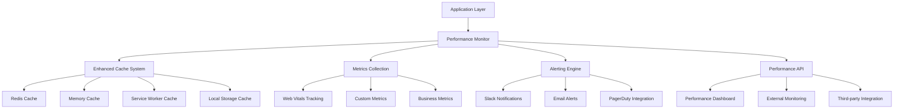

# Performance Monitoring Documentation

## Table of Contents

1. [Performance Monitoring Overview](#performance-monitoring-overview)
2. [Monitoring Infrastructure](#monitoring-infrastructure)
3. [Metrics and Analytics](#metrics-and-analytics)
4. [Alerting and Notifications](#alerting-and-notifications)
5. [Performance Dashboards](#performance-dashboards)
6. [Optimization Guidance](#optimization-guidance)
7. [Integration and APIs](#integration-and-apis)
8. [Troubleshooting and Diagnostics](#troubleshooting-and-diagnostics)
9. [Best Practices and Guidelines](#best-practices-and-guidelines)
10. [Operational Procedures](#operational-procedures)

---

## Performance Monitoring Overview

### Introduction

The Energy Drink Calculator application features a comprehensive performance monitoring system designed to provide real-time insights into application performance, user experience, and system health. This monitoring infrastructure enables proactive performance optimization, rapid issue detection, and data-driven decision making.

### Architecture Overview



### Key Performance Indicators (KPIs)

#### Core Web Vitals
- **Largest Contentful Paint (LCP)**: Measures loading performance
- **First Input Delay (FID)**: Measures interactivity
- **Cumulative Layout Shift (CLS)**: Measures visual stability
- **First Contentful Paint (FCP)**: Measures perceived load speed
- **Time to First Byte (TTFB)**: Measures server response time

#### Application Metrics
- **API Response Times**: Average, P50, P95, P99 percentiles
- **Cache Hit Rates**: Multi-level cache performance
- **Memory Usage**: Application and system memory consumption
- **Error Rates**: Application and API error tracking
- **Throughput**: Requests per second and concurrent users

#### Business Metrics
- **Conversion Rates**: Calculator usage and affiliate conversions
- **User Engagement**: Session duration and page views
- **Revenue Metrics**: Affiliate earnings and cost per acquisition
- **Feature Usage**: Popular features and user paths

### Real-time Monitoring Capabilities

The system provides comprehensive real-time monitoring with:

- **30-second metric collection intervals** for rapid issue detection
- **Automatic threshold monitoring** with intelligent alerting
- **Background performance optimization** including cache warming
- **Cross-platform monitoring** (server-side and client-side)
- **Multi-environment support** (development, staging, production)

### Alerting and Notification Systems

The monitoring system includes a sophisticated alerting framework:

- **Configurable thresholds** for all performance metrics
- **Multi-channel notifications** (Slack, email, PagerDuty)
- **Escalation procedures** based on severity and duration
- **Cooldown periods** to prevent alert fatigue
- **Alert acknowledgment** and resolution tracking

---

## Monitoring Infrastructure

### Performance Monitor Architecture

The core monitoring system is implemented in `src/lib/performance-monitor.ts` with the following components:

#### PerformanceMonitor Class

```typescript
class PerformanceMonitor {
  // Real-time metrics collection
  private metrics = new Map<string, number[]>();
  
  // Alert management
  private alerts: PerformanceAlert[] = [];
  
  // Background monitoring
  private monitoringInterval: NodeJS.Timeout | null = null;
  
  constructor() {
    this.startMonitoring();
  }
}
```

**Key Features:**
- **Metric Collection**: Records performance data with configurable tags
- **Statistical Analysis**: Calculates percentiles (P50, P95, P99) and averages
- **Threshold Monitoring**: Automatically checks performance thresholds
- **Alert Generation**: Creates alerts based on threshold violations
- **Report Generation**: Produces comprehensive performance reports

#### PerformanceOptimizer Class

```typescript
class PerformanceOptimizer {
  // Cache warming for popular content
  static async warmCache(): Promise<void>
  
  // Memory optimization
  static optimizeMemoryUsage(): void
  
  // Query optimization suggestions
  static generateQueryOptimizationSuggestions(stats: PerformanceStats): string[]
}
```

**Optimization Capabilities:**
- **Intelligent Cache Warming**: Preloads popular content based on usage patterns
- **Memory Management**: Triggers garbage collection and memory optimization
- **Query Analysis**: Analyzes performance patterns and suggests optimizations

### Enhanced Cache System Architecture

The multi-level caching system (`src/lib/enhanced-cache.ts`) provides:

#### Cache Layers

1. **Redis Cache**: Distributed caching for multi-instance deployments
2. **Memory Cache**: In-memory LRU cache with compression
3. **Service Worker Cache**: Browser-side caching for offline functionality
4. **Local Storage Cache**: Client-side persistent caching

#### Cache Features

- **LRU Eviction**: Automatically removes least recently used items
- **Compression**: Reduces memory usage for large objects
- **TTL Management**: Configurable time-to-live for different data types
- **Performance Metrics**: Tracks hit rates, memory usage, and response times
- **Background Synchronization**: Keeps cache layers synchronized

### API Performance Monitoring

The performance API (`src/app/api/performance/route.ts`) provides:

#### RESTful Endpoints

```typescript
// GET /api/performance
// Query parameters:
// - report=full: Complete performance report
// - report=metrics: Exported metrics format
// - export=true: External monitoring format
// - optimize=true: Trigger memory optimization
// - warm=true: Trigger cache warming

// POST /api/performance
// Body: { action, key, pattern, ttl }
// Actions: clear, delete, warm, metrics
```

#### Response Headers

- **X-Response-Time**: API response time in milliseconds
- **X-Performance-Report**: Type of performance report generated
- **Cache-Control**: Prevents caching of performance data

### Client-Side Monitoring

The Web Vitals tracker (`src/components/performance/web-vitals-tracker.tsx`) provides:

#### Core Web Vitals Collection

```typescript
// Automatic collection of Core Web Vitals
onCLS(reportWebVitals);  // Cumulative Layout Shift
onFCP(reportWebVitals);  // First Contentful Paint
onLCP(reportWebVitals);  // Largest Contentful Paint
onTTFB(reportWebVitals); // Time to First Byte
```

#### Integration Points

- **Google Analytics**: Sends metrics to GA4
- **Sentry Monitoring**: Tracks performance in error monitoring
- **Console Logging**: Development mode debugging

---

## Metrics and Analytics

### Metric Collection Framework

#### Custom Metrics

The system supports custom metric collection with the following interface:

```typescript
interface PerformanceStats {
  count: number;    // Number of data points
  avg: number;      // Average value
  min: number;      // Minimum value
  max: number;      // Maximum value
  p50: number;      // 50th percentile (median)
  p95: number;      // 95th percentile
  p99: number;      // 99th percentile
}
```

#### Metric Categories

**Application Performance Metrics:**
- API response times by endpoint
- Database query performance
- Cache operation statistics
- Memory usage patterns
- Error rates and types

**User Experience Metrics:**
- Core Web Vitals (LCP, FID, CLS, FCP, TTFB)
- Page load times
- User interaction delays
- Conversion funnel performance

**Business Metrics:**
- Conversion rates
- Revenue per user
- Feature adoption rates
- User engagement scores

### Performance Statistics

#### Statistical Analysis

The monitoring system calculates comprehensive statistics:

```typescript
// Example performance statistics
{
  "api.responseTime": {
    count: 150,
    avg: 245,
    min: 120,
    max: 1200,
    p50: 200,
    p95: 450,
    p99: 890
  },
  "cache.hitRate[memory]": {
    count: 100,
    avg: 85.2,
    min: 70.1,
    max: 98.5,
    p50: 87.3,
    p95: 94.1,
    p99: 97.2
  }
}
```

#### Trend Analysis

- **Time-series data**: Metrics collected over time for trend analysis
- **Percentile analysis**: P50, P95, P99 for performance distribution understanding
- **Anomaly detection**: Automatic detection of unusual performance patterns
- **Seasonal analysis**: Identifies recurring performance patterns

### Cache Performance Metrics

#### Cache Layer Statistics

```typescript
interface CachePerformanceMetrics {
  hitRate: number;         // Cache hit rate percentage
  memoryUsageMB: number;   // Current memory usage in MB
  avgResponseTime: number; // Average response time in ms
  totalRequests: number;   // Total cache requests
  evictions: number;       // Number of cache evictions
}
```

#### Multi-Level Cache Analytics

- **Hit Rate Analysis**: Per-layer and overall cache efficiency
- **Memory Usage Tracking**: Real-time memory consumption monitoring
- **Eviction Patterns**: LRU eviction analysis and optimization
- **Compression Ratios**: Data compression effectiveness

### API Performance Analytics

#### Endpoint Performance Tracking

```typescript
interface ApiPerformanceMetrics {
  avgResponseTime: number;     // Average response time
  cacheHitRate: number;        // API cache hit rate
  memoryUsage: number;         // Memory consumption
  backgroundSyncStatus: string; // Background sync status
}
```

#### Performance Distribution

- **Response Time Histograms**: Distribution of API response times
- **Error Rate Tracking**: API error rates by endpoint and time
- **Throughput Metrics**: Requests per second and concurrent users
- **Resource Utilization**: CPU, memory, and network usage

---

## Alerting and Notifications

### Alert Configuration

#### Alert Rules

The system supports configurable alert rules with the following structure:

```typescript
interface PerformanceAlert {
  type: string;           // Alert type identifier
  severity: 'info' | 'warning' | 'error';
  message: string;        // Human-readable alert message
  value: number;          // Current metric value
  threshold: number;      // Threshold that was exceeded
  timestamp: number;      // Alert generation timestamp
}
```

#### Default Alert Thresholds

**Performance Thresholds:**
- Cache hit rate < 50%: Warning alert
- Memory usage > 40MB: Warning alert
- API response time P95 > 2000ms: Error alert
- System health score < 40: Error alert

**Business Thresholds:**
- Conversion rate < 1%: Warning alert
- Error rate > 5%: Critical alert
- Uptime < 99%: Critical alert

### Notification Channels

#### Slack Integration

```typescript
// Slack notification format
{
  channel: '#alerts',
  username: 'Performance Monitor',
  attachments: [{
    color: 'warning', // or 'danger' for critical
    title: '⚠️ High Response Time Detected',
    fields: [
      { title: 'Severity', value: 'WARNING', short: true },
      { title: 'Time', value: '2024-01-15T10:30:00Z', short: true },
      { title: 'Metric', value: 'API Response Time', short: true },
      { title: 'Value', value: '2450ms', short: true }
    ]
  }]
}
```

#### Email Notifications

Email alerts include:
- Detailed performance metrics
- Historical trend information
- Recommended actions
- Links to performance dashboards

#### PagerDuty Integration

Critical alerts are escalated to PagerDuty for:
- 24/7 monitoring coverage
- Automatic incident creation
- On-call engineer notification
- Escalation procedures

### Escalation Procedures

#### Severity Levels

**Critical (P0):**
- System down or major functionality broken
- Response time: Immediate (0-15 minutes)
- Channels: PagerDuty, SMS, Phone call
- Escalation: 15 minutes to engineering manager

**High (P1):**
- Significant performance degradation
- Response time: Within 1 hour
- Channels: PagerDuty, Slack, Email
- Escalation: 1 hour to team lead

**Medium (P2):**
- Minor performance issues
- Response time: Within 4 hours
- Channels: Slack, Email
- Escalation: 4 hours to team lead

**Low (P3):**
- Performance warnings
- Response time: Within 24 hours
- Channels: Email
- Escalation: 24 hours to team lead

#### Alert Cooldowns

- **Critical alerts**: 5-minute cooldown
- **High severity**: 15-minute cooldown
- **Medium severity**: 1-hour cooldown
- **Low severity**: 4-hour cooldown

---

## Performance Dashboards

### Real-Time Monitoring Dashboard

The monitoring dashboard (`src/app/monitoring/page.tsx`) provides:

#### Key Metrics Display

```typescript
// Dashboard metrics
const metrics = {
  uptime: '99.9%',           // System availability
  responseTime: '245ms',     // Average response time
  errorRate: '0.1%',         // Error rate percentage
  activeUsers: '1,234',      // Currently active users
  totalRequests: '45,678',   // 24-hour request count
  cacheHitRate: '94.2%',     // Cache efficiency
};
```

#### Performance Indicators

- **System Health Status**: Overall application health score
- **Service Dependencies**: API, database, cache, CDN status
- **Recent Alerts**: Timeline of recent performance alerts
- **Performance Trends**: Historical performance graphs

### Performance Demo Dashboard

The performance demo (`src/app/performance-demo/page.tsx`) showcases:

#### Optimization Features

**Image Optimization:**
- Progressive loading with blur placeholders
- WebP/AVIF format support with fallbacks
- Responsive image sizing
- Lazy loading implementation
- Error handling with fallback images

**Asset Optimization:**
- Resource hints (dns-prefetch, preconnect)
- Critical asset preloading
- Image and font prefetching
- Performance monitoring integration
- CDN-ready asset structure

**Font Optimization:**
- Font-display: swap for FOIT prevention
- Critical font preloading
- WOFF2 format optimization
- Performance monitoring
- Fallback font strategies

#### Real-Time Metrics

- **Asset Loading Statistics**: Request counts and success rates
- **Font Loading Status**: Real-time font loading progress
- **Optimization Progress**: Live optimization metrics

### Custom Dashboard Creation

#### Dashboard Components

```typescript
// Example dashboard component
function CustomPerformanceDashboard() {
  const [metrics, setMetrics] = useState(null);
  
  useEffect(() => {
    const fetchMetrics = async () => {
      const response = await fetch('/api/performance?report=full');
      const data = await response.json();
      setMetrics(data);
    };
    
    const interval = setInterval(fetchMetrics, 30000); // 30 seconds
    return () => clearInterval(interval);
  }, []);
  
  return (
    <div className="dashboard">
      <MetricCard title="API Response Time" value={metrics?.api?.avgResponseTime} />
      <MetricCard title="Cache Hit Rate" value={metrics?.cache?.hitRate} />
      <MetricCard title="Error Rate" value={metrics?.errorRate} />
    </div>
  );
}
```

#### Widget Types

- **Metric Cards**: Single-value displays with trend indicators
- **Time Series Charts**: Historical performance data visualization
- **Alert Lists**: Recent alerts with severity indicators
- **Status Indicators**: Service health and dependency status
- **Performance Scores**: Composite performance metrics

### Dashboard Sharing and Collaboration

#### Access Control

- **Public Dashboards**: Read-only access for stakeholders
- **Team Dashboards**: Restricted to team members
- **Admin Dashboards**: Full access for operations team
- **Custom Views**: User-specific dashboard configurations

#### Export and Reporting

- **PDF Reports**: Automated performance reports
- **CSV Exports**: Raw metrics data export
- **API Access**: Programmatic dashboard access
- **Embed Integration**: Dashboard embedding in other applications

---

## Optimization Guidance

### Performance Bottleneck Identification

#### Common Performance Issues

**Slow API Response Times:**
```typescript
// Detection: API response time P95 > 2000ms
// Causes: Database queries, external API calls, heavy computation
// Solutions: Query optimization, caching, async processing
```

**High Memory Usage:**
```typescript
// Detection: Memory usage > 40MB
// Causes: Memory leaks, large data structures, inefficient algorithms
// Solutions: Memory optimization, garbage collection, data structure review
```

**Low Cache Hit Rates:**
```typescript
// Detection: Cache hit rate < 70%
// Causes: Poor cache key strategy, short TTL, cache size limits
// Solutions: Cache strategy optimization, TTL adjustment, size increase
```

#### Diagnostic Tools

**Performance Profiler:**
```typescript
// Built-in performance profiling
const profiler = new PerformanceProfiler();
profiler.startProfile('api_call');
// ... API operation ...
const result = profiler.endProfile('api_call');
console.log(result.duration, result.memoryUsage);
```

**Memory Analyzer:**
```typescript
// Memory usage analysis
const analyzer = new MemoryAnalyzer();
analyzer.takeSnapshot();
const leaks = analyzer.detectLeaks();
console.log('Memory leaks detected:', leaks);
```

### Optimization Recommendations

#### Cache Optimization

**Cache Key Strategy:**
```typescript
// Good cache keys
const cacheKeys = {
  flavors: 'data:flavors:v1',           // Versioned keys
  flavorsFiltered: 'data:flavors:filtered:category:energy',
  userPreferences: 'user:prefs:123',    // User-specific
  searchResults: 'search:caffeine:filters:v1'
};

// Avoid these patterns
const badKeys = {
  timestamp: `data:${Date.now()}`,      // Always new
  random: `data:${Math.random()}`,      // Unpredictable
  userInput: `data:${userInput}`        // Potential security issue
};
```

**TTL Optimization:**
```typescript
// TTL recommendations
const ttlConfig = {
  staticData: 86400,     // 24 hours - ingredients, suppliers
  dynamicData: 1800,     // 30 minutes - user preferences
  searchResults: 300,    // 5 minutes - search results
  apiResponses: 600,     // 10 minutes - API cache
  performance: 300       // 5 minutes - metrics
};
```

#### Database Optimization

**Query Performance:**
```typescript
// Optimized query patterns
const optimizedQueries = {
  // Use specific columns instead of SELECT *
  selectSpecific: 'SELECT id, name, caffeine FROM flavors WHERE active = true',
  
  // Use proper indexing
  indexedQuery: 'SELECT * FROM flavors WHERE category = ? AND caffeine < ?',
  
  // Implement pagination
  paginatedQuery: 'SELECT * FROM flavors ORDER BY name LIMIT 20 OFFSET 0',
  
  // Use connection pooling
  pooledQuery: 'SELECT * FROM flavors WHERE active = true'
};
```

**Index Strategy:**
```sql
-- Performance indexes
CREATE INDEX idx_flavors_category_active ON flavors(category, active);
CREATE INDEX idx_flavors_caffeine ON flavors(caffeine);
CREATE INDEX idx_ingredients_name ON ingredients(name);
CREATE INDEX idx_suppliers_region ON suppliers(region, active);
```

#### Frontend Optimization

**Bundle Optimization:**
```javascript
// Next.js optimization configuration
module.exports = {
  experimental: {
    optimizeCss: true,
    optimizePackageImports: ['@/components/ui']
  },
  webpack: (config, { dev, isServer }) => {
    if (!dev && !isServer) {
      config.optimization.splitChunks.cacheGroups = {
        vendor: {
          test: /[\\/]node_modules[\\/]/,
          name: 'vendors',
          chunks: 'all',
        },
      };
    }
    return config;
  },
};
```

**Image Optimization:**
```typescript
// Optimized image component usage
<OptimizedImage
  src="/hero-image.jpg"
  alt="Energy Drink Hero"
  priority={true}              // Above-the-fold loading
  progressive={true}           // Blur placeholder
  quality={85}                 // Compressed quality
  sizes="(max-width: 768px) 100vw, 50vw"
  className="w-full h-auto"
/>
```

### Performance Tuning Procedures

#### Memory Optimization

**Memory Monitoring:**
```typescript
// Memory usage tracking
const memoryMonitor = {
  checkMemoryUsage: () => {
    if (typeof window !== 'undefined') {
      return {
        used: (performance as any).memory?.usedJSHeapSize || 0,
        total: (performance as any).memory?.totalJSHeapSize || 0,
        limit: (performance as any).memory?.jsHeapSizeLimit || 0
      };
    }
    return process.memoryUsage();
  },
  
  triggerGC: () => {
    if (global.gc) {
      global.gc();
    }
  }
};
```

**Memory Leak Detection:**
```typescript
// Memory leak detection utilities
class MemoryLeakDetector {
  private snapshots = [];
  
  takeSnapshot() {
    const snapshot = {
      timestamp: Date.now(),
      heapUsage: process.memoryUsage().heapUsed,
      snapshot: process.binding('v8').getHeapStatistics()
    };
    this.snapshots.push(snapshot);
    return snapshot;
  }
  
  detectLeaks(threshold = 10 * 1024 * 1024) { // 10MB threshold
    if (this.snapshots.length < 2) return false;
    
    const recent = this.snapshots[this.snapshots.length - 1];
    const previous = this.snapshots[this.snapshots.length - 2];
    
    return (recent.heapUsage - previous.heapUsage) > threshold;
  }
}
```

#### Query Optimization

**Query Performance Analysis:**
```typescript
// Query performance monitoring
class QueryOptimizer {
  async analyzeSlowQueries() {
    const queries = await this.getSlowQueryLogs();
    return queries.map(query => ({
      query: query.query,
      avgTime: query.mean_time,
      calls: query.calls,
      totalTime: query.total_time,
      suggestions: this.generateOptimizations(query)
    }));
  }
  
  generateOptimizations(query) {
    const suggestions = [];
    
    if (query.mean_time > 100) {
      suggestions.push('Consider adding database indexes');
    }
    
    if (query.query.includes('SELECT *')) {
      suggestions.push('Select only required columns');
    }
    
    if (query.query.includes('ORDER BY') && !query.query.includes('LIMIT')) {
      suggestions.push('Add LIMIT clause to ordered queries');
    }
    
    return suggestions;
  }
}
```

---

## Integration and APIs

### Performance Monitoring API

#### API Endpoints

**GET /api/performance**

Retrieve performance metrics and reports:

```typescript
// Query parameters
interface PerformanceQuery {
  report?: 'basic' | 'full' | 'metrics';
  export?: boolean;
  optimize?: boolean;
  warm?: boolean;
}

// Response format
interface PerformanceResponse {
  timestamp: number;
  cache?: CachePerformanceMetrics;
  api?: ApiPerformanceMetrics;
  report?: PerformanceReport;
  metrics?: ExportedMetrics;
}
```

**POST /api/performance**

Cache management and optimization:

```typescript
// Request body
interface CacheManagementRequest {
  action: 'clear' | 'delete' | 'warm' | 'metrics';
  key?: string;           // Required for delete action
  pattern?: string;       // Required for clear action
  ttl?: number;           // Optional TTL for cache operations
}

// Response format
interface CacheManagementResponse {
  status: string;
  key?: string;
  pattern?: string;
  metrics?: CacheMetrics;
}
```

#### API Authentication

```typescript
// API key authentication
const authenticateRequest = (req: NextRequest) => {
  const apiKey = req.headers.get('x-api-key');
  
  if (!apiKey || !isValidApiKey(apiKey)) {
    throw new Error('Invalid or missing API key');
  }
  
  return true;
};

// Rate limiting
const rateLimiter = {
  requests: new Map(),
  limit: 100, // requests per hour
  
  isAllowed: (apiKey: string) => {
    const now = Date.now();
    const hour = Math.floor(now / (1000 * 60 * 60));
    
    if (!requests.has(apiKey)) {
      requests.set(apiKey, new Map());
    }
    
    const apiRequests = requests.get(apiKey);
    const count = apiRequests.get(hour) || 0;
    
    if (count >= limit) {
      return false;
    }
    
    apiRequests.set(hour, count + 1);
    return true;
  }
};
```

### Third-Party Monitoring Integration

#### Sentry Integration

```typescript
// Sentry performance monitoring
import * as Sentry from "@sentry/nextjs";

Sentry.init({
  dsn: process.env.SENTRY_DSN,
  tracesSampleRate: 0.1, // 10% sampling for performance
  
  beforeSendTransaction: (transaction) => {
    // Filter health check transactions
    if (transaction.transaction === '/api/health') {
      return null;
    }
    return transaction;
  },
  
  beforeSendSpan: (span) => {
    // Add custom tags
    span.setTag('environment', process.env.NODE_ENV);
    span.setTag('region', process.env.VERCEL_REGION);
    return span;
  }
});
```

#### Vercel Analytics Integration

```typescript
// Vercel Analytics tracking
import { track } from '@vercel/analytics';

class AnalyticsTracker {
  trackPageView(path: string, referrer?: string) {
    track('page_view', {
      page: path,
      referrer: referrer || document.referrer,
      timestamp: Date.now()
    });
  }
  
  trackPerformanceMetric(metric: PerformanceMetric) {
    track('performance_metric', {
      name: metric.name,
      value: metric.value,
      rating: metric.rating,
      page: window.location.pathname,
      timestamp: Date.now()
    });
  }
  
  trackBusinessEvent(eventName: string, properties: Record<string, any>) {
    track(eventName, {
      ...properties,
      timestamp: Date.now(),
      url: window.location.href,
      userAgent: navigator.userAgent
    });
  }
}
```

### Custom Metric Integration

#### Metric Collection Interface

```typescript
// Custom metric collector
class CustomMetricCollector {
  private metrics = new Map<string, CustomMetric[]>();
  
  record(name: string, value: number, tags: Record<string, string> = {}) {
    const metric: CustomMetric = {
      name,
      value,
      tags,
      timestamp: Date.now()
    };
    
    if (!this.metrics.has(name)) {
      this.metrics.set(name, []);
    }
    
    this.metrics.get(name)!.push(metric);
    
    // Send to monitoring systems
    this.sendToMonitoringSystems(metric);
  }
  
  private async sendToMonitoringSystems(metric: CustomMetric) {
    // Send to multiple monitoring endpoints
    await Promise.allSettled([
      this.sendToInfluxDB(metric),
      this.sendToPrometheus(metric),
      this.sendToDataDog(metric),
      this.sendToNewRelic(metric)
    ]);
  }
}
```

#### Webhook Notifications

```typescript
// Webhook configuration
interface WebhookConfig {
  url: string;
  events: string[];           // ['performance_alert', 'error', 'custom_metric']
  headers?: Record<string, string>;
  retryPolicy?: {
    maxRetries: number;
    backoffMs: number;
  };
}

// Webhook sender
class WebhookSender {
  async send(config: WebhookConfig, payload: any) {
    const response = await fetch(config.url, {
      method: 'POST',
      headers: {
        'Content-Type': 'application/json',
        ...config.headers
      },
      body: JSON.stringify({
        timestamp: Date.now(),
        event: payload.event,
        data: payload.data
      })
    });
    
    if (!response.ok) {
      throw new Error(`Webhook failed: ${response.status}`);
    }
  }
}
```

### Data Export and Reporting

#### Export Formats

**JSON Export:**
```typescript
// Standard JSON export format
{
  "timestamp": 1640995200000,
  "version": "1.0",
  "metrics": {
    "performance": { ... },
    "business": { ... },
    "technical": { ... }
  }
}
```

**CSV Export:**
```typescript
// CSV format for spreadsheet analysis
"timestamp","metric_name","value","tags"
"2024-01-01T00:00:00Z","api.responseTime","245","endpoint:/api/flavors"
"2024-01-01T00:00:01Z","cache.hitRate","85.2","level:memory"
```

**Prometheus Format:**
```typescript
// Prometheus metrics format
# HELP api_response_time API response time in milliseconds
# TYPE api_response_time histogram
api_response_time_bucket{endpoint="/api/flavors",le="200"} 100
api_response_time_bucket{endpoint="/api/flavors",le="500"} 150
api_response_time_bucket{endpoint="/api/flavors",le="1000"} 180
api_response_time_bucket{endpoint="/api/flavors",le="+Inf"} 200
api_response_time_sum{endpoint="/api/flavors"} 45000
api_response_time_count{endpoint="/api/flavors"} 200
```

#### Automated Reporting

```typescript
// Automated report generation
class ReportGenerator {
  async generateDailyReport(): Promise<Report> {
    const metrics = await this.collectDailyMetrics();
    const trends = await this.analyzeTrends(metrics);
    const alerts = await this.getDailyAlerts();
    
    return {
      date: new Date().toISOString().split('T')[0],
      summary: {
        overallHealth: this.calculateOverallHealth(metrics),
        keyMetrics: this.extractKeyMetrics(metrics),
        trends: trends,
        alerts: alerts
      },
      recommendations: this.generateRecommendations(metrics, trends),
      nextActions: this.suggestNextActions(metrics)
    };
  }
  
  async sendReport(report: Report, recipients: string[]) {
    const email = this.formatReportAsEmail(report);
    
    await Promise.all(
      recipients.map(email => this.sendEmail(email, email.subject, email.body))
    );
  }
}
```

---

## Troubleshooting and Diagnostics

### Performance Issue Diagnosis

#### Diagnostic Framework

The performance diagnostics system provides a structured approach to identifying and resolving performance issues:

```typescript
class PerformanceDiagnostics {
  private diagnosticSteps = [
    'system_health',
    'application_metrics',
    'infrastructure_analysis',
    'user_experience',
    'business_impact'
  ];
  
  async diagnosePerformanceIssue(symptoms: PerformanceSymptoms) {
    const diagnosis = {
      timestamp: Date.now(),
      symptoms,
      findings: {},
      rootCause: null,
      recommendations: [],
      urgency: this.assessUrgency(symptoms)
    };
    
    // Run diagnostic steps
    for (const step of this.diagnosticSteps) {
      diagnosis.findings[step] = await this.runDiagnosticStep(step, symptoms);
    }
    
    // Analyze and generate recommendations
    diagnosis.rootCause = this.analyzeRootCause(diagnosis.findings);
    diagnosis.recommendations = this.generateRecommendations(diagnosis.findings, diagnosis.rootCause);
    
    return diagnosis;
  }
}
```

#### Common Performance Issues

**Slow Response Times:**
```typescript
// Symptom: API responses taking > 3 seconds
const symptoms = {
  highResponseTime: {
    value: 3500,
    threshold: 3000,
    affectedEndpoints: ['/api/flavors', '/api/ingredients'],
    duration: '15 minutes'
  }
};

// Diagnostic checks
const diagnosticSteps = [
  'checkDatabasePerformance',
  'analyzeQueryPatterns',
  'reviewCacheHitRates',
  'examineMemoryUsage',
  'checkExternalDependencies'
];
```

**High Memory Usage:**
```typescript
// Symptom: Memory usage > 80% of limit
const symptoms = {
  highMemoryUsage: {
    value: 45, // MB
    threshold: 40, // MB
    duration: '10 minutes',
    trend: 'increasing'
  }
};

// Investigation areas
const investigationAreas = [
  'memoryLeaks',
  'largeDataStructures',
  'cacheBloat',
  'garbageCollection'
];
```

**Low Cache Performance:**
```typescript
// Symptom: Cache hit rate < 60%
const symptoms = {
  lowCacheHitRate: {
    value: 45, // %
    threshold: 70, // %
    affectedLayers: ['memory', 'redis'],
    impact: 'database_load_increase'
  }
};
```

### Performance Regression Detection

#### Regression Detection Algorithm

```typescript
class RegressionDetector {
  private baselineMetrics = new Map<string, BaselineMetric>();
  private regressionThreshold = 0.2; // 20% degradation
  
  async detectRegressions(currentMetrics: PerformanceMetrics) {
    const regressions = [];
    
    for (const [metricName, currentValue] of Object.entries(currentMetrics)) {
      const baseline = this.baselineMetrics.get(metricName);
      
      if (baseline && this.isRegression(currentValue, baseline)) {
        regressions.push({
          metric: metricName,
          current: currentValue,
          baseline: baseline.value,
          regression: this.calculateRegression(currentValue, baseline.value),
          severity: this.assessRegressionSeverity(currentValue, baseline.value),
          timestamp: Date.now()
        });
      }
    }
    
    return regressions;
  }
  
  private isRegression(current: number, baseline: BaselineMetric): boolean {
    const change = (current - baseline.value) / baseline.value;
    return change > this.regressionThreshold;
  }
  
  private calculateRegression(current: number, baseline: number): number {
    return ((current - baseline) / baseline) * 100;
  }
}
```

#### Baseline Establishment

```typescript
// Baseline metrics establishment
class BaselineEstablishment {
  async establishBaselines(timeframe: '1h' | '24h' | '7d' = '24h') {
    const metrics = await this.collectHistoricalMetrics(timeframe);
    const baselines = new Map<string, BaselineMetric>();
    
    for (const [metricName, values] of Object.entries(metrics)) {
      baselines.set(metricName, {
        value: this.calculateMedian(values),
        percentile95: this.calculatePercentile(values, 0.95),
        percentile99: this.calculatePercentile(values, 0.99),
        standardDeviation: this.calculateStandardDeviation(values),
        establishedAt: Date.now(),
        timeframe
      });
    }
    
    return baselines;
  }
  
  private calculateMedian(values: number[]): number {
    const sorted = [...values].sort((a, b) => a - b);
    const mid = Math.floor(sorted.length / 2);
    return sorted.length % 2 === 0
      ? (sorted[mid - 1] + sorted[mid]) / 2
      : sorted[mid];
  }
}
```

### Performance Testing Procedures

#### Load Testing Framework

```typescript
class PerformanceTestingFramework {
  private testScenarios: TestScenario[] = [];
  
  async runLoadTest(config: LoadTestConfig) {
    const results = {
      testId: generateTestId(),
      config,
      startTime: Date.now(),
      results: []
    };
    
    for (const scenario of this.testScenarios) {
      if (scenario.name === config.scenario) {
        const scenarioResult = await this.executeScenario(scenario, config);
        results.results.push(scenarioResult);
      }
    }
    
    results.endTime = Date.now();
    results.duration = results.endTime - results.startTime;
    
    return results;
  }
  
  private async executeScenario(scenario: TestScenario, config: LoadTestConfig) {
    const startTime = Date.now();
    const requests = [];
    
    // Simulate concurrent users
    const concurrentUsers = config.concurrentUsers || 10;
    
    for (let i = 0; i < concurrentUsers; i++) {
      const userRequests = this.generateUserRequests(scenario, config);
      requests.push(...userRequests);
    }
    
    // Execute all requests
    const responses = await Promise.allSettled(
      requests.map(req => this.executeRequest(req))
    );
    
    return {
      scenario: scenario.name,
      totalRequests: requests.length,
      successfulRequests: responses.filter(r => r.status === 'fulfilled').length,
      failedRequests: responses.filter(r => r.status === 'rejected').length,
      averageResponseTime: this.calculateAverageResponseTime(responses),
      percentile95: this.calculatePercentile95(responses),
      throughput: this.calculateThroughput(requests.length, Date.now() - startTime)
    };
  }
}
```

#### Stress Testing

```typescript
// Stress testing configuration
const stressTestConfig = {
  name: 'Peak Load Test',
  duration: '30m',
  rampUp: '5m',
  rampDown: '5m',
  phases: [
    {
      name: 'Normal Load',
      users: 100,
      duration: '10m'
    },
    {
      name: 'High Load',
      users: 500,
      duration: '10m'
    },
    {
      name: 'Peak Load',
      users: 1000,
      duration: '10m'
    }
  ],
  thresholds: {
    responseTime: 2000,      // 2 seconds
    errorRate: 0.05,         // 5%
    cpuUsage: 80,            // 80%
    memoryUsage: 85          // 85%
  }
};
```

### Performance Audit Guidelines

#### Audit Checklist

**Infrastructure Audit:**
- [ ] Server resource utilization (CPU, memory, disk)
- [ ] Network latency and bandwidth utilization
- [ ] Database performance and query optimization
- [ ] Cache configuration and hit rates
- [ ] CDN configuration and edge performance

**Application Audit:**
- [ ] API response times and throughput
- [ ] Frontend performance (Core Web Vitals)
- [ ] Code optimization opportunities
- [ ] Bundle size analysis
- [ ] Image and asset optimization

**Monitoring Audit:**
- [ ] Alert configuration and thresholds
- [ ] Dashboard accuracy and completeness
- [ ] Metric collection coverage
- [ ] Notification channel functionality
- [ ] Escalation procedure testing

#### Audit Report Template

```typescript
interface PerformanceAuditReport {
  auditId: string;
  auditDate: Date;
  auditor: string;
  scope: AuditScope;
  findings: AuditFinding[];
  recommendations: AuditRecommendation[];
  score: PerformanceScore;
  nextAudit: Date;
}

interface AuditFinding {
  category: 'infrastructure' | 'application' | 'monitoring';
  severity: 'critical' | 'high' | 'medium' | 'low';
  title: string;
  description: string;
  impact: string;
  evidence: string;
  affectedSystems: string[];
}

interface PerformanceScore {
  overall: number;           // 0-100
  infrastructure: number;
  application: number;
  monitoring: number;
  grade: 'A' | 'B' | 'C' | 'D' | 'F';
}
```

### Emergency Performance Procedures

#### Incident Response

```typescript
class PerformanceIncidentResponse {
  private incidentPhases = [
    'detection',
    'assessment',
    'mitigation',
    'resolution',
    'postmortem'
  ];
  
  async handlePerformanceIncident(incident: PerformanceIncident) {
    const response = {
      incidentId: incident.id,
      startTime: Date.now(),
      phases: {},
      resolution: null
    };
    
    // Phase 1: Detection and Alert
    response.phases.detection = await this.handleDetection(incident);
    
    // Phase 2: Assessment
    response.phases.assessment = await this.assessImpact(incident);
    
    // Phase 3: Immediate Mitigation
    response.phases.mitigation = await this.immediateMitigation(incident);
    
    // Phase 4: Resolution
    response.phases.resolution = await this.resolveIssue(incident);
    
    // Phase 5: Postmortem
    response.phases.postmortem = await this.conductPostmortem(incident);
    
    response.endTime = Date.now();
    response.totalDuration = response.endTime - response.startTime;
    
    return response;
  }
}
```

#### Emergency Procedures

**Critical Performance Degradation:**
1. **Immediate Assessment** (0-5 minutes)
   - Check system status and dependencies
   - Identify affected services
   - Assess user impact

2. **Rapid Mitigation** (5-15 minutes)
   - Enable emergency caching
   - Scale resources automatically
   - Implement rate limiting

3. **Root Cause Resolution** (15-60 minutes)
   - Deploy performance fixes
   - Optimize critical paths
   - Clear problematic caches

4. **Recovery Verification** (60-90 minutes)
   - Monitor performance recovery
   - Validate user experience
   - Remove emergency measures

**Complete System Outage:**
1. **Emergency Response** (0-10 minutes)
   - Activate incident response team
   - Enable fallback systems
   - Communicate with stakeholders

2. **Service Restoration** (10-60 minutes)
   - Restart failed services
   - Restore database connectivity
   - Verify cache functionality

3. **Performance Validation** (60-120 minutes)
   - Run performance tests
   - Verify SLA compliance
   - Monitor for stability

---

## Best Practices and Guidelines

### Performance Monitoring Best Practices

#### Metric Collection Standards

**Consistent Naming Conventions:**
```typescript
// Metric naming standards
const metricNaming = {
  // Use dot notation for hierarchical naming
  api: {
    responseTime: 'api.responseTime',
    errorRate: 'api.errorRate',
    throughput: 'api.throughput'
  },
  
  cache: {
    hitRate: 'cache.hitRate',
    memoryUsage: 'cache.memoryUsage',
    evictions: 'cache.evictions'
  },
  
  business: {
    conversionRate: 'business.conversionRate',
    revenue: 'business.revenue',
    userEngagement: 'business.userEngagement'
  },
  
  // Avoid these patterns
  avoid: {
    inconsistent: 'APIResponse',
    unclear: 'metric1',
    redundant: 'cacheCacheHitRate'
  }
};
```

**Tagging Standards:**
```typescript
// Standard tags for all metrics
interface StandardTags {
  environment: 'development' | 'staging' | 'production';
  region: string;              // e.g., 'us-east-1'
  service: string;             // e.g., 'api-gateway'
  version: string;             // Application version
  deployment: string;          // Deployment ID
}

// Optional tags based on metric type
interface OptionalTags {
  endpoint?: string;           // For API metrics
  userType?: string;           // For user-related metrics
  feature?: string;            // For feature-specific metrics
  tier?: string;               // For pricing tier metrics
}
```

#### Data Quality Standards

**Completeness:**
- All metrics should have consistent collection intervals
- No gaps in time-series data
- Complete metadata for all metrics

**Accuracy:**
- Validate metric values before storage
- Implement outlier detection and handling
- Regular calibration of monitoring systems

**Timeliness:**
- Real-time metrics: < 30 seconds latency
- Near-real-time metrics: < 5 minutes latency
- Batch metrics: < 1 hour latency

### Performance Optimization Strategies

#### Proactive Optimization

**Performance Budgets:**
```typescript
// Define performance budgets
const performanceBudgets = {
  // Core Web Vitals
  LCP: 2500,              // Largest Contentful Paint < 2.5s
  FID: 100,               // First Input Delay < 100ms
  CLS: 0.1,               // Cumulative Layout Shift < 0.1
  
  // API Performance
  apiResponseTime: {
    p50: 200,             // 50th percentile < 200ms
    p95: 500,             // 95th percentile < 500ms
    p99: 1000             // 99th percentile < 1s
  },
  
  // Resource Limits
  bundleSize: 500 * 1024, // 500KB total bundle size
  memoryUsage: 40,        // 40MB maximum memory usage
  cacheHitRate: 80        // 80% minimum cache hit rate
};
```

**Continuous Monitoring:**
```typescript
// Continuous performance monitoring
class ContinuousOptimizer {
  private budgets = performanceBudgets;
  private optimizationRules = [];
  
  async monitorPerformance() {
    const currentMetrics = await this.collectCurrentMetrics();
    const violations = this.checkBudgetViolations(currentMetrics);
    
    for (const violation of violations) {
      await this.triggerOptimization(violation);
    }
    
    return this.generateOptimizationReport(violations);
  }
  
  private async triggerOptimization(violation: BudgetViolation) {
    const rule = this.findOptimizationRule(violation.metric);
    
    if (rule) {
      await rule.execute(violation);
      this.logOptimizationAction(violation, rule);
    }
  }
}
```

#### Reactive Optimization

**Performance Incident Response:**
```typescript
// Performance incident optimization
class ReactiveOptimizer {
  async optimizeForIncident(incident: PerformanceIncident) {
    const optimizations = [];
    
    switch (incident.type) {
      case 'high_response_time':
        optimizations.push(
          this.increaseCacheTTL(),
          this.optimizeDatabaseQueries(),
          this.enableResponseCompression()
        );
        break;
        
      case 'high_memory_usage':
        optimizations.push(
          this.clearNonEssentialCaches(),
          this.optimizeDataStructures(),
          this.triggerGarbageCollection()
        );
        break;
        
      case 'low_cache_performance':
        optimizations.push(
          this.analyzeCachePatterns(),
          this.optimizeCacheStrategy(),
          this.preloadCriticalData()
        );
        break;
    }
    
    return Promise.all(optimizations);
  }
}
```

### Performance Testing Frameworks

#### Testing Standards

**Test Coverage Requirements:**
```typescript
const testCoverage = {
  // Unit tests for performance-critical functions
  unit: {
    threshold: 90,        // 90% code coverage
    focus: [
      'cache_operations',
      'data_processing',
      'performance_calculation'
    ]
  },
  
  // Integration tests for API performance
  integration: {
    threshold: 80,        // 80% API endpoint coverage
    focus: [
      'api_response_times',
      'database_operations',
      'cache_interactions'
    ]
  },
  
  // Load tests for system performance
  load: {
    scenarios: [
      'normal_load',
      'peak_load',
      'stress_test',
      'spike_test'
    ],
    frequency: 'weekly'
  }
};
```

#### Automated Performance Testing

```typescript
// Automated performance testing pipeline
class AutomatedPerformanceTesting {
  async runPerformanceTests(): Promise<TestResults> {
    const tests = [
      this.runUnitPerformanceTests(),
      this.runIntegrationPerformanceTests(),
      this.runLoadTests(),
      this.runStressTests()
    ];
    
    const results = await Promise.all(tests);
    
    return {
      timestamp: Date.now(),
      results,
      summary: this.generateTestSummary(results),
      recommendations: this.generateRecommendations(results),
      passed: this.evaluateTestResults(results)
    };
  }
  
  private async runLoadTests(): Promise<LoadTestResults> {
    const scenarios = [
      {
        name: 'Normal Load',
        users: 100,
        duration: '10m',
        rampUp: '2m'
      },
      {
        name: 'Peak Load',
        users: 500,
        duration: '15m',
        rampUp: '5m'
      }
    ];
    
    const results = [];
    
    for (const scenario of scenarios) {
      const result = await this.executeLoadTest(scenario);
      results.push(result);
    }
    
    return { scenarios: results };
  }
}
```

### Performance Monitoring Standards

#### Alert Standards

**Alert Hierarchy:**
```typescript
// Alert severity standards
const alertStandards = {
  critical: {
    responseTime: '< 15 minutes',
    escalation: 'immediate',
    channels: ['pagerduty', 'sms', 'phone'],
    autoScaling: true,
    examples: [
      'system_down',
      'critical_error_rate',
      'security_breach'
    ]
  },
  
  high: {
    responseTime: '< 1 hour',
    escalation: '30 minutes',
    channels: ['pagerduty', 'slack', 'email'],
    autoScaling: false,
    examples: [
      'high_response_time',
      'low_availability',
      'performance_degradation'
    ]
  },
  
  medium: {
    responseTime: '< 4 hours',
    escalation: '2 hours',
    channels: ['slack', 'email'],
    autoScaling: false,
    examples: [
      'warning_thresholds',
      'capacity_planning',
      'trend_alerts'
    ]
  },
  
  low: {
    responseTime: '< 24 hours',
    escalation: 'none',
    channels: ['email'],
    autoScaling: false,
    examples: [
      'info_alerts',
      'maintenance_notices',
      'optimization_suggestions'
    ]
  }
};
```

#### Documentation Standards

**Performance Documentation Requirements:**
```typescript
// Documentation standards for performance
const documentationStandards = {
  // Required for all new features
  newFeature: [
    'performance_requirements',
    'expected_load_patterns',
    'monitoring_strategy',
    'scaling_considerations'
  ],
  
  // Required for performance optimizations
  optimization: [
    'before_metrics',
    'optimization_approach',
    'after_metrics',
    'lessons_learned'
  ],
  
  // Required for performance incidents
  incident: [
    'incident_timeline',
    'root_cause_analysis',
    'resolution_steps',
    'prevention_measures'
  ]
};
```

### Performance Governance Procedures

#### Governance Framework

**Performance Review Board:**
```typescript
// Performance governance structure
const performanceGovernance = {
  board: {
    members: [
      'Engineering Manager',
      'DevOps Lead',
      'Product Manager',
      'QA Lead'
    ],
    responsibilities: [
      'approve_performance_budgets',
      'review_performance_incidents',
      'set_performance_standards',
      'approve_optimization_strategies'
    ]
  },
  
  reviewSchedule: {
    daily: 'automated_performance_reports',
    weekly: 'performance_metrics_review',
    monthly: 'performance_optimization_review',
    quarterly: 'performance_strategy_review'
  }
};
```

**Performance Approval Process:**
```typescript
// Performance approval workflow
class PerformanceApprovalProcess {
  async requestPerformanceApproval(request: PerformanceRequest) {
    const approval = {
      id: generateRequestId(),
      request,
      status: 'pending',
      approvals: [],
      timeline: {}
    };
    
    // Stage 1: Technical Review
    approval.timeline.technicalReview = await this.technicalReview(request);
    if (!approval.timeline.technicalReview.approved) {
      approval.status = 'rejected';
      return approval;
    }
    
    // Stage 2: Performance Impact Assessment
    approval.timeline.impactAssessment = await this.assessPerformanceImpact(request);
    if (!approval.timeline.impactAssessment.approved) {
      approval.status = 'rejected';
      return approval;
    }
    
    // Stage 3: Governance Board Approval
    approval.timeline.governanceReview = await this.governanceReview(request);
    approval.status = approval.timeline.governanceReview.approved ? 'approved' : 'rejected';
    
    return approval;
  }
}
```

---

## Operational Procedures

### Daily Performance Monitoring Routines

#### Daily Health Check

**Morning Performance Review (9:00 AM):**
```typescript
// Daily performance review checklist
const dailyHealthCheck = {
  reviewItems: [
    {
      task: 'Check overnight alerts',
      duration: '15 minutes',
      owner: 'on_call_engineer',
      checklist: [
        'Review all alerts from previous 24 hours',
        'Verify alert accuracy and resolution',
        'Check for recurring alert patterns',
        'Update alert acknowledgment status'
      ]
    },
    
    {
      task: 'Review performance dashboards',
      duration: '20 minutes',
      owner: 'on_call_engineer',
      checklist: [
        'Check system health indicators',
        'Review Core Web Vitals trends',
        'Analyze API performance metrics',
        'Verify cache performance'
      ]
    },
    
    {
      task: 'Monitor business metrics',
      duration: '15 minutes',
      owner: 'product_analyst',
      checklist: [
        'Review conversion rates',
        'Check user engagement metrics',
        'Analyze revenue trends',
        'Verify affiliate performance'
      ]
    },
    
    {
      task: 'Infrastructure capacity check',
      duration: '10 minutes',
      owner: 'devops_engineer',
      checklist: [
        'Check resource utilization',
        'Review scaling metrics',
        'Verify backup status',
        'Monitor external dependencies'
      ]
    }
  ],
  
  reporting: {
    format: 'automated_daily_report',
    recipients: ['engineering_team', 'product_team', 'management'],
    schedule: '10:00 AM daily'
  }
};
```

**Evening Performance Summary (6:00 PM):**
```typescript
// Evening performance summary
const eveningSummary = {
  tasks: [
    'Generate daily performance report',
    'Archive performance data',
    'Prepare next-day monitoring priorities',
    'Update performance dashboards'
  ],
  
  automation: {
    dataArchival: 'automated_compression_and_storage',
    reportGeneration: 'automated_pdf_and_email',
    dashboardUpdates: 'automated_refresh_and_backup'
  }
};
```

#### Real-Time Monitoring

**Continuous Monitoring Tasks:**
```typescript
// Real-time monitoring responsibilities
const continuousMonitoring = {
  interval: '30 seconds',    // Metric collection frequency
  responsibilities: [
    {
      task: 'Performance threshold monitoring',
      frequency: 'real_time',
      alerts: 'immediate',
      escalation: 'automatic'
    },
    
    {
      task: 'Error rate monitoring',
      frequency: 'real_time',
      alerts: 'if > 1%',
      escalation: 'automatic'
    },
    
    {
      task: 'Resource utilization tracking',
      frequency: '1 minute',
      alerts: 'if > 80%',
      escalation: 'manual_review'
    }
  ],
  
  automatedResponses: {
    highResponseTime: 'auto_scale_resources',
    highErrorRate: 'enable_circuit_breaker',
    lowCachePerformance: 'clear_and_warm_cache',
    highMemoryUsage: 'trigger_garbage_collection'
  }
};
```

### Performance Review Processes

#### Weekly Performance Review

**Weekly Performance Meeting (Every Monday, 10:00 AM):**

**Agenda:**
1. **Previous Week Performance Summary**
   - Overall system health score
   - Key performance achievements
   - Performance incidents and resolutions
   - Performance optimization completions

2. **Current Week Focus Areas**
   - Planned performance optimizations
   - Capacity planning initiatives
   - Performance testing schedules
   - Monitoring system improvements

3. **Performance Metrics Analysis**
   - Week-over-week comparison
   - Trend analysis and projections
   - Budget compliance review
   - SLA adherence assessment

**Participants:**
- Engineering Manager (Chair)
- DevOps Lead
- Performance Engineer
- Product Manager
- QA Lead

**Output:**
- Weekly performance report
- Action items with owners and deadlines
- Performance improvement initiatives
- Capacity planning recommendations

#### Monthly Performance Assessment

**Monthly Performance Review (Last Friday of Month, 2:00 PM):**

**Deep Dive Analysis:**
```typescript
// Monthly performance analysis
const monthlyAssessment = {
  analysis: [
    {
      area: 'performance_trends',
      metrics: [
        'monthly_performance_score',
        'performance_improvement_rate',
        'performance_budget_compliance',
        'sla_adherence_percentage'
      ],
      deliverables: [
        'trend_analysis_report',
        'performance_forecasting',
        'budget_optimization_recommendations'
      ]
    },
    
    {
      area: 'capacity_planning',
      metrics: [
        'peak_usage_analysis',
        'resource_utilization_efficiency',
        'scaling_effectiveness',
        'cost_performance_ratio'
      ],
      deliverables: [
        'capacity_forecast',
        'scaling_strategy_recommendations',
        'cost_optimization_plan'
      ]
    },
    
    {
      area: 'optimization_impact',
      metrics: [
        'optimization_roi',
        'performance_improvements',
        'resource_savings',
        'user_experience_enhancement'
      ],
      deliverables: [
        'optimization_impact_report',
        'success_stories',
        'lessons_learned'
      ]
    }
  ],
  
  stakeholders: [
    'engineering_leadership',
    'product_management',
    'business_operations',
    'finance_team'
  ]
};
```

### Performance Reporting Procedures

#### Automated Report Generation

**Report Types and Schedules:**

```typescript
// Performance reporting schedule
const performanceReporting = {
  realTime: {
    type: 'dashboard',
    frequency: 'continuous',
    audience: 'operations_team',
    format: 'web_dashboard',
    content: [
      'current_system_health',
      'real_time_metrics',
      'active_alerts',
      'performance_trends'
    ]
  },
  
  daily: {
    type: 'executive_summary',
    frequency: 'daily_9am',
    audience: 'management',
    format: 'email_pdf',
    content: [
      'previous_day_summary',
      'key_performance_indicators',
      'notable_events',
      'action_items'
    ]
  },
  
  weekly: {
    type: 'detailed_analysis',
    frequency: 'weekly_monday',
    audience: 'engineering_team',
    format: 'presentation_pdf',
    content: [
      'performance_trend_analysis',
      'optimization_progress',
      'incident_analysis',
      'upcoming_priorities'
    ]
  },
  
  monthly: {
    type: 'comprehensive_report',
    frequency: 'monthly_last_friday',
    audience: 'stakeholders',
    format: 'interactive_dashboard',
    content: [
      'executive_summary',
      'detailed_metrics',
      'capacity_analysis',
      'strategic_recommendations'
    ]
  }
};
```

**Report Content Standards:**

```typescript
// Standard report sections
const reportStandards = {
  executiveSummary: {
    maxLength: '1 page',
    sections: [
      'overall_performance_score',
      'key_achievements',
      'critical_issues',
      'strategic_recommendations'
    ]
  },
  
  technicalDetails: {
    maxLength: '5 pages',
    sections: [
      'detailed_metrics',
      'performance_analysis',
      'optimization_impact',
      'capacity_utilization'
    ]
  },
  
  appendices: {
    content: [
      'raw_data_exports',
      'methodology_notes',
      'glossary_of_terms',
      'contact_information'
    ]
  }
};
```

### Performance Optimization Workflows

#### Optimization Request Process

```typescript
// Performance optimization workflow
class PerformanceOptimizationWorkflow {
  async submitOptimizationRequest(request: OptimizationRequest) {
    const workflow = {
      requestId: generateWorkflowId(),
      request,
      stages: {},
      approvals: [],
      timeline: {}
    };
    
    // Stage 1: Initial Assessment
    workflow.stages.initialAssessment = await this.conductInitialAssessment(request);
    if (!workflow.stages.initialAssessment.approved) {
      workflow.status = 'rejected';
      return workflow;
    }
    
    // Stage 2: Impact Analysis
    workflow.stages.impactAnalysis = await this.analyzePerformanceImpact(request);
    if (!workflow.stages.impactAnalysis.approved) {
      workflow.status = 'rejected';
      return workflow;
    }
    
    // Stage 3: Implementation Planning
    workflow.stages.implementation = await this.createImplementationPlan(request);
    workflow.status = 'approved';
    
    return workflow;
  }
}
```

#### Implementation Workflow

**Optimization Implementation Steps:**

1. **Preparation Phase**
   - Review optimization requirements
   - Set up monitoring and baseline measurements
   - Prepare rollback procedures
   - Schedule implementation window

2. **Implementation Phase**
   - Deploy optimization changes
   - Monitor performance impact
   - Validate optimization effectiveness
   - Document implementation details

3. **Validation Phase**
   - Compare performance against baselines
   - Validate business impact
   - Monitor for side effects
   - Update performance documentation

4. **Completion Phase**
   - Archive optimization artifacts
   - Update performance baselines
   - Share lessons learned
   - Plan follow-up optimizations

### Performance Team Responsibilities

#### Team Structure

**Performance Team Roles:**

```typescript
// Performance team responsibilities
const performanceTeam = {
  performance_engineer: {
    responsibilities: [
      'performance_monitoring_setup',
      'performance_analysis',
      'optimization_implementation',
      'performance_testing'
    ],
    skills: [
      'performance_profiling',
      'system_optimization',
      'monitoring_tools',
      'load_testing'
    ],
    availability: 'business_hours_plus_on_call'
  },
  
  devops_engineer: {
    responsibilities: [
      'infrastructure_monitoring',
      'auto_scaling_configuration',
      'deployment_optimization',
      'system_maintenance'
    ],
    skills: [
      'cloud_platforms',
      'container_orchestration',
      'monitoring_infrastructure',
      'automation_tools'
    ],
    availability: '24_7_on_call_rotation'
  },
  
  qa_engineer: {
    responsibilities: [
      'performance_testing',
      'test_automation',
      'quality_assurance',
      'performance_validation'
    ],
    skills: [
      'load_testing_tools',
      'test_automation',
      'performance_benchmarks',
      'quality_metrics'
    ],
    availability: 'business_hours'
  },
  
  product_manager: {
    responsibilities: [
      'performance_requirements',
      'business_impact_assessment',
      'user_experience_validation',
      'performance_prioritization'
    ],
    skills: [
      'product_strategy',
      'user_experience',
      'business_analysis',
      'stakeholder_management'
    ],
    availability: 'business_hours'
  }
};
```

#### On-Call Procedures

**Performance On-Call Rotation:**

```typescript
// On-call schedule and procedures
const onCallProcedures = {
  schedule: {
    rotation: 'weekly',
    primary: 'devops_engineer',
    secondary: 'performance_engineer',
    escalation: 'engineering_manager'
  },
  
  responsibilities: {
    primary_on_call: [
      'monitor_real_time_alerts',
      'respond_to_performance_incidents',
      'execute_emergency_procedures',
      'coordinate_incident_resolution'
    ],
    
    secondary_on_call: [
      'provide_technical_support',
      'assist_with_diagnosis',
      'support_implementation',
      'backup_primary_responsibilities'
    ]
  },
  
  escalation: {
    level1: '15_minutes',      // Primary to Secondary
    level2: '30_minutes',      // Secondary to Manager
    level3: '60_minutes'       // Manager to Director
  }
};
```

#### Training and Development

**Performance Team Training Program:**

```typescript
// Training and development plan
const trainingProgram = {
  onboarding: {
    duration: '2 weeks',
    modules: [
      'performance_monitoring_fundamentals',
      'system_architecture_overview',
      'monitoring_tools_training',
      'incident_response_procedures'
    ]
  },
  
  continuous_learning: {
    frequency: 'monthly',
    activities: [
      'performance_best_practices_review',
      'new_tools_and_techniques',
      'industry_trends_analysis',
      'lessons_learned_sharing'
    ]
  },
  
  certifications: {
    recommended: [
      'AWS_Certified_Solutions_Architect',
      'Google_Cloud_Professional_Cloud_Architect',
      'New_Relic_University_Certification',
      'Datadog_Professional_Certification'
    ]
  }
};
```

---

## Conclusion

This comprehensive Performance Monitoring Documentation provides a complete framework for monitoring, analyzing, and optimizing the Energy Drink Calculator application's performance. The system includes:

### Key Components

1. **Real-time Monitoring**: 30-second metric collection with automatic threshold monitoring
2. **Multi-level Alerting**: Intelligent alerting with escalation procedures
3. **Performance Dashboards**: Real-time visualization of system health and performance
4. **Optimization Tools**: Automated performance optimization and recommendations
5. **Comprehensive APIs**: RESTful interfaces for integration and automation
6. **Operational Procedures**: Structured workflows for daily operations and incident response

### Benefits

- **Proactive Issue Detection**: Early warning systems prevent performance degradation
- **Data-Driven Optimization**: Performance metrics guide optimization efforts
- **Improved User Experience**: Faster response times and better Core Web Vitals
- **Operational Excellence**: Structured procedures ensure consistent performance management
- **Scalability**: Monitoring systems scale with application growth

### Next Steps

1. **Implement Alert Integration**: Connect to Slack, email, and PagerDuty
2. **Deploy Monitoring Dashboard**: Make dashboards accessible to stakeholders
3. **Establish Performance Baselines**: Set initial performance benchmarks
4. **Train Operations Team**: Ensure team is familiar with monitoring procedures
5. **Schedule Regular Reviews**: Implement weekly and monthly performance reviews

This documentation serves as the foundation for maintaining exceptional performance as the application grows and evolves.