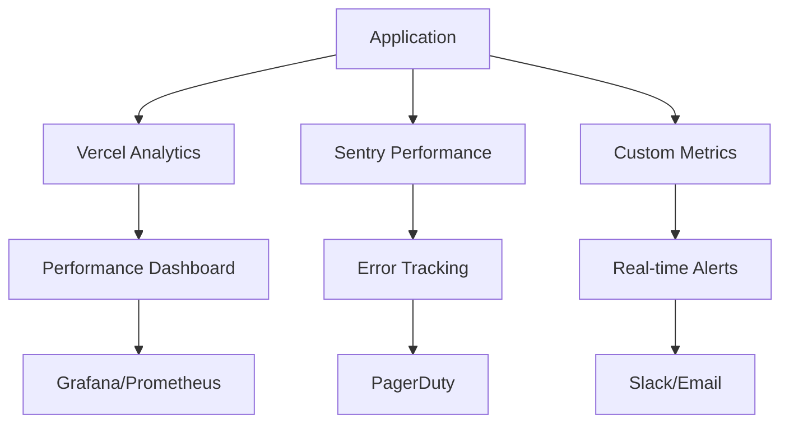

# Performance Monitoring & Scaling Guide

## Overview

This guide provides comprehensive procedures for monitoring, scaling, and optimizing the Energy Drink Calculator application's performance in production environments. It covers real-time monitoring, alerting systems, capacity planning, and automated scaling strategies.

## Table of Contents

1. [Performance Monitoring Architecture](#performance-monitoring-architecture)
2. [Key Performance Indicators](#key-performance-indicators)
3. [Monitoring Setup](#monitoring-setup)
4. [Alerting Configuration](#alerting-configuration)
5. [Scaling Strategies](#scaling-strategies)
6. [Performance Optimization](#performance-optimization)
7. [Capacity Planning](#capacity-planning)
8. [Troubleshooting Performance Issues](#troubleshooting-performance-issues)

## Performance Monitoring Architecture

### Monitoring Stack Overview



### Monitoring Components

#### Application-Level Monitoring

```javascript
// Enhanced performance monitoring setup
import { getCLS, getFID, getFCP, getLCP, getTTFB } from 'web-vitals';

class PerformanceMonitor {
  constructor() {
    this.metrics = {
      webVitals: {},
      customMetrics: {},
      businessMetrics: {}
    };
    this.setupWebVitals();
    this.setupCustomMetrics();
    this.setupBusinessMetrics();
  }
  
  setupWebVitals() {
    // Core Web Vitals monitoring
    getCLS(this.sendToAnalytics.bind(this));
    getFID(this.sendToAnalytics.bind(this));
    getFCP(this.sendToAnalytics.bind(this));
    getLCP(this.sendToAnalytics.bind(this));
    getTTFB(this.sendToAnalytics.bind(this));
  }
  
  setupCustomMetrics() {
    // Custom application metrics
    this.trackAPILatency();
    this.trackDatabasePerformance();
    this.trackCacheHitRates();
    this.trackUserInteractions();
  }
  
  setupBusinessMetrics() {
    // Business-specific metrics
    this.trackConversionRates();
    this.trackUserEngagement();
    this.trackRevenueMetrics();
    this.trackFeatureUsage();
  }
  
  sendToAnalytics(metric) {
    // Send to multiple monitoring systems
    this.sendToVercel(metric);
    this.sendToSentry(metric);
    this.sendToCustomEndpoint(metric);
  }
  
  trackAPILatency() {
    // Monitor API response times
    const originalFetch = window.fetch;
    window.fetch = async (...args) => {
      const start = performance.now();
      try {
        const response = await originalFetch(...args);
        const end = performance.now();
        
        this.recordMetric('api_latency', {
          endpoint: this.getEndpointFromUrl(args[0]),
          duration: end - start,
          status: response.status,
          timestamp: Date.now()
        });
        
        return response;
      } catch (error) {
        const end = performance.now();
        this.recordMetric('api_error', {
          endpoint: this.getEndpointFromUrl(args[0]),
          duration: end - start,
          error: error.message,
          timestamp: Date.now()
        });
        throw error;
      }
    };
  }
}
```

#### Infrastructure Monitoring

```javascript
// Infrastructure performance monitoring
class InfrastructureMonitor {
  constructor() {
    this.monitors = {
      memory: new MemoryMonitor(),
      cpu: new CPUMonitor(),
      network: new NetworkMonitor(),
      storage: new StorageMonitor()
    };
    
    this.startMonitoring();
  }
  
  startMonitoring() {
    // Real-time monitoring
    setInterval(() => {
      this.collectMetrics();
    }, 5000);
    
    // Store metrics for trend analysis
    setInterval(() => {
      this.analyzeTrends();
    }, 60000);
  }
  
  async collectMetrics() {
    const metrics = await Promise.all([
      this.monitors.memory.getUsage(),
      this.monitors.cpu.getUsage(),
      this.monitors.network.getStats(),
      this.monitors.storage.getUsage()
    ]);
    
    this.processMetrics(metrics);
  }
}
```

## Key Performance Indicators

### Application Performance Metrics

#### Core Web Vitals Thresholds

```javascript
const performanceThresholds = {
  // Core Web Vitals (Google's recommended thresholds)
  coreWebVitals: {
    LCP: { good: 2500, poor: 4000 }, // Largest Contentful Paint
    FID: { good: 100, poor: 300 },   // First Input Delay
    CLS: { good: 0.1, poor: 0.25 }   // Cumulative Layout Shift
  },
  
  // Additional performance metrics
  additional: {
    FCP: { good: 1800, poor: 3000 }, // First Contentful Paint
    TTFB: { good: 800, poor: 1800 }, // Time to First Byte
    TTI: { good: 3800, poor: 7300 }  // Time to Interactive
  },
  
  // API performance
  api: {
    responseTime: { warning: 1000, critical: 3000 },
    errorRate: { warning: 0.01, critical: 0.05 },
    availability: { warning: 0.995, critical: 0.99 }
  },
  
  // Business metrics
  business: {
    conversionRate: { warning: 0.02, critical: 0.01 },
    bounceRate: { warning: 0.6, critical: 0.8 },
    sessionDuration: { warning: 120, critical: 60 } // seconds
  }
};

class KPIMonitor {
  constructor() {
    this.thresholds = performanceThresholds;
    this.currentMetrics = new Map();
  }
  
  evaluateMetric(name, value) {
    const threshold = this.thresholds[name];
    if (!threshold) return 'unknown';
    
    if (value <= threshold.good) return 'good';
    if (value <= threshold.poor || value <= threshold.warning) return 'needs-improvement';
    return 'poor';
  }
  
  getOverallScore() {
    const scores = Array.from(this.currentMetrics.values())
      .map(metric => this.evaluateMetric(metric.name, metric.value));
    
    const goodCount = scores.filter(s => s === 'good').length;
    const totalCount = scores.length;
    
    return (goodCount / totalCount) * 100;
  }
}
```

#### Custom Business Metrics

```javascript
// Business performance tracking
class BusinessMetricsTracker {
  constructor() {
    this.metrics = {
      conversions: {
        calculatorUsage: 0,
        flavorExploration: 0,
        affiliateClicks: 0,
        purchases: 0
      },
      engagement: {
        sessionDuration: [],
        pagesPerSession: [],
        returnVisitors: 0,
        newVisitors: 0
      },
      revenue: {
        affiliateRevenue: 0,
        conversionValue: 0,
        costPerAcquisition: 0,
        lifetimeValue: 0
      }
    };
  }
  
  trackConversion(type, value = 1) {
    this.metrics.conversions[type] += value;
    this.sendMetric('conversion', { type, value });
  }
  
  trackEngagement(sessionData) {
    this.metrics.engagement.sessionDuration.push(sessionData.duration);
    this.metrics.engagement.pagesPerSession.push(sessionData.pages);
    
    if (sessionData.isReturnVisitor) {
      this.metrics.engagement.returnVisitors++;
    } else {
      this.metrics.engagement.newVisitors++;
    }
  }
  
  getConversionRate() {
    const totalVisitors = this.metrics.engagement.newVisitors + this.metrics.engagement.returnVisitors;
    const conversions = Object.values(this.metrics.conversions).reduce((sum, val) => sum + val, 0);
    
    return totalVisitors > 0 ? conversions / totalVisitors : 0;
  }
  
  getEngagementScore() {
    const avgSessionDuration = this.average(this.metrics.engagement.sessionDuration);
    const avgPagesPerSession = this.average(this.metrics.engagement.pagesPerSession);
    const returnVisitorRate = this.metrics.engagement.returnVisitors / 
      (this.metrics.engagement.returnVisitors + this.metrics.engagement.newVisitors);
    
    return (avgSessionDuration * 0.4 + avgPagesPerSession * 30 + returnVisitorRate * 100) / 3;
  }
}
```

## Monitoring Setup

### Sentry Performance Monitoring

```javascript
// Sentry configuration for performance monitoring
import * as Sentry from "@sentry/nextjs";

Sentry.init({
  dsn: process.env.SENTRY_DSN,
  tracesSampleRate: 0.1, // 10% of transactions for performance monitoring
  
  // Performance monitoring configuration
  beforeSendTransaction(transaction) {
    // Filter out health check transactions
    if (transaction.transaction === '/api/health') {
      return null;
    }
    
    return transaction;
  },
  
  // Custom performance data collection
  beforeSendSpan(span) {
    // Add custom tags for better categorization
    span.setTag('environment', process.env.NODE_ENV);
    span.setTag('region', process.env.VERCEL_REGION);
    
    return span;
  }
});

// Performance monitoring wrapper
export function withPerformanceMonitoring(handler, name) {
  return async (req, res) => {
    const transaction = Sentry.startTransaction({
      op: 'http.server',
      name: name || req.url,
    });
    
    const span = transaction.startChild({
      op: 'http.request',
      description: `${req.method} ${req.url}`,
    });
    
    try {
      const result = await handler(req, res);
      span.setStatus('ok');
      return result;
    } catch (error) {
      span.setStatus('internal_error');
      Sentry.captureException(error);
      throw error;
    } finally {
      span.finish();
      transaction.finish();
    }
  };
}
```

### Custom Metrics Collection

```javascript
// Custom metrics collection system
class MetricsCollector {
  constructor() {
    this.buffer = [];
    this.flushInterval = 30000; // 30 seconds
    this.maxBufferSize = 1000;
    
    this.startBufferFlush();
  }
  
  record(name, value, tags = {}, timestamp = Date.now()) {
    const metric = {
      name,
      value,
      tags,
      timestamp
    };
    
    this.buffer.push(metric);
    
    // Auto-flush if buffer is full
    if (this.buffer.length >= this.maxBufferSize) {
      this.flush();
    }
  }
  
  recordLatency(endpoint, duration, status = 200) {
    this.record('api.latency', duration, {
      endpoint,
      status: status.toString(),
      method: 'GET' // Would extract from context
    });
  }
  
  recordError(endpoint, error, status = 500) {
    this.record('api.errors', 1, {
      endpoint,
      status: status.toString(),
      errorType: this.getErrorType(error)
    });
  }
  
  recordBusinessMetric(name, value, tags = {}) {
    this.record(`business.${name}`, value, {
      ...tags,
      timestamp: new Date().toISOString().split('T')[0] // Date partition
    });
  }
  
  flush() {
    if (this.buffer.length === 0) return;
    
    const metrics = [...this.buffer];
    this.buffer = [];
    
    // Send to monitoring endpoints
    Promise.all([
      this.sendToInfluxDB(metrics),
      this.sendToPrometheus(metrics),
      this.sendToAnalytics(metrics)
    ]).catch(error => {
      console.error('Failed to flush metrics:', error);
    });
  }
  
  startBufferFlush() {
    setInterval(() => {
      this.flush();
    }, this.flushInterval);
  }
}

// Global metrics collector instance
export const metricsCollector = new MetricsCollector();
```

### Vercel Analytics Integration

```javascript
// Vercel Analytics performance tracking
import { track } from '@vercel/analytics';

class VercelAnalyticsTracker {
  constructor() {
    this.setupPageTracking();
    this.setupPerformanceTracking();
    this.setupCustomEventTracking();
  }
  
  setupPageTracking() {
    // Automatic page view tracking
    if (typeof window !== 'undefined') {
      // Track initial page load
      track('page_view', {
        page: window.location.pathname,
        referrer: document.referrer,
        timestamp: Date.now()
      });
      
      // Track SPA navigation
      this.setupSPATracking();
    }
  }
  
  setupPerformanceTracking() {
    // Track Core Web Vitals
    if (typeof window !== 'undefined') {
      import('web-vitals').then(({ getCLS, getFID, getFCP, getLCP, getTTFB }) => {
        getCLS(this.trackCoreWebVital.bind(this));
        getFID(this.trackCoreWebVital.bind(this));
        getFCP(this.trackCoreWebVital.bind(this));
        getLCP(this.trackCoreWebVital.bind(this));
        getTTFB(this.trackCoreWebVital.bind(this));
      });
    }
  }
  
  trackCoreWebVital(metric) {
    track('performance_metric', {
      name: metric.name,
      value: metric.value,
      rating: metric.rating,
      page: window.location.pathname,
      timestamp: Date.now()
    });
  }
  
  trackCustomEvent(eventName, properties = {}) {
    track(eventName, {
      ...properties,
      timestamp: Date.now(),
      url: window.location.href,
      userAgent: navigator.userAgent
    });
  }
}

export const analytics = new VercelAnalyticsTracker();
```

## Alerting Configuration

### Alert Rules Configuration

```javascript
// Comprehensive alerting system
class AlertingSystem {
  constructor() {
    this.rules = [
      {
        name: 'High Error Rate',
        condition: (metrics) => metrics.api.errorRate > 0.05,
        severity: 'critical',
        channels: ['pagerduty', 'slack', 'email'],
        cooldown: 300, // 5 minutes
        description: 'API error rate exceeds 5%'
      },
      {
        name: 'Slow Response Time',
        condition: (metrics) => metrics.api.avgResponseTime > 2000,
        severity: 'warning',
        channels: ['slack', 'email'],
        cooldown: 180, // 3 minutes
        description: 'Average API response time exceeds 2 seconds'
      },
      {
        name: 'High Core Web Vitals',
        condition: (metrics) => metrics.webVitals.LCP > 4000,
        severity: 'warning',
        channels: ['slack'],
        cooldown: 600, // 10 minutes
        description: 'Largest Contentful Paint exceeds 4 seconds'
      },
      {
        name: 'Low Conversion Rate',
        condition: (metrics) => metrics.business.conversionRate < 0.01,
        severity: 'warning',
        channels: ['slack', 'email'],
        cooldown: 1800, // 30 minutes
        description: 'Conversion rate drops below 1%'
      },
      {
        name: 'Uptime Issue',
        condition: (metrics) => metrics.availability < 0.99,
        severity: 'critical',
        channels: ['pagerduty', 'slack', 'email'],
        cooldown: 60, // 1 minute
        description: 'System availability drops below 99%'
      }
    ];
    
    this.alertHistory = new Map();
    this.notificationChannels = {
      slack: new SlackNotification(),
      email: new EmailNotification(),
      pagerduty: new PagerDutyNotification(),
      webhook: new WebhookNotification()
    };
  }
  
  async evaluateAlerts(metrics) {
    const alerts = [];
    
    for (const rule of this.rules) {
      try {
        if (rule.condition(metrics)) {
          const alert = await this.triggerAlert(rule, metrics);
          alerts.push(alert);
        }
      } catch (error) {
        console.error(`Error evaluating alert rule ${rule.name}:`, error);
      }
    }
    
    return alerts;
  }
  
  async triggerAlert(rule, metrics) {
    // Check cooldown period
    const lastAlert = this.alertHistory.get(rule.name);
    const now = Date.now();
    
    if (lastAlert && (now - lastAlert) < (rule.cooldown * 1000)) {
      return null; // Still in cooldown
    }
    
    const alert = {
      id: `alert-${now}`,
      name: rule.name,
      severity: rule.severity,
      description: rule.description,
      metrics: metrics,
      timestamp: now,
      acknowledged: false
    };
    
    // Send notifications
    await Promise.all(
      rule.channels.map(channel => 
        this.notificationChannels[channel].send(alert)
      )
    );
    
    // Store alert history
    this.alertHistory.set(rule.name, now);
    
    return alert;
  }
  
  acknowledgeAlert(alertId) {
    // Mark alert as acknowledged
    // This would update the alert in your alerting system
  }
}
```

### Notification Channels

```javascript
// Slack notification integration
class SlackNotification {
  constructor() {
    this.webhookUrl = process.env.SLACK_WEBHOOK_URL;
    this.channel = process.env.SLACK_ALERT_CHANNEL || '#alerts';
  }
  
  async send(alert) {
    if (!this.webhookUrl) {
      console.error('Slack webhook URL not configured');
      return;
    }
    
    const color = this.getAlertColor(alert.severity);
    const emoji = this.getAlertEmoji(alert.severity);
    
    const payload = {
      channel: this.channel,
      username: 'Performance Monitor',
      icon_emoji: ':warning:',
      attachments: [{
        color: color,
        title: `${emoji} ${alert.name}`,
        text: alert.description,
        fields: [
          {
            title: 'Severity',
            value: alert.severity.toUpperCase(),
            short: true
          },
          {
            title: 'Time',
            value: new Date(alert.timestamp).toISOString(),
            short: true
          },
          {
            title: 'Metrics',
            value: '```' + JSON.stringify(alert.metrics, null, 2) + '```',
            short: false
          }
        ],
        footer: 'Performance Monitoring System',
        ts: Math.floor(alert.timestamp / 1000)
      }]
    };
    
    try {
      const response = await fetch(this.webhookUrl, {
        method: 'POST',
        headers: { 'Content-Type': 'application/json' },
        body: JSON.stringify(payload)
      });
      
      if (!response.ok) {
        throw new Error(`Slack API error: ${response.status}`);
      }
    } catch (error) {
      console.error('Failed to send Slack notification:', error);
    }
  }
  
  getAlertColor(severity) {
    const colors = {
      critical: 'danger',
      warning: 'warning',
      info: 'good'
    };
    return colors[severity] || '#36a64f';
  }
  
  getAlertEmoji(severity) {
    const emojis = {
      critical: '🚨',
      warning: '⚠️',
      info: 'ℹ️'
    };
    return emojis[severity] || '📊';
  }
}

// Email notification system
class EmailNotification {
  constructor() {
    this.smtpConfig = {
      host: process.env.SMTP_HOST,
      port: process.env.SMTP_PORT || 587,
      secure: false,
      auth: {
        user: process.env.SMTP_USER,
        pass: process.env.SMTP_PASS
      }
    };
  }
  
  async send(alert) {
    const subject = `[${alert.severity.toUpperCase()}] ${alert.name}`;
    const body = this.generateEmailBody(alert);
    
    const mailOptions = {
      from: 'performance-monitor@energydrink.app',
      to: this.getRecipients(alert.severity),
      subject: subject,
      html: body
    };
    
    // Implementation would use nodemailer or similar
    console.log('Email notification sent:', subject);
  }
  
  generateEmailBody(alert) {
    return `
      <h2>${alert.name}</h2>
      <p><strong>Severity:</strong> ${alert.severity}</p>
      <p><strong>Description:</strong> ${alert.description}</p>
      <p><strong>Time:</strong> ${new Date(alert.timestamp).toISOString()}</p>
      <h3>Current Metrics</h3>
      <pre>${JSON.stringify(alert.metrics, null, 2)}</pre>
      <p><a href="${process.env.DASHBOARD_URL}/alerts/${alert.id}">View in Dashboard</a></p>
    `;
  }
  
  getRecipients(severity) {
    const recipients = {
      critical: ['ops@energydrink.app', 'engineering@energydrink.app'],
      warning: ['ops@energydrink.app'],
      info: ['team@energydrink.app']
    };
    return recipients[severity] || recipients.info;
  }
}
```

## Scaling Strategies

### Horizontal Scaling

#### Auto-scaling Configuration

```javascript
// Vercel auto-scaling configuration
const autoScalingConfig = {
  // Function-specific scaling rules
  functions: {
    'api/flavors': {
      maxInstances: 1000,
      minInstances: 1,
      targetConcurrency: 100,
      memory: 1024, // MB
      timeout: 30
    },
    'api/ingredients': {
      maxInstances: 500,
      minInstances: 1,
      targetConcurrency: 50,
      memory: 512,
      timeout: 15
    },
    'api/calculator': {
      maxInstances: 200,
      minInstances: 1,
      targetConcurrency: 20,
      memory: 256,
      timeout: 10
    }
  },
  
  // Global scaling policies
  global: {
    // Scale up triggers
    scaleUp: {
      cpuThreshold: 70,        // Scale up when CPU > 70%
      memoryThreshold: 80,     // Scale up when memory > 80%
      responseTimeThreshold: 2000, // Scale up when response time > 2s
      errorRateThreshold: 0.02,    // Scale up when error rate > 2%
      duration: 120            // Duration in seconds before scaling
    },
    
    // Scale down triggers
    scaleDown: {
      cpuThreshold: 30,        // Scale down when CPU < 30%
      memoryThreshold: 50,     // Scale down when memory < 50%
      responseTimeThreshold: 500, // Scale down when response time < 500ms
      errorRateThreshold: 0.005,  // Scale down when error rate < 0.5%
      duration: 300            // Duration in seconds before scaling
    }
  },
  
  // Geographic scaling
  regions: {
    primary: ['fra1', 'cdg1', 'lhr1'],  // Europe
    secondary: ['sfo1', 'iad1'],        // North America
    tertiary: ['hnd1', 'sin1']          // Asia-Pacific
  }
};

class AutoScalingManager {
  constructor(config) {
    this.config = config;
    this.metrics = new Map();
    this.scalingHistory = [];
  }
  
  async evaluateScaling() {
    const currentMetrics = await this.collectCurrentMetrics();
    const scalingDecisions = [];
    
    // Evaluate each function
    for (const [functionName, functionConfig] of Object.entries(this.config.functions)) {
      const decision = this.evaluateFunctionScaling(functionName, functionConfig, currentMetrics);
      if (decision.shouldScale) {
        scalingDecisions.push(decision);
      }
    }
    
    // Execute scaling decisions
    for (const decision of scalingDecisions) {
      await this.executeScaling(decision);
    }
    
    return scalingDecisions;
  }
  
  evaluateFunctionScaling(functionName, functionConfig, metrics) {
    const functionMetrics = metrics.functions[functionName] || {};
    const scaleUp = this.config.global.scaleUp;
    const scaleDown = this.config.global.scaleDown;
    
    let shouldScale = false;
    let direction = null;
    let reason = [];
    
    // Evaluate scale up conditions
    if (this.shouldScaleUp(functionMetrics, scaleUp)) {
      shouldScale = true;
      direction = 'up';
      reason.push('Performance thresholds exceeded');
    }
    
    // Evaluate scale down conditions
    if (this.shouldScaleDown(functionMetrics, scaleDown)) {
      shouldScale = true;
      direction = 'down';
      reason.push('Resource utilization low');
    }
    
    return {
      functionName,
      direction,
      shouldScale,
      reason: reason.join(', '),
      currentInstances: functionMetrics.currentInstances || 1,
      targetInstances: this.calculateTargetInstances(functionName, direction, functionConfig)
    };
  }
  
  shouldScaleUp(metrics, thresholds) {
    return (
      (metrics.cpuUsage || 0) > thresholds.cpuThreshold ||
      (metrics.memoryUsage || 0) > thresholds.memoryThreshold ||
      (metrics.responseTime || 0) > thresholds.responseTimeThreshold ||
      (metrics.errorRate || 0) > thresholds.errorRateThreshold
    );
  }
  
  shouldScaleDown(metrics, thresholds) {
    return (
      (metrics.cpuUsage || 0) < thresholds.cpuThreshold &&
      (metrics.memoryUsage || 0) < thresholds.memoryThreshold &&
      (metrics.responseTime || 0) < thresholds.responseTimeThreshold &&
      (metrics.errorRate || 0) < thresholds.errorRateThreshold
    );
  }
  
  async executeScaling(decision) {
    try {
      // This would interface with Vercel's API or infrastructure
      console.log(`Scaling ${decision.functionName} ${decision.direction}: ${decision.currentInstances} -> ${decision.targetInstances}`);
      
      // Record scaling action
      this.scalingHistory.push({
        timestamp: Date.now(),
        functionName: decision.functionName,
        direction: decision.direction,
        from: decision.currentInstances,
        to: decision.targetInstances,
        reason: decision.reason
      });
      
      // In a real implementation, this would call the Vercel API
      // const response = await vercel.functions.scale(decision.functionName, decision.targetInstances);
      
    } catch (error) {
      console.error(`Failed to scale ${decision.functionName}:`, error);
    }
  }
}
```

### Vertical Scaling

```javascript
// Vertical scaling for database and cache resources
class VerticalScalingManager {
  constructor() {
    this.resources = {
      database: {
        current: 'small',
        scaling: {
          thresholds: {
            cpu: { warning: 70, critical: 85 },
            memory: { warning: 75, critical: 90 },
            connections: { warning: 80, critical: 95 }
          },
          schedule: {
            upgrade: ['small', 'medium', 'large', 'xlarge'],
            downgrade: ['xlarge', 'large', 'medium', 'small']
          }
        }
      },
      cache: {
        current: 'standard',
        scaling: {
          thresholds: {
            hitRate: { warning: 0.8, critical: 0.7 },
            memoryUsage: { warning: 75, critical: 90 }
          },
          schedule: {
            upgrade: ['standard', 'premium', 'enterprise'],
            downgrade: ['enterprise', 'premium', 'standard']
          }
        }
      }
    };
  }
  
  async evaluateVerticalScaling() {
    const recommendations = [];
    
    for (const [resourceType, resourceConfig] of Object.entries(this.resources)) {
      const metrics = await this.getResourceMetrics(resourceType);
      const recommendation = this.evaluateResourceScaling(resourceType, resourceConfig, metrics);
      
      if (recommendation.shouldScale) {
        recommendations.push(recommendation);
      }
    }
    
    return recommendations;
  }
  
  evaluateResourceScaling(resourceType, resourceConfig, metrics) {
    const thresholds = resourceConfig.scaling.thresholds;
    let shouldScale = false;
    let direction = null;
    let reason = [];
    
    // Check each threshold
    for (const [metric, threshold] of Object.entries(thresholds)) {
      const value = metrics[metric];
      if (value > threshold.critical) {
        shouldScale = true;
        direction = 'up';
        reason.push(`${metric} at ${value}% (critical: ${threshold.critical}%)`);
      } else if (value < threshold.warning && direction !== 'up') {
        shouldScale = true;
        direction = 'down';
        reason.push(`${metric} at ${value}% (low usage)`);
      }
    }
    
    const currentTier = resourceConfig.current;
    const schedule = resourceConfig.scaling.schedule[direction || 'up'];
    const currentIndex = schedule.indexOf(currentTier);
    const targetTier = direction === 'up' 
      ? schedule[Math.min(currentIndex + 1, schedule.length - 1)]
      : schedule[Math.max(currentIndex - 1, 0)];
    
    return {
      resourceType,
      current: currentTier,
      target: targetTier,
      direction,
      shouldScale,
      reason: reason.join(', '),
      metrics,
      estimatedCost: this.estimateCost(resourceType, targetTier)
    };
  }
  
  async getResourceMetrics(resourceType) {
    switch (resourceType) {
      case 'database':
        return this.getDatabaseMetrics();
      case 'cache':
        return this.getCacheMetrics();
      default:
        return {};
    }
  }
  
  async getDatabaseMetrics() {
    // In a real implementation, this would query database statistics
    return {
      cpu: Math.random() * 100,
      memory: Math.random() * 100,
      connections: Math.random() * 100,
      storage: Math.random() * 100
    };
  }
  
  async getCacheMetrics() {
    // In a real implementation, this would query cache statistics
    return {
      hitRate: Math.random(),
      memoryUsage: Math.random() * 100,
      operations: Math.random() * 1000
    };
  }
  
  estimateCost(resourceType, tier) {
    const costEstimates = {
      database: {
        small: 50,
        medium: 150,
        large: 300,
        xlarge: 600
      },
      cache: {
        standard: 25,
        premium: 75,
        enterprise: 200
      }
    };
    
    return costEstimates[resourceType]?.[tier] || 0;
  }
}
```

## Performance Optimization

### Database Optimization

```sql
-- Database performance optimization queries

-- 1. Index optimization analysis
SELECT 
    schemaname,
    tablename,
    indexname,
    idx_scan,
    idx_tup_read,
    idx_tup_fetch,
    pg_size_pretty(pg_relation_size(indexrelname)) as index_size
FROM pg_stat_user_indexes
ORDER BY idx_scan DESC;

-- 2. Query performance analysis
SELECT 
    query,
    calls,
    total_time,
    mean_time,
    min_time,
    max_time,
    stddev_time,
    rows,
    100.0 * shared_blks_hit / nullif(shared_blks_hit + shared_blks_read, 0) AS hit_percent
FROM pg_stat_statements
WHERE mean_time > 100  -- Queries slower than 100ms
ORDER BY total_time DESC
LIMIT 20;

-- 3. Table bloat analysis
SELECT 
    schemaname,
    tablename,
    pg_size_pretty(pg_total_relation_size(schemaname||'.'||tablename)) as size,
    pg_size_pretty(pg_relation_size(schemaname||'.'||tablename)) as table_size,
    pg_size_pretty(pg_total_relation_size(schemaname||'.'||tablename) - pg_relation_size(schemaname||'.'||tablename)) as bloat_size
FROM pg_tables
WHERE schemaname = 'public'
ORDER BY pg_total_relation_size(schemaname||'.'||tablename) DESC;

-- 4. Connection pool analysis
SELECT 
    state,
    count(*) as connection_count,
    max(now() - state_change) as max_idle_time
FROM pg_stat_activity
WHERE datname = current_database()
GROUP BY state;

-- 5. Cache hit ratio monitoring
SELECT 
    sum(heap_blks_hit) / (sum(heap_blks_hit) + sum(heap_blks_read)) AS cache_hit_ratio,
    sum(heap_blks_hit) as heap_hits,
    sum(heap_blks_read) as heap_reads
FROM pg_statio_user_tables;
```

### Cache Optimization

```javascript
// Multi-level caching strategy
class CacheManager {
  constructor() {
    this.caches = {
      // Level 1: In-memory cache (fastest)
      memory: new Map(),
      
      // Level 2: Redis cache (fast)
      redis: null, // Would be initialized with Redis connection
      
      // Level 3: CDN cache (global)
      cdn: null    // Would be initialized with CDN config
    };
    
    this.config = {
      memory: {
        maxSize: 1000,        // Maximum items in memory
        ttl: 300,             // 5 minutes
        compression: true
      },
      redis: {
        db: 0,
        ttl: 3600,            // 1 hour
        compression: true
      },
      cdn: {
        ttl: 86400,           // 1 day
        compression: true
      }
    };
  }
  
  async get(key) {
    // Try memory cache first
    let value = this.getFromMemory(key);
    if (value !== null) {
      return { value, source: 'memory', hit: true };
    }
    
    // Try Redis cache
    value = await this.getFromRedis(key);
    if (value !== null) {
      // Populate memory cache
      this.setToMemory(key, value);
      return { value, source: 'redis', hit: true };
    }
    
    // Try CDN cache
    value = await this.getFromCDN(key);
    if (value !== null) {
      // Populate both memory and Redis caches
      this.setToMemory(key, value);
      await this.setToRedis(key, value);
      return { value, source: 'cdn', hit: true };
    }
    
    return { value: null, source: 'none', hit: false };
  }
  
  async set(key, value, options = {}) {
    const ttl = options.ttl || this.config.memory.ttl;
    
    // Set in all cache levels
    this.setToMemory(key, value, ttl);
    await this.setToRedis(key, value, options.redisTtl || this.config.redis.ttl);
    await this.setToCDN(key, value, options.cdnTtl || this.config.cdn.ttl);
  }
  
  getFromMemory(key) {
    const item = this.caches.memory.get(key);
    if (item && item.expires > Date.now()) {
      return item.value;
    }
    if (item) {
      this.caches.memory.delete(key); // Clean up expired
    }
    return null;
  }
  
  setToMemory(key, value, ttl) {
    // Implement LRU eviction if cache is full
    if (this.caches.memory.size >= this.config.memory.maxSize) {
      const oldestKey = this.caches.memory.keys().next().value;
      this.caches.memory.delete(oldestKey);
    }
    
    this.caches.memory.set(key, {
      value,
      expires: Date.now() + (ttl * 1000)
    });
  }
  
  async invalidate(pattern) {
    // Invalidate across all cache levels
    const keys = Array.from(this.caches.memory.keys()).filter(key => 
      this.matchesPattern(key, pattern)
    );
    
    keys.forEach(key => this.caches.memory.delete(key));
    
    // Would also invalidate Redis and CDN with pattern matching
    if (this.caches.redis) {
      await this.caches.redis.keys(pattern).forEach(key => 
        this.caches.redis.del(key)
      );
    }
  }
  
  getStats() {
    return {
      memory: {
        size: this.caches.memory.size,
        maxSize: this.config.memory.maxSize,
        hitRate: this.calculateHitRate('memory')
      },
      redis: {
        connected: this.caches.redis ? true : false,
        hitRate: this.calculateHitRate('redis')
      },
      cdn: {
        configured: this.caches.cdn ? true : false,
        hitRate: this.calculateHitRate('cdn')
      }
    };
  }
}

// Cache optimization strategies
class CacheOptimizer {
  constructor(cacheManager) {
    this.cacheManager = cacheManager;
    this.optimizationRules = [
      {
        name: 'cache_flavors',
        pattern: 'flavors:*',
        strategy: 'warm_on_start',
        ttl: 3600
      },
      {
        name: 'cache_ingredients',
        pattern: 'ingredients:*',
        strategy: 'lazy_warm',
        ttl: 1800
      },
      {
        name: 'cache_search_results',
        pattern: 'search:*',
        strategy: 'cache_only',
        ttl: 300
      }
    ];
  }
  
  async optimize() {
    const stats = this.cacheManager.getStats();
    
    // Analyze cache performance
    if (stats.memory.hitRate < 0.8) {
      await this.optimizeMemoryCache();
    }
    
    // Warm critical caches
    await this.warmCriticalCaches();
    
    // Clean up expired entries
    await this.cleanupExpiredEntries();
    
    return stats;
  }
  
  async warmCriticalCaches() {
    for (const rule of this.optimizationRules) {
      if (rule.strategy === 'warm_on_start') {
        await this.warmCache(rule);
      }
    }
  }
  
  async warmCache(rule) {
    // This would fetch and cache critical data
    console.log(`Warming cache for pattern: ${rule.pattern}`);
    
    // Example: Warm flavor cache
    if (rule.pattern.startsWith('flavors:')) {
      const flavors = await this.fetchAllFlavors();
      for (const flavor of flavors) {
        await this.cacheManager.set(`flavors:${flavor.id}`, flavor, {
          cdnTtl: rule.ttl,
          redisTtl: rule.ttl
        });
      }
    }
  }
}
```

### Frontend Performance Optimization

```javascript
// Frontend performance optimization strategies
class FrontendOptimizer {
  constructor() {
    this.optimizations = {
      bundleOptimization: new BundleOptimizer(),
      imageOptimization: new ImageOptimizer(),
      lazyLoading: new LazyLoadingOptimizer(),
      caching: new FrontendCachingOptimizer()
    };
  }
  
  async optimize() {
    const results = {};
    
    for (const [name, optimizer] of Object.entries(this.optimizations)) {
      try {
        results[name] = await optimizer.optimize();
      } catch (error) {
        console.error(`Optimization failed for ${name}:`, error);
        results[name] = { error: error.message };
      }
    }
    
    return results;
  }
}

// Bundle optimization
class BundleOptimizer {
  async optimize() {
    return {
      codeSplitting: await this.analyzeCodeSplitting(),
      treeShaking: await this.analyzeTreeShaking(),
      compression: await this.analyzeCompression(),
      recommendations: await this.generateRecommendations()
    };
  }
  
  async analyzeCodeSplitting() {
    // Analyze bundle size and suggest code splitting
    const bundles = await this.getBundleAnalysis();
    
    return bundles.map(bundle => ({
      name: bundle.name,
      size: bundle.size,
      recommendations: this.getSplittingRecommendations(bundle)
    }));
  }
  
  getSplittingRecommendations(bundle) {
    const recommendations = [];
    
    if (bundle.size > 500 * 1024) { // 500KB
      recommendations.push('Consider code splitting for this bundle');
    }
    
    if (bundle.modules.some(module => module.includes('/node_modules/'))) {
      recommendations.push('Consider vendor bundle separation');
    }
    
    return recommendations;
  }
}

// Image optimization
class ImageOptimizer {
  async optimize() {
    return {
      formatOptimization: await this.optimizeFormats(),
      sizeOptimization: await this.optimizeSizes(),
      lazyLoading: await this.analyzeLazyLoading(),
      cdnOptimization: await this.optimizeCDN()
    };
  }
  
  async optimizeFormats() {
    return {
      webp: await this.convertToWebP(),
      avif: await this.convertToAVIF(),
      suggestions: await this.getFormatSuggestions()
    };
  }
  
  async analyzeLazyLoading() {
    return {
      currentImplementation: await this.checkLazyLoading(),
      recommendations: await this.getLazyLoadingRecommendations(),
      performanceImpact: await this.calculatePerformanceImpact()
    };
  }
}
```

## Capacity Planning

### Traffic Forecasting

```javascript
// Capacity planning and traffic forecasting
class CapacityPlanner {
  constructor() {
    this.historicalData = [];
    this.seasonalFactors = {
      winter: 1.2,    // Higher energy drink consumption
      spring: 0.9,
      summer: 0.8,
      fall: 1.0
    };
  }
  
  async forecastTraffic(timeframe = '3months') {
    const historicalMetrics = await this.getHistoricalMetrics();
    const trends = this.analyzeTrends(historicalMetrics);
    const seasonalAdjustment = this.calculateSeasonalAdjustment();
    const growthProjection = this.projectGrowth(trends);
    
    return {
      timeframe,
      currentCapacity: await this.getCurrentCapacity(),
      forecastedDemand: growthProjection,
      recommendedCapacity: this.calculateRecommendedCapacity(growthProjection),
      confidence: this.calculateConfidence(trends),
      recommendations: this.generateCapacityRecommendations(growthProjection)
    };
  }
  
  analyzeTrends(historicalMetrics) {
    const periods = historicalMetrics.length;
    const requests = historicalMetrics.map(m => m.requests);
    const users = historicalMetrics.map(m => m.uniqueUsers);
    
    return {
      requestGrowth: this.calculateGrowthRate(requests),
      userGrowth: this.calculateGrowthRate(users),
      peakUsage: this.findPeakUsage(historicalMetrics),
      trendDirection: this.determineTrendDirection(requests)
    };
  }
  
  calculateRecommendedCapacity(forecast) {
    const safetyFactor = 1.5; // 50% overhead
    const peakMultiplier = 2.0; // Handle peak loads
    
    const baseCapacity = forecast.averageDailyRequests * safetyFactor;
    const peakCapacity = forecast.peakDailyRequests * peakMultiplier;
    
    return {
      base: Math.ceil(baseCapacity),
      peak: Math.ceil(peakCapacity),
      recommended: Math.ceil(Math.max(baseCapacity, peakCapacity))
    };
  }
  
  generateCapacityRecommendations(forecast) {
    const recommendations = [];
    
    if (forecast.growthRate > 0.1) {
      recommendations.push({
        type: 'scaling',
        priority: 'high',
        description: 'High growth rate detected. Consider proactive scaling.',
        action: 'Scale up infrastructure by 25%'
      });
    }
    
    if (forecast.seasonalVariance > 0.3) {
      recommendations.push({
        type: 'scheduling',
        priority: 'medium',
        description: 'Significant seasonal variance detected.',
        action: 'Implement auto-scaling with seasonal adjustments'
      });
    }
    
    return recommendations;
  }
}
```

### Resource Allocation

```javascript
// Resource allocation optimization
class ResourceAllocator {
  constructor() {
    this.resourcePools = {
      compute: {
        small: { cpu: 1, memory: 512, cost: 10, maxInstances: 100 },
        medium: { cpu: 2, memory: 1024, cost: 20, maxInstances: 50 },
        large: { cpu: 4, memory: 2048, cost: 40, maxInstances: 25 }
      },
      database: {
        small: { cpu: 1, memory: 1024, storage: 10, cost: 50 },
        medium: { cpu: 2, memory: 2048, storage: 50, cost: 150 },
        large: { cpu: 4, memory: 4096, storage: 100, cost: 300 }
      },
      cache: {
        small: { memory: 256, cost: 25 },
        medium: { memory: 1024, cost: 75 },
        large: { memory: 4096, cost: 200 }
      }
    };
  }
  
  async optimizeAllocation(currentMetrics, projectedGrowth) {
    const optimizations = [];
    
    // Compute resource optimization
    const computeOptimization = this.optimizeComputeResources(currentMetrics, projectedGrowth);
    if (computeOptimization.shouldChange) {
      optimizations.push(computeOptimization);
    }
    
    // Database resource optimization
    const dbOptimization = this.optimizeDatabaseResources(currentMetrics, projectedGrowth);
    if (dbOptimization.shouldChange) {
      optimizations.push(dbOptimization);
    }
    
    // Cache resource optimization
    const cacheOptimization = this.optimizeCacheResources(currentMetrics, projectedGrowth);
    if (cacheOptimization.shouldChange) {
      optimizations.push(cacheOptimization);
    }
    
    return {
      optimizations,
      estimatedSavings: this.calculateCostSavings(optimizations),
      implementationPlan: this.createImplementationPlan(optimizations)
    };
  }
  
  optimizeComputeResources(metrics, growth) {
    const currentLoad = metrics.compute.averageCpuUsage;
    const projectedLoad = currentLoad * (1 + growth.percentage);
    
    const recommendedTier = this.recommendTier('compute', projectedLoad);
    
    return {
      type: 'compute',
      current: metrics.compute.tier,
      recommended: recommendedTier.tier,
      shouldChange: recommendedTier.shouldChange,
      reason: recommendedTier.reason,
      estimatedCost: recommendedTier.monthlyCost,
      implementation: {
        steps: recommendedTier.implementationSteps,
        downtime: recommendedTier.downtime,
        rollback: recommendedTier.rollbackPlan
      }
    };
  }
  
  recommendTier(resourceType, projectedLoad) {
    const tiers = Object.entries(this.resourcePools[resourceType]);
    const suitableTiers = tiers.filter(([name, specs]) => 
      projectedLoad < specs.cpu * 100 * 0.7 // 70% utilization threshold
    );
    
    const recommended = suitableTiers.length > 0 ? suitableTiers[0] : tiers[tiers.length - 1];
    
    return {
      tier: recommended[0],
      shouldChange: true,
      reason: `Projected load ${projectedLoad}% requires ${recommended[0]} tier`,
      monthlyCost: recommended[1].cost,
      implementationSteps: this.getImplementationSteps(resourceType, recommended[0]),
      downtime: this.estimateDowntime(resourceType, recommended[0]),
      rollbackPlan: this.createRollbackPlan(resourceType)
    };
  }
}
```

## Troubleshooting Performance Issues

### Performance Diagnosis Framework

```javascript
// Comprehensive performance diagnosis system
class PerformanceDiagnostics {
  constructor() {
    this.diagnosticSteps = [
      'system_health',
      'application_metrics',
      'infrastructure_analysis',
      'user_experience',
      'business_impact'
    ];
  }
  
  async diagnosePerformanceIssue(symptoms) {
    const diagnosis = {
      timestamp: Date.now(),
      symptoms,
      findings: {},
      rootCause: null,
      recommendations: [],
      urgency: this.assessUrgency(symptoms)
    };
    
    // Run diagnostic steps
    for (const step of this.diagnosticSteps) {
      try {
        diagnosis.findings[step] = await this.runDiagnosticStep(step, symptoms);
      } catch (error) {
        diagnosis.findings[step] = { error: error.message };
      }
    }
    
    // Analyze findings
    diagnosis.rootCause = this.analyzeRootCause(diagnosis.findings);
    diagnosis.recommendations = this.generateRecommendations(diagnosis.findings, diagnosis.rootCause);
    
    return diagnosis;
  }
  
  async runDiagnosticStep(step, symptoms) {
    switch (step) {
      case 'system_health':
        return await this.checkSystemHealth();
      case 'application_metrics':
        return await this.checkApplicationMetrics(symptoms);
      case 'infrastructure_analysis':
        return await this.checkInfrastructureHealth();
      case 'user_experience':
        return await this.checkUserExperienceMetrics();
      case 'business_impact':
        return await this.checkBusinessImpact();
      default:
        return { error: 'Unknown diagnostic step' };
    }
  }
  
  async checkSystemHealth() {
    return {
      cpu: await this.getCPUUsage(),
      memory: await this.getMemoryUsage(),
      disk: await this.getDiskUsage(),
      network: await this.getNetworkStats(),
      processes: await this.getTopProcesses()
    };
  }
  
  async checkApplicationMetrics(symptoms) {
    return {
      responseTime: await this.getAverageResponseTime(),
      errorRate: await this.getErrorRate(),
      throughput: await this.getThroughput(),
      activeConnections: await this.getActiveConnections(),
      databasePerformance: await this.getDatabaseMetrics(),
      cachePerformance: await this.getCacheMetrics()
    };
  }
  
  analyzeRootCause(findings) {
    const indicators = [];
    
    // System-level indicators
    if (findings.system_health.cpu > 90) {
      indicators.push({ type: 'high_cpu', severity: 'high', source: 'system' });
    }
    
    if (findings.system_health.memory > 90) {
      indicators.push({ type: 'high_memory', severity: 'high', source: 'system' });
    }
    
    // Application-level indicators
    if (findings.application_metrics.responseTime > 5000) {
      indicators.push({ type: 'slow_response', severity: 'high', source: 'application' });
    }
    
    if (findings.application_metrics.errorRate > 0.05) {
      indicators.push({ type: 'high_error_rate', severity: 'high', source: 'application' });
    }
    
    // Database indicators
    if (findings.application_metrics.databasePerformance.slowQueries > 10) {
      indicators.push({ type: 'slow_queries', severity: 'medium', source: 'database' });
    }
    
    // Determine primary root cause
    return this.determinePrimaryCause(indicators);
  }
  
  determinePrimaryCause(indicators) {
    const highSeverityIndicators = indicators.filter(i => i.severity === 'high');
    
    if (highSeverityIndicators.length === 0) {
      return { type: 'unknown', confidence: 'low', indicators };
    }
    
    // Sort by source priority
    const priority = { application: 3, database: 2, system: 1 };
    highSeverityIndicators.sort((a, b) => priority[b.source] - priority[a.source]);
    
    return {
      type: highSeverityIndicators[0].type,
      confidence: 'high',
      source: highSeverityIndicators[0].source,
      indicators: highSeverityIndicators,
      description: this.getRootCauseDescription(highSeverityIndicators[0])
    };
  }
  
  generateRecommendations(findings, rootCause) {
    const recommendations = [];
    
    // Immediate actions
    if (rootCause.confidence === 'high') {
      recommendations.push({
        type: 'immediate',
        priority: 'critical',
        action: this.getImmediateAction(rootCause),
        estimatedTime: this.getEstimatedTime(rootCause),
        impact: 'high'
      });
    }
    
    // Short-term recommendations
    recommendations.push(...this.getShortTermRecommendations(findings, rootCause));
    
    // Long-term recommendations
    recommendations.push(...this.getLongTermRecommendations(findings));
    
    return recommendations.sort((a, b) => {
      const priorityOrder = { critical: 3, high: 2, medium: 1, low: 0 };
      return priorityOrder[b.priority] - priorityOrder[a.priority];
    });
  }
  
  getImmediateAction(rootCause) {
    const actions = {
      'high_cpu': 'Scale up compute resources or optimize CPU-intensive operations',
      'high_memory': 'Clear caches and restart services to free memory',
      'slow_response': 'Enable caching and optimize database queries',
      'high_error_rate': 'Check recent deployments and rollback if necessary',
      'slow_queries': 'Add database indexes and optimize slow queries'
    };
    
    return actions[rootCause.type] || 'Investigate root cause and apply appropriate fix';
  }
}
```

### Performance Recovery Procedures

```javascript
// Performance recovery automation
class PerformanceRecovery {
  constructor() {
    this.recoveryStrategies = {
      high_cpu: {
        immediate: ['clear_cache', 'restart_services'],
        short_term: ['scale_resources', 'optimize_queries'],
        long_term: ['architecture_review', 'capacity_planning']
      },
      high_memory: {
        immediate: ['garbage_collection', 'restart_services'],
        short_term: ['memory_optimization', 'cache_adjustment'],
        long_term: ['memory_leak_investigation', 'architecture_improvement']
      },
      slow_response: {
        immediate: ['enable_caching', 'database_optimization'],
        short_term: ['cdn_optimization', 'resource_scaling'],
        long_term: ['performance_optimization', 'architecture_improvement']
      }
    };
  }
  
  async executeRecovery(rootCause, severity = 'high') {
    const strategies = this.recoveryStrategies[rootCause.type] || {};
    const recovery = {
      timestamp: Date.now(),
      rootCause,
      severity,
      actions: [],
      results: {},
      success: false
    };
    
    // Execute immediate actions
    if (strategies.immediate) {
      for (const action of strategies.immediate) {
        try {
          const result = await this.executeAction(action);
          recovery.actions.push({ action, status: 'success', result });
        } catch (error) {
          recovery.actions.push({ action, status: 'failed', error: error.message });
        }
      }
    }
    
    // Check if recovery was successful
    recovery.success = await this.verifyRecovery();
    
    if (!recovery.success && strategies.short_term) {
      // Execute short-term strategies
      for (const action of strategies.short_term) {
        try {
          const result = await this.executeAction(action);
          recovery.actions.push({ action, status: 'success', result });
        } catch (error) {
          recovery.actions.push({ action, status: 'failed', error: error.message });
        }
      }
      
      recovery.success = await this.verifyRecovery();
    }
    
    return recovery;
  }
  
  async executeAction(action) {
    switch (action) {
      case 'clear_cache':
        return await this.clearAllCaches();
      case 'restart_services':
        return await this.restartServices();
      case 'scale_resources':
        return await this.scaleResources();
      case 'enable_caching':
        return await this.enableCaching();
      case 'database_optimization':
        return await this.optimizeDatabase();
      case 'garbage_collection':
        return await this.triggerGarbageCollection();
      default:
        throw new Error(`Unknown recovery action: ${action}`);
    }
  }
  
  async clearAllCaches() {
    // Clear all cache levels
    await Promise.all([
      this.clearMemoryCache(),
      this.clearRedisCache(),
      this.clearCDNCache()
    ]);
    
    return { message: 'All caches cleared successfully' };
  }
  
  async restartServices() {
    // Restart application services
    const services = ['web', 'api', 'background-jobs'];
    const results = [];
    
    for (const service of services) {
      try {
        // This would call the actual service restart command
        results.push({ service, status: 'restarted' });
      } catch (error) {
        results.push({ service, status: 'failed', error: error.message });
      }
    }
    
    return { message: 'Services restarted', results };
  }
  
  async verifyRecovery() {
    // Check if performance has improved
    const currentMetrics = await this.getCurrentPerformanceMetrics();
    
    return {
      responseTime: currentMetrics.responseTime < 2000,
      errorRate: currentMetrics.errorRate < 0.01,
      cpuUsage: currentMetrics.cpuUsage < 70,
      memoryUsage: currentMetrics.memoryUsage < 80
    };
  }
}
```

This comprehensive performance monitoring and scaling guide provides the framework for maintaining optimal performance, proactively scaling resources, and quickly recovering from performance issues in the Energy Drink Calculator application.