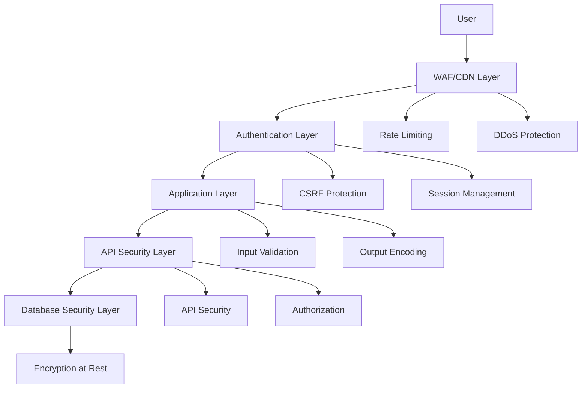

# Security and Compliance Guide

## Overview

This comprehensive guide covers security configurations, compliance procedures, audit frameworks, and incident response for the Energy Drink Calculator application. It ensures adherence to security best practices, regulatory compliance, and effective threat management.

## Table of Contents

1. [Security Architecture](#security-architecture)
2. [Security Configuration](#security-configuration)
3. [Compliance Framework](#compliance-framework)
4. [Audit Procedures](#audit-procedures)
5. [Incident Response](#incident-response)
6. [Security Monitoring](#security-monitoring)
7. [Data Protection](#data-protection)
8. [Access Control](#access-control)

## Security Architecture

### Security Layers



### Security Components

#### 1. Web Application Firewall (WAF)

```javascript
// Vercel WAF configuration
const wafRules = {
  // OWASP Top 10 protection
  rules: [
    {
      id: 'sqli-protection',
      name: 'SQL Injection Protection',
      pattern: /('|(\\x27)|(\\x3D)|(\\x3B)|(\\x00)|(\\x09)|(\\x0D)|(\\x0A))/i,
      action: 'block',
      description: 'Blocks common SQL injection patterns'
    },
    {
      id: 'xss-protection',
      name: 'Cross-Site Scripting Protection',
      pattern: /(script|javascript:|data:text\\/html|vbscript:)/i,
      action: 'block',
      description: 'Prevents XSS attacks'
    },
    {
      id: 'path-traversal',
      name: 'Path Traversal Protection',
      pattern: /(\\.\\.|\\.\\.\\/|\\.\\.\\\\)/i,
      action: 'block',
      description: 'Prevents directory traversal attacks'
    },
    {
      id: 'file-inclusion',
      name: 'Remote File Inclusion Protection',
      pattern: /(http:|https:|php:|file:|ftp:)/i,
      action: 'block',
      description: 'Prevents remote file inclusion'
    }
  ],
  
  // Custom business logic rules
  custom: [
    {
      id: 'age-verification',
      name: 'Age Verification Bypass Protection',
      condition: 'ageVerified == false && path matches "/(flavors|calculator|ingredients)"',
      action: 'redirect',
      redirect: '/age-verification',
      description: 'Ensures age verification for restricted content'
    },
    {
      id: 'api-rate-limit',
      name: 'API Rate Limiting',
      condition: 'rateLimitExceeded == true',
      action: 'rate-limit',
      limit: 100,
      window: 3600,
      description: 'Prevents API abuse'
    }
  ]
};

// Rate limiting configuration
const rateLimitConfig = {
  // API endpoint limits
  '/api/flavors': {
    windowMs: 60000, // 1 minute
    max: 60,         // 60 requests per minute
    message: 'Too many flavor requests, please try again later'
  },
  '/api/ingredients': {
    windowMs: 60000,
    max: 40,
    message: 'Too many ingredient requests, please try again later'
  },
  '/api/auth/verify-age': {
    windowMs: 300000, // 5 minutes
    max: 10,
    message: 'Too many age verification attempts'
  },
  
  // Global rate limiting
  global: {
    windowMs: 60000,
    max: 1000,
    skipSuccessfulRequests: true
  }
};
```

#### 2. Application Security

```javascript
// Security middleware configuration
import rateLimit from 'express-rate-limit';
import helmet from 'helmet';
import csrf from 'csurf';
import { body, validationResult } from 'express-validator';

const securityMiddleware = {
  // Helmet.js security headers
  helmet: helmet({
    contentSecurityPolicy: {
      directives: {
        defaultSrc: ["'self'"],
        styleSrc: ["'self'", "'unsafe-inline'"],
        scriptSrc: ["'self'"],
        imgSrc: ["'self'", "data:", "https:"],
        connectSrc: ["'self'", "https://api.vercel.com"],
        fontSrc: ["'self'"],
        objectSrc: ["'none'"],
        mediaSrc: ["'self'"],
        frameSrc: ["'none'"]
      }
    },
    hsts: {
      maxAge: 31536000,
      includeSubDomains: true,
      preload: true
    },
    xssFilter: true,
    noSniff: true,
    frameguard: 'deny'
  }),
  
  // Rate limiting
  rateLimiter: rateLimit({
    windowMs: 15 * 60 * 1000, // 15 minutes
    max: 100, // limit each IP to 100 requests per windowMs
    message: 'Too many requests from this IP, please try again later',
    standardHeaders: true,
    legacyHeaders: false
  }),
  
  // CSRF protection
  csrfProtection: csrf(),
  
  // Input validation
  validateInput: [
    body('birthYear').isInt({ min: 1900, max: new Date().getFullYear() }).withMessage('Invalid birth year'),
    body('email').isEmail().withMessage('Invalid email format'),
    body('id').isAlphanumeric().withMessage('Invalid ID format')
  ]
};
```

#### 3. Data Security

```javascript
// Encryption utilities
import crypto from 'crypto';

class SecurityManager {
  constructor() {
    this.algorithm = 'aes-256-gcm';
    this.encryptionKey = process.env.ENCRYPTION_KEY;
  }
  
  // Encrypt sensitive data
  encrypt(text) {
    const iv = crypto.randomBytes(12);
    const cipher = crypto.createCipher(this.algorithm, this.encryptionKey);
    cipher.setAAD(Buffer.from('additional-auth-data'));
    
    let encrypted = cipher.update(text, 'utf8', 'hex');
    encrypted += cipher.final('hex');
    
    const authTag = cipher.getAuthTag();
    
    return {
      iv: iv.toString('hex'),
      content: encrypted,
      authTag: authTag.toString('hex')
    };
  }
  
  // Decrypt sensitive data
  decrypt(encryptedData) {
    const decipher = crypto.createDecipher(this.algorithm, this.encryptionKey);
    decipher.setAAD(Buffer.from('additional-auth-data'));
    decipher.setAuthTag(Buffer.from(encryptedData.authTag, 'hex'));
    
    let decrypted = decipher.update(encryptedData.content, 'hex', 'utf8');
    decrypted += decipher.final('utf8');
    
    return decrypted;
  }
  
  // Generate secure random tokens
  generateSecureToken(length = 32) {
    return crypto.randomBytes(length).toString('hex');
  }
  
  // Hash passwords with salt
  hashPassword(password) {
    const salt = crypto.randomBytes(16).toString('hex');
    const hash = crypto.pbkdf2Sync(password, salt, 10000, 64, 'sha512').toString('hex');
    return { salt, hash };
  }
  
  // Verify password
  verifyPassword(password, hash, salt) {
    const verifyHash = crypto.pbkdf2Sync(password, salt, 10000, 64, 'sha512').toString('hex');
    return verifyHash === hash;
  }
}

// GDPR-compliant data handling
class GDPRManager {
  constructor() {
    this.dataRetentionPeriod = 7 * 365 * 24 * 60 * 60 * 1000; // 7 years in milliseconds
    this.anonymizationKey = process.env.GDPR_ANONYMIZATION_KEY;
  }
  
  // Anonymize personal data
  anonymizeUserData(userData) {
    return {
      ...userData,
      email: this.hashEmail(userData.email),
      ip: this.hashIP(userData.ip),
      name: null,
      address: null,
      phone: null,
      birthDate: null,
      consentTimestamp: userData.consentTimestamp,
      anonymized: true,
      anonymizationDate: new Date().toISOString()
    };
  }
  
  hashEmail(email) {
    return crypto.createHash('sha256').update(email + this.anonymizationKey).digest('hex');
  }
  
  hashIP(ip) {
    return crypto.createHash('sha256').update(ip + this.anonymizationKey).digest('hex');
  }
  
  // Data retention policy
  shouldRetainData(createdDate) {
    const age = Date.now() - new Date(createdDate).getTime();
    return age < this.dataRetentionPeriod;
  }
  
  // Process data subject requests
  async handleDataSubjectRequest(request) {
    const { type, userId, email } = request;
    
    switch (type) {
      case 'access':
        return await this.exportUserData(userId, email);
      case 'rectification':
        return await this.updateUserData(userId, request.data);
      case 'erasure':
        return await this.deleteUserData(userId, email);
      case 'portability':
        return await this.exportUserDataPortable(userId, email);
      default:
        throw new Error('Unknown data subject request type');
    }
  }
}
```

## Security Configuration

### SSL/TLS Configuration

```javascript
// SSL/TLS security configuration
const sslConfig = {
  // Minimum TLS version
  minVersion: 'TLSv1.2',
  
  // Preferred TLS versions
  preferredVersions: ['TLSv1.3', 'TLSv1.2'],
  
  // Cipher suites (only strong ciphers)
  cipherSuites: [
    'TLS_AES_256_GCM_SHA384',
    'TLS_CHACHA20_POLY1305_SHA256',
    'TLS_AES_128_GCM_SHA256',
    'ECDHE-RSA-AES256-GCM-SHA384',
    'ECDHE-RSA-AES128-GCM-SHA256'
  ],
  
  // HSTS configuration
  hsts: {
    maxAge: 31536000, // 1 year
    includeSubDomains: true,
    preload: true
  },
  
  // Certificate transparency
  certificateTransparency: true,
  
  // OCSP stapling
  ocspStapling: true
};

// Security headers configuration
const securityHeaders = {
  // Content Security Policy
  'Content-Security-Policy': "default-src 'self'; script-src 'self' 'unsafe-inline'; style-src 'self' 'unsafe-inline'; img-src 'self' data: https:; connect-src 'self' https:; font-src 'self'; object-src 'none'; media-src 'self'; frame-src 'none';",
  
  // HTTP Strict Transport Security
  'Strict-Transport-Security': 'max-age=31536000; includeSubDomains; preload',
  
  // X-Frame-Options
  'X-Frame-Options': 'DENY',
  
  // X-Content-Type-Options
  'X-Content-Type-Options': 'nosniff',
  
  // X-XSS-Protection
  'X-XSS-Protection': '1; mode=block',
  
  // Referrer Policy
  'Referrer-Policy': 'strict-origin-when-cross-origin',
  
  // Permissions Policy
  'Permissions-Policy': 'camera=(), microphone=(), geolocation=(), payment=()',
  
  // Cross-Origin Embedder Policy
  'Cross-Origin-Embedder-Policy': 'require-corp',
  
  // Cross-Origin Opener Policy
  'Cross-Origin-Opener-Policy': 'same-origin',
  
  // Cross-Origin Resource Policy
  'Cross-Origin-Resource-Policy': 'same-origin'
};
```

### Authentication and Authorization

```javascript
// JWT-based authentication
import jwt from 'jsonwebtoken';
import bcrypt from 'bcryptjs';

class AuthenticationManager {
  constructor() {
    this.jwtSecret = process.env.JWT_SECRET;
    this.jwtExpiry = '24h';
    this.refreshTokenExpiry = '7d';
  }
  
  // Generate JWT tokens
  generateTokens(userId, role = 'user') {
    const accessToken = jwt.sign(
      { userId, role },
      this.jwtSecret,
      { expiresIn: this.jwtExpiry }
    );
    
    const refreshToken = jwt.sign(
      { userId, type: 'refresh' },
      this.jwtSecret,
      { expiresIn: this.refreshTokenExpiry }
    );
    
    return { accessToken, refreshToken };
  }
  
  // Verify JWT token
  verifyToken(token) {
    try {
      return jwt.verify(token, this.jwtSecret);
    } catch (error) {
      throw new Error('Invalid token');
    }
  }
  
  // Refresh access token
  async refreshAccessToken(refreshToken) {
    const decoded = this.verifyToken(refreshToken);
    
    if (decoded.type !== 'refresh') {
      throw new Error('Invalid refresh token');
    }
    
    return this.generateTokens(decoded.userId);
  }
}

// Role-based access control
class AuthorizationManager {
  constructor() {
    this.roles = {
      user: ['read:own-data', 'update:own-data'],
      moderator: ['read:all-data', 'moderate:content'],
      admin: ['read:all-data', 'write:all-data', 'delete:all-data', 'manage:users'],
      super_admin: ['*'] // All permissions
    };
  }
  
  // Check if user has permission
  hasPermission(userRole, requiredPermission) {
    if (!userRole || !this.roles[userRole]) {
      return false;
    }
    
    const rolePermissions = this.roles[userRole];
    
    // Check for wildcard permission
    if (rolePermissions.includes('*')) {
      return true;
    }
    
    // Check for exact permission
    if (rolePermissions.includes(requiredPermission)) {
      return true;
    }
    
    // Check for pattern-based permission
    const [requiredResource, requiredAction] = requiredPermission.split(':');
    
    return rolePermissions.some(permission => {
      const [resource, action] = permission.split(':');
      
      // Check for resource wildcard
      if (resource === '*') {
        return action === requiredAction || action === '*';
      }
      
      // Check for action wildcard
      if (action === '*') {
        return resource === requiredResource || resource === '*';
      }
      
      return resource === requiredResource && action === requiredAction;
    });
  }
  
  // Middleware for permission checking
  requirePermission(permission) {
    return (req, res, next) => {
      const user = req.user;
      
      if (!user || !this.hasPermission(user.role, permission)) {
        return res.status(403).json({
          error: 'Insufficient permissions',
          code: 'INSUFFICIENT_PERMISSIONS'
        });
      }
      
      next();
    };
  }
}
```

## Compliance Framework

### GDPR Compliance

```javascript
// GDPR compliance implementation
class GDPRCompliance {
  constructor() {
    this.consentTypes = {
      analytics: 'cookie_consent_analytics',
      marketing: 'cookie_consent_marketing',
      functional: 'cookie_consent_functional',
      necessary: 'cookie_consent_necessary'
    };
    
    this.dataCategories = {
      personal: ['email', 'name', 'address', 'phone', 'birthDate'],
      behavioral: ['pageViews', 'clicks', 'sessionDuration'],
      technical: ['ipAddress', 'userAgent', 'deviceInfo'],
      consent: ['consentTimestamp', 'consentVersion', 'consentSource']
    };
  }
  
  // Consent management
  async recordConsent(userId, consentData) {
    const consent = {
      userId,
      timestamp: new Date().toISOString(),
      version: '1.0',
      source: consentData.source,
      consents: this.validateConsents(consentData.consents),
      ipAddress: consentData.ipAddress,
      userAgent: consentData.userAgent
    };
    
    // Store consent record
    await this.storeConsentRecord(consent);
    
    // Update user consent status
    await this.updateUserConsent(userId, consent);
    
    return consent;
  }
  
  validateConsents(consents) {
    const validated = {};
    
    for (const [type, granted] of Object.entries(consents)) {
      if (this.consentTypes[type]) {
        validated[this.consentTypes[type]] = Boolean(granted);
      }
    }
    
    // Necessary cookies are always granted
    validated[this.consentTypes.necessary] = true;
    
    return validated;
  }
  
  // Data subject rights
  async handleDataSubjectRequest(request) {
    const { type, userId, email } = request;
    
    switch (type) {
      case 'access':
        return await this.exportPersonalData(userId, email);
      case 'rectification':
        return await this.rectifyPersonalData(request);
      case 'erasure':
        return await this.erasePersonalData(userId, email);
      case 'portability':
        return await this.exportPersonalDataPortable(userId, email);
      case 'restriction':
        return await this.restrictProcessing(userId, email);
      case 'objection':
        return await this.processObjection(userId, email);
      default:
        throw new Error('Unsupported data subject request');
    }
  }
  
  // Export personal data
  async exportPersonalData(userId, email) {
    const userData = await this.getUserData(userId, email);
    const consentData = await this.getConsentData(userId);
    const activityData = await this.getActivityData(userId);
    
    return {
      exportDate: new Date().toISOString(),
      data: {
        personal: userData,
        consent: consentData,
        activity: activityData
      },
      metadata: {
        exportVersion: '1.0',
        dataCategories: this.dataCategories,
        retentionPolicy: '7 years from collection'
      }
    };
  }
  
  // Data retention management
  async manageDataRetention() {
    const cutoffDate = new Date(Date.now() - (7 * 365 * 24 * 60 * 60 * 1000));
    
    // Find data older than retention period
    const expiredData = await this.findExpiredData(cutoffDate);
    
    // Anonymize or delete according to retention policy
    for (const record of expiredData) {
      if (record.type === 'analytics') {
        await this.anonymizeRecord(record);
      } else if (record.type === 'personal') {
        await this.deleteRecord(record);
      }
    }
    
    return {
      processedRecords: expiredData.length,
      anonymized: expiredData.filter(r => r.type === 'analytics').length,
      deleted: expiredData.filter(r => r.type === 'personal').length
    };
  }
}
```

### Data Protection

```javascript
// Comprehensive data protection
class DataProtectionManager {
  constructor() {
    this.encryptionConfig = {
      algorithm: 'aes-256-gcm',
      keyDerivation: 'pbkdf2',
      iterations: 10000
    };
    
    this.piiFields = [
      'email', 'name', 'address', 'phone', 'birthDate',
      'ipAddress', 'userAgent', 'location'
    ];
  }
  
  // Classify data sensitivity
  classifyData(data) {
    const classification = {
      public: [],
      internal: [],
      confidential: [],
      restricted: []
    };
    
    for (const [field, value] of Object.entries(data)) {
      if (this.piiFields.includes(field)) {
        classification.restricted.push(field);
      } else if (field.includes('internal') || field.includes('config')) {
        classification.confidential.push(field);
      } else if (field.includes('public') || field.includes('general')) {
        classification.public.push(field);
      } else {
        classification.internal.push(field);
      }
    }
    
    return classification;
  }
  
  // Apply data protection measures
  protectData(data, classification) {
    const protectedData = { ...data };
    
    // Encrypt restricted data
    classification.restricted.forEach(field => {
      if (protectedData[field]) {
        protectedData[field] = this.encryptField(protectedData[field]);
      }
    });
    
    // Mask confidential data
    classification.confidential.forEach(field => {
      if (protectedData[field]) {
        protectedData[field] = this.maskField(protectedData[field]);
      }
    });
    
    return protectedData;
  }
  
  // Data loss prevention
  async scanForSensitiveData(data) {
    const sensitivePatterns = {
      email: /\b[A-Za-z0-9._%+-]+@[A-Za-z0-9.-]+\.[A-Z|a-z]{2,}\b/g,
      phone: /\b\d{3}[-.]?\d{3}[-.]?\d{4}\b/g,
      ssn: /\b\d{3}-\d{2}-\d{4}\b/g,
      creditCard: /\b\d{4}[- ]?\d{4}[- ]?\d{4}[- ]?\d{4}\b/g
    };
    
    const findings = [];
    
    for (const [type, pattern] of Object.entries(sensitivePatterns)) {
      const matches = JSON.stringify(data).match(pattern);
      if (matches) {
        findings.push({
          type,
          count: matches.length,
          severity: 'high',
          description: `Potential ${type} detected in data`
        });
      }
    }
    
    return findings;
  }
}
```

## Audit Procedures

### Security Auditing

```bash
#!/bin/bash
# Comprehensive security audit script

AUDIT_DATE=$(date +%Y%m%d_%H%M%S)
AUDIT_DIR="./security-audits/$AUDIT_DATE"
REPORT_FILE="$AUDIT_DIR/security-audit-report.md"

mkdir -p "$AUDIT_DIR"

echo "Starting comprehensive security audit..."

# 1. Dependency vulnerability scan
echo "Scanning for vulnerabilities..."
npm audit --json > "$AUDIT_DIR/npm-audit.json"
VULNERABILITIES=$(jq '.metadata.vulnerabilities.total' "$AUDIT_DIR/npm-audit.json")

# 2. Static code security analysis
echo "Running static code analysis..."
npm run security:lint > "$AUDIT_DIR/static-analysis.json"

# 3. Container security scan (if applicable)
if [ -f "Dockerfile" ]; then
    echo "Scanning container configuration..."
    docker run --rm -v $(pwd):/app aquasec/trivy fs /app > "$AUDIT_DIR/container-scan.json"
fi

# 4. Infrastructure security check
echo "Checking infrastructure security..."
curl -s -I https://app.energydrink.app | grep -E "(Strict-Transport|X-Content-Type|X-Frame)" > "$AUDIT_DIR/security-headers.txt"

# 5. SSL/TLS configuration audit
echo "Auditing SSL/TLS configuration..."
testssl.sh --jsonfile-pretty "$AUDIT_DIR/ssl-audit.json" app.energydrink.app

# 6. Access control audit
echo "Auditing access controls..."
vercel teams list > "$AUDIT_DIR/access-control.txt"

# 7. Generate comprehensive report
cat > "$REPORT_FILE" << EOF
# Security Audit Report
**Date**: $AUDIT_DATE
**Auditor**: Security Team
**Scope**: Full application security assessment

## Executive Summary
- **Vulnerabilities Found**: $VULNERABILITIES
- **Critical Issues**: $(jq '.metadata.vulnerabilities.critical // 0' "$AUDIT_DIR/npm-audit.json")
- **High Priority Issues**: $(jq '.metadata.vulnerabilities.high // 0' "$AUDIT_DIR/npm-audit.json")
- **SSL Rating**: [To be filled from SSL audit]

## Detailed Findings

### Dependency Vulnerabilities
$(jq -r '.vulnerabilities | to_entries[] | "- \(.key): \(.value.severity) - \(.value.title)"' "$AUDIT_DIR/npm-audit.json" || echo "No vulnerabilities found")

### Security Headers Assessment
$(cat "$AUDIT_DIR/security-headers.txt")

### SSL/TLS Configuration
$(jq -r '.scanDetails[]? | "- \(.id): \(.finding)"' "$AUDIT_DIR/ssl-audit.json" || echo "SSL audit completed")

### Access Control Review
$(cat "$AUDIT_DIR/access-control.txt")

## Compliance Status
- **GDPR**: [Status]
- **SOC 2**: [Status]
- **ISO 27001**: [Status]

## Recommendations
1. **Critical**: Address all critical and high severity vulnerabilities
2. **High**: Implement additional security monitoring
3. **Medium**: Enhance security awareness training
4. **Low**: Optimize security configurations

---
*Report generated on $(date)*
EOF

echo "Security audit completed. Report: $REPORT_FILE"
```

### Compliance Monitoring

```javascript
// Compliance monitoring system
class ComplianceMonitor {
  constructor() {
    this.frameworks = {
      gdpr: new GDPRComplianceFramework(),
      soc2: new SOC2ComplianceFramework(),
      iso27001: new ISO27001ComplianceFramework()
    };
    
    this.monitoringRules = [
      {
        framework: 'gdpr',
        rule: 'consent_recording',
        check: this.checkConsentRecording,
        frequency: 'daily',
        severity: 'high'
      },
      {
        framework: 'gdpr',
        rule: 'data_retention',
        check: this.checkDataRetention,
        frequency: 'weekly',
        severity: 'medium'
      },
      {
        framework: 'soc2',
        rule: 'access_controls',
        check: this.checkAccessControls,
        frequency: 'daily',
        severity: 'high'
      },
      {
        framework: 'iso27001',
        rule: 'incident_response',
        check: this.checkIncidentResponse,
        frequency: 'monthly',
        severity: 'medium'
      }
    ];
  }
  
  async runComplianceChecks() {
    const results = [];
    
    for (const rule of this.monitoringRules) {
      try {
        const result = await rule.check();
        results.push({
          framework: rule.framework,
          rule: rule.rule,
          status: result.status,
          findings: result.findings,
          severity: rule.severity,
          timestamp: new Date().toISOString()
        });
      } catch (error) {
        results.push({
          framework: rule.framework,
          rule: rule.rule,
          status: 'error',
          error: error.message,
          severity: rule.severity,
          timestamp: new Date().toISOString()
        });
      }
    }
    
    return this.generateComplianceReport(results);
  }
  
  async checkConsentRecording() {
    const recentConsents = await this.getRecentConsents();
    const missingConsents = recentConsents.filter(consent => !consent.isRecorded);
    
    return {
      status: missingConsents.length === 0 ? 'pass' : 'fail',
      findings: missingConsents.length > 0 ? [`${missingConsents.length} consents not properly recorded`] : []
    };
  }
  
  async checkDataRetention() {
    const expiredData = await this.findExpiredData();
    
    return {
      status: expiredData.length === 0 ? 'pass' : 'fail',
      findings: expiredData.length > 0 ? [`${expiredData.length} records past retention period`] : []
    };
  }
  
  async checkAccessControls() {
    const accessLogs = await this.getAccessLogs();
    const unauthorizedAttempts = accessLogs.filter(log => !log.isAuthorized);
    
    return {
      status: unauthorizedAttempts.length === 0 ? 'pass' : 'fail',
      findings: unauthorizedAttempts.length > 0 ? [`${unauthorizedAttempts.length} unauthorized access attempts`] : []
    };
  }
  
  generateComplianceReport(results) {
    const frameworkScores = {};
    
    for (const result of results) {
      if (!frameworkScores[result.framework]) {
        frameworkScores[result.framework] = { pass: 0, fail: 0, total: 0 };
      }
      
      frameworkScores[result.framework].total++;
      if (result.status === 'pass') {
        frameworkScores[result.framework].pass++;
      } else {
        frameworkScores[result.framework].fail++;
      }
    }
    
    return {
      timestamp: new Date().toISOString(),
      summary: {
        totalChecks: results.length,
        passed: results.filter(r => r.status === 'pass').length,
        failed: results.filter(r => r.status === 'fail').length,
        errors: results.filter(r => r.status === 'error').length
      },
      frameworkScores,
      detailedResults: results,
      recommendations: this.generateRecommendations(results)
    };
  }
}
```

## Incident Response

### Security Incident Response

```javascript
// Security incident response system
class SecurityIncidentResponse {
  constructor() {
    this.incidentTypes = {
      data_breach: {
        severity: 'critical',
        responseTime: 15, // minutes
        escalation: ['ciso', 'legal', 'compliance']
      },
      unauthorized_access: {
        severity: 'high',
        responseTime: 30,
        escalation: ['security_team', 'it_ops']
      },
      malware_detection: {
        severity: 'high',
        responseTime: 15,
        escalation: ['security_team', 'it_ops']
      },
      ddos_attack: {
        severity: 'medium',
        responseTime: 60,
        escalation: ['it_ops']
      },
      vulnerability_exploitation: {
        severity: 'high',
        responseTime: 30,
        escalation: ['security_team', 'development']
      }
    };
    
    this.responseTeam = {
      primary: 'security@energydrink.app',
      secondary: 'it-ops@energydrink.app',
      escalation: 'management@energydrink.app'
    };
  }
  
  async respondToIncident(incident) {
    const incidentRecord = {
      id: this.generateIncidentId(),
      type: incident.type,
      severity: this.incidentTypes[incident.type].severity,
      timestamp: new Date().toISOString(),
      reporter: incident.reporter,
      description: incident.description,
      affectedSystems: incident.affectedSystems,
      status: 'active',
      timeline: [{
        timestamp: new Date().toISOString(),
        action: 'incident_created',
        details: `Incident reported by ${incident.reporter}`
      }]
    };
    
    // Immediate response actions
    await this.executeImmediateResponse(incidentRecord);
    
    // Notify response team
    await this.notifyResponseTeam(incidentRecord);
    
    // Start investigation
    await this.startInvestigation(incidentRecord);
    
    return incidentRecord;
  }
  
  async executeImmediateResponse(incident) {
    const responseConfig = this.incidentTypes[incident.type];
    
    // Log immediate response
    incident.timeline.push({
      timestamp: new Date().toISOString(),
      action: 'immediate_response_started',
      details: `Initiating ${responseConfig.severity} severity response`
    });
    
    switch (incident.type) {
      case 'data_breach':
        await this.containDataBreach(incident);
        break;
      case 'unauthorized_access':
        await this.containUnauthorizedAccess(incident);
        break;
      case 'malware_detection':
        await this.containMalware(incident);
        break;
      case 'ddos_attack':
        await this.containDDoS(incident);
        break;
    }
  }
  
  async containDataBreach(incident) {
    // 1. Isolate affected systems
    await this.isolateAffectedSystems(incident.affectedSystems);
    
    // 2. Preserve evidence
    await this.preserveEvidence(incident);
    
    // 3. Assess scope
    await this.assessBreachScope(incident);
    
    // 4. Notify authorities if required
    if (incident.severity === 'critical') {
      await this.notifyDataProtectionAuthorities(incident);
    }
  }
  
  async notifyResponseTeam(incident) {
    const config = this.incidentTypes[incident.type];
    const notification = {
      subject: `[${incident.severity.toUpperCase()}] Security Incident: ${incident.type}`,
      priority: incident.severity === 'critical' ? 'urgent' : 'high',
      body: this.generateIncidentNotification(incident),
      recipients: this.getNotificationRecipients(config.escalation)
    };
    
    // Send notifications
    await Promise.all([
      this.sendEmailNotification(notification),
      this.sendSlackNotification(incident),
      this.createIncidentTicket(incident)
    ]);
    
    incident.timeline.push({
      timestamp: new Date().toISOString(),
      action: 'response_team_notified',
      details: `Notifications sent to ${notification.recipients.join(', ')}`
    });
  }
  
  generateIncidentNotification(incident) {
    return `
      SECURITY INCIDENT ALERT
      
      Incident ID: ${incident.id}
      Type: ${incident.type}
      Severity: ${incident.severity.toUpperCase()}
      Time: ${incident.timestamp}
      Reporter: ${incident.reporter}
      
      Description:
      ${incident.description}
      
      Affected Systems:
      ${incident.affectedSystems.join(', ')}
      
      Immediate Actions Required:
      ${this.getImmediateActions(incident.type)}
      
      Response Team Contact:
      Primary: ${this.responseTeam.primary}
      Secondary: ${this.responseTeam.secondary}
      
      This is an automated security incident notification.
    `;
  }
}
```

### Forensics and Evidence Preservation

```javascript
// Digital forensics and evidence preservation
class DigitalForensics {
  constructor() {
    this.evidenceTypes = {
      logs: ['application', 'access', 'error', 'security'],
      network: ['traffic', 'packets', 'connections'],
      system: ['memory', 'disk', 'processes'],
      application: ['database', 'files', 'configurations']
    };
  }
  
  async preserveEvidence(incident) {
    const evidenceCollection = {
      incidentId: incident.id,
      collectionDate: new Date().toISOString(),
      collector: 'automated-system',
      items: []
    };
    
    // Collect system logs
    const systemLogs = await this.collectSystemLogs();
    evidenceCollection.items.push({
      type: 'logs',
      source: 'system',
      data: systemLogs,
      hash: this.calculateHash(systemLogs)
    });
    
    // Collect application logs
    const appLogs = await this.collectApplicationLogs();
    evidenceCollection.items.push({
      type: 'logs',
      source: 'application',
      data: appLogs,
      hash: this.calculateHash(appLogs)
    });
    
    // Collect network traffic (if applicable)
    if (incident.type === 'ddos_attack' || incident.type === 'unauthorized_access') {
      const networkTraffic = await this.collectNetworkTraffic();
      evidenceCollection.items.push({
        type: 'network',
        source: 'traffic',
        data: networkTraffic,
        hash: this.calculateHash(networkTraffic)
      });
    }
    
    // Preserve database state
    const dbState = await this.captureDatabaseState();
    evidenceCollection.items.push({
      type: 'database',
      source: 'application',
      data: dbState,
      hash: this.calculateHash(dbState)
    });
    
    // Create evidence package
    const evidencePackage = await this.createEvidencePackage(evidenceCollection);
    
    // Store in secure evidence repository
    await this.storeEvidence(evidencePackage);
    
    return evidencePackage;
  }
  
  async collectSystemLogs() {
    // Collect system logs relevant to the incident
    return {
      timestamp: new Date().toISOString(),
      system: {
        uptime: await this.getSystemUptime(),
        processes: await this.getRunningProcesses(),
        network: await this.getNetworkConnections(),
        disk: await this.getDiskUsage()
      },
      security: {
        failed_logins: await this.getFailedLogins(),
        sudo_attempts: await this.getSudoAttempts(),
        firewall: await this.getFirewallLogs()
      }
    };
  }
  
  async createEvidencePackage(evidenceCollection) {
    const packageId = `evidence-${evidenceCollection.incidentId}-${Date.now()}`;
    
    return {
      id: packageId,
      incidentId: evidenceCollection.incidentId,
      createdAt: evidenceCollection.collectionDate,
      collector: evidenceCollection.collector,
      chainOfCustody: [{
        timestamp: evidenceCollection.collectionDate,
        action: 'collected',
        person: 'automated-system',
        details: 'Initial evidence collection'
      }],
      items: evidenceCollection.items,
      integrity: {
        algorithm: 'SHA-256',
        packageHash: this.calculateHash(JSON.stringify(evidenceCollection.items)),
        itemsHash: evidenceCollection.items.map(item => item.hash)
      }
    };
  }
}
```

## Security Monitoring

### Real-time Security Monitoring

```javascript
// Real-time security monitoring system
class SecurityMonitor {
  constructor() {
    this.alertRules = [
      {
        name: 'Multiple Failed Login Attempts',
        condition: (events) => {
          const failedLogins = events.filter(e => e.type === 'login_failed');
          return failedLogins.length >= 5 && failedLogins.length < 10;
        },
        severity: 'warning',
        action: 'notify_security_team'
      },
      {
        name: 'Brute Force Attack Detected',
        condition: (events) => {
          const failedLogins = events.filter(e => e.type === 'login_failed');
          return failedLogins.length >= 10;
        },
        severity: 'critical',
        action: 'block_ip'
      },
      {
        name: 'Suspicious API Usage',
        condition: (events) => {
          const apiCalls = events.filter(e => e.type === 'api_call');
          const uniqueIPs = new Set(apiCalls.map(e => e.ip));
          const callsPerIP = apiCalls.length / uniqueIPs.size;
          return callsPerIP > 100; // More than 100 calls per IP
        },
        severity: 'warning',
        action: 'rate_limit'
      },
      {
        name: 'Data Exfiltration Attempt',
        condition: (events) => {
          const dataExports = events.filter(e => e.type === 'data_export');
          return dataExports.some(e => e.size > 10 * 1024 * 1024); // > 10MB
        },
        severity: 'critical',
        action: 'block_and_notify'
      }
    ];
    
    this.monitoringInterval = 5000; // 5 seconds
    this.eventBuffer = [];
    this.alertHistory = new Map();
  }
  
  startMonitoring() {
    setInterval(() => {
      this.processEvents();
    }, this.monitoringInterval);
  }
  
  recordSecurityEvent(event) {
    const securityEvent = {
      ...event,
      timestamp: new Date().toISOString(),
      id: this.generateEventId()
    };
    
    this.eventBuffer.push(securityEvent);
    
    // Keep only recent events (last 5 minutes)
    const cutoff = Date.now() - (5 * 60 * 1000);
    this.eventBuffer = this.eventBuffer.filter(e => 
      new Date(e.timestamp).getTime() > cutoff
    );
  }
  
  processEvents() {
    if (this.eventBuffer.length === 0) return;
    
    for (const rule of this.alertRules) {
      try {
        if (rule.condition(this.eventBuffer)) {
          this.triggerAlert(rule, this.eventBuffer);
        }
      } catch (error) {
        console.error(`Error evaluating alert rule ${rule.name}:`, error);
      }
    }
  }
  
  triggerAlert(rule, events) {
    const alert = {
      id: this.generateAlertId(),
      rule: rule.name,
      severity: rule.severity,
      timestamp: new Date().toISOString(),
      events: events.slice(-10), // Last 10 relevant events
      status: 'active'
    };
    
    // Check if similar alert was recently triggered
    const lastAlert = this.alertHistory.get(rule.name);
    const now = Date.now();
    
    if (lastAlert && (now - lastAlert) < 60000) { // 1 minute cooldown
      return; // Don't spam alerts
    }
    
    // Execute alert action
    this.executeAlertAction(rule.action, alert);
    
    // Record alert history
    this.alertHistory.set(rule.name, now);
    
    // Store alert
    this.storeAlert(alert);
  }
  
  async executeAlertAction(action, alert) {
    switch (action) {
      case 'notify_security_team':
        await this.notifySecurityTeam(alert);
        break;
      case 'block_ip':
        await this.blockSuspiciousIPs(alert);
        break;
      case 'rate_limit':
        await this.applyRateLimiting(alert);
        break;
      case 'block_and_notify':
        await this.blockSuspiciousIPs(alert);
        await this.notifySecurityTeam(alert);
        break;
    }
  }
  
  async notifySecurityTeam(alert) {
    const notification = {
      subject: `[${alert.severity.toUpperCase()}] Security Alert: ${alert.rule}`,
      priority: alert.severity === 'critical' ? 'urgent' : 'high',
      body: this.generateAlertNotification(alert)
    };
    
    await Promise.all([
      this.sendEmail(notification),
      this.sendSlack(alert),
      this.createSecurityTicket(alert)
    ]);
  }
  
  async blockSuspiciousIPs(alert) {
    // Extract suspicious IPs from events
    const suspiciousIPs = [...new Set(
      alert.events.map(e => e.ip).filter(ip => ip)
    )];
    
    for (const ip of suspiciousIPs) {
      await this.addToBlocklist(ip, alert.id);
    }
  }
}
```

This comprehensive security and compliance guide provides the framework for maintaining strong security posture, regulatory compliance, and effective incident response capabilities for the Energy Drink Calculator application.