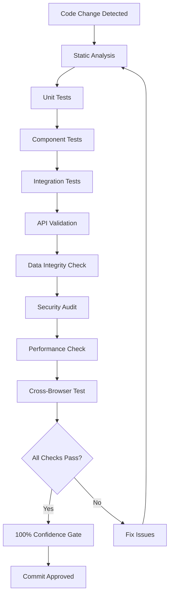

# Comprehensive Validation Workflow Architecture

## Overview

This document outlines a systematic validation workflow architecture for the Energy Drink Calculator App, designed to handle extensive modifications across configuration files, API routes, components, data files, and library functions. The framework provides clear checkpoints, validation criteria, and decision gates for confident version control commits.

## Table of Contents

- [Architecture Principles](#architecture-principles)
- [Validation Framework Structure](#validation-framework-structure)
- [Component-Specific Testing Protocols](#component-specific-testing-protocols)
- [Validation Checkpoints](#validation-checkpoints)
- [Backward Compatibility Procedures](#backward-compatibility-procedures)
- [Documentation Templates](#documentation-templates)
- [Rollback Procedures](#rollback-procedocols)
- [Integration Testing Strategy](#integration-testing-strategy)
- [Feature-Specific Validation Checklists](#feature-specific-validation-checklists)

## Architecture Principles

### 1. Layered Validation Approach
```
┌─────────────────────────────────────┐
│     100% Confidence Gate            │ ← Final commit approval
├─────────────────────────────────────┤
│     Integration Testing            │ ← System-wide validation
├─────────────────────────────────────┤
│     Component Integration Tests     │ ← Cross-component validation
├─────────────────────────────────────┤
│     Unit & Component Tests         │ ← Individual component validation
├─────────────────────────────────────┤
│     Static Analysis & Linting      │ ← Code quality checks
└─────────────────────────────────────┘
```

### 2. Risk-Based Validation
- **Critical Systems** (Safety, Security, Data): 100% validation coverage
- **Core Features** (Calculator, API routes): 95% validation coverage  
- **Enhancement Features** (Analytics, UI): 85% validation coverage
- **Utility Functions**: 80% validation coverage

### 3. Systematic Checkpoint Design
- **Checkpoint 1**: Static Analysis & Security Validation
- **Checkpoint 2**: Unit & Component Testing
- **Checkpoint 3**: Component Integration Testing
- **Checkpoint 4**: API Endpoint Validation
- **Checkpoint 5**: Data Integrity Verification
- **Checkpoint 6**: Cross-Browser Compatibility
- **Checkpoint 7**: Performance & Security Audit
- **Checkpoint 8**: Final Integration Testing

## Validation Framework Structure

### File Classification Matrix

| Category | Risk Level | Validation Depth | Rollback Complexity |
|----------|------------|------------------|-------------------|
| Configuration Files | Critical | 100% | High |
| API Routes | Critical | 100% | Medium |
| Safety Components | Critical | 100% | Low |
| Data Files | High | 95% | Low |
| Library Functions | High | 90% | Medium |
| UI Components | Medium | 85% | Low |
| Analytics Code | Medium | 80% | Low |

### Validation Workflow States



## Component-Specific Testing Protocols

### 1. Configuration Files Validation

#### .eslintrc.json, next.config.ts, package.json
**Validation Steps:**
```bash
# Syntax validation
npm run lint --fix
npx next config validate

# Security scanning
npm run security:audit
npm run security:snyk

# Dependency analysis
npm audit
npm outdated

# Type checking
npx tsc --noEmit
```

**Validation Criteria:**
- ✅ No syntax errors or warnings
- ✅ Security audit passes (no high/critical vulnerabilities)
- ✅ All dependencies are current or acceptable versions
- ✅ TypeScript compilation successful
- ✅ ESLint passes with no errors

**Rollback Procedure:**
```bash
# Revert configuration changes
git checkout HEAD -- .eslintrc.json next.config.ts package.json

# Restore dependency tree
npm install

# Verify system stability
npm run build
npm run test
```

### 2. API Routes Validation

#### Flavors, Ingredients, Suppliers, Calculator APIs
**Validation Steps:**
```bash
# API route testing
npm run test -- --testPathPattern=api
npm run test:e2e -- --grep="API"

# Performance testing
npm run test:performance

# Security validation
npm run security:validate
```

**Validation Criteria:**
- ✅ All API endpoints respond correctly
- ✅ Response times < 200ms for 95th percentile
- ✅ Error handling works as expected
- ✅ Rate limiting functions properly
- ✅ CSRF protection active
- ✅ Input validation passes

**API Testing Template:**
```typescript
// test/api/{route}.test.ts
describe('{Route} API Validation', () => {
  test('should return expected response structure', async () => {
    const response = await fetch('/api/{route}');
    expect(response.status).toBe(200);
    const data = await response.json();
    expect(data).toMatchSnapshot();
  });

  test('should handle errors gracefully', async () => {
    const response = await fetch('/api/{route}', {
      method: 'POST',
      body: 'invalid-data'
    });
    expect(response.status).toBe(400);
  });

  test('should respect rate limits', async () => {
    const requests = Array(100).fill(null).map(() => 
      fetch('/api/{route}')
    );
    const responses = await Promise.all(requests);
    const rateLimited = responses.filter(r => r.status === 429);
    expect(rateLimited.length).toBeGreaterThan(0);
  });
});
```

### 3. Component Validation

#### Error Boundary, Layout, Optimized Image Components
**Validation Steps:**
```bash
# Component testing
npm run test -- --testPathPattern=components
npm run test:accessibility

# Visual regression testing
npm run test:visual

# Performance testing
npm run test:lighthouse
```

**Validation Criteria:**
- ✅ Component renders without errors
- ✅ Accessibility compliance (WCAG 2.1 AA)
- ✅ Mobile responsiveness verified
- ✅ Error boundaries catch and handle errors
- ✅ Performance metrics meet budgets

**Component Testing Template:**
```typescript
// test/components/{Component}.test.tsx
import { render, screen, fireEvent } from '@testing-library/react';
import { {Component} } from '@/components/{Component}';

describe('{Component} Validation', () => {
  test('renders correctly with valid props', () => {
    render(<{Component} {...validProps} />);
    expect(screen.getByTestId('component-root')).toBeInTheDocument();
  });

  test('handles errors gracefully', () => {
    const consoleSpy = jest.spyOn(console, 'error').mockImplementation();
    render(<{Component} {...invalidProps} />);
    expect(consoleSpy).not.toHaveBeenCalled();
    consoleSpy.mockRestore();
  });

  test('meets accessibility standards', async () => {
    const { container } = render(<{Component} {...props} />);
    const results = await axe(container);
    expect(results).toHaveNoViolations();
  });
});
```

### 4. Data Files Validation

#### Flavor JSON Files
**Validation Steps:**
```bash
# Data integrity validation
npm run validate-data

# Schema validation
node scripts/validate-json-schema.js

# Safety limit verification
npm run safety:validate
```

**Validation Criteria:**
- ✅ All required fields present
- ✅ Data types match specifications
- ✅ Safety limits within acceptable ranges
- ✅ No circular references
- ✅ UTF-8 encoding valid

**Data Validation Script:**
```javascript
// scripts/validate-data.js
const fs = require('fs');
const path = require('path');

function validateFlavorData() {
  const flavorsDir = path.join(__dirname, '../src/data/flavors');
  const files = fs.readdirSync(flavorsDir).filter(f => f.endsWith('.json'));
  
  files.forEach(file => {
    const content = JSON.parse(fs.readFileSync(path.join(flavorsDir, file)));
    
    // Validate required fields
    const required = ['id', 'name', 'ingredients', 'safetyChecks'];
    required.forEach(field => {
      if (!content[field]) {
        throw new Error(`Missing required field: ${field} in ${file}`);
      }
    });
    
    // Validate safety constraints
    if (content.caffeineContent && content.caffeineContent > 400) {
      throw new Error(`Caffeine content exceeds limit in ${file}`);
    }
  });
}
```

### 5. Library Functions Validation

#### Analytics, Cache, Config, CSRF, GDPR, Logger, Safety Services
**Validation Steps:**
```bash
# Library testing
npm run test -- --testPathPattern=lib

# Integration testing
npm run test:integration

# Performance profiling
npm run test:performance:lib
```

**Validation Criteria:**
- ✅ All functions export correctly
- ✅ Error handling robust
- ✅ Performance meets targets
- ✅ GDPR compliance verified
- ✅ Security measures active

## Validation Checkpoints

### Checkpoint 1: Static Analysis & Security Validation
**Trigger:** On every code change
**Duration:** 2-3 minutes
**Automation:** Pre-commit hook

```bash
# Static analysis
npm run lint
npx tsc --noEmit
npm run security:audit

# Security scanning
npm run security:snyk
npm run security:validate

# Quality gates
if [ $EXIT_CODE -ne 0 ]; then
  echo "Static analysis failed. Commit blocked."
  exit 1
fi
```

**Success Criteria:**
- No ESLint errors or warnings
- TypeScript compilation successful
- Security audit clean (no high/critical issues)
- All quality gates passed

### Checkpoint 2: Unit & Component Testing
**Trigger:** After static analysis passes
**Duration:** 5-10 minutes
**Automation:** CI pipeline

```bash
# Unit tests
npm run test:unit

# Component tests
npm run test:components

# Coverage verification
npm run test:coverage
```

**Success Criteria:**
- All tests pass (100% for critical components)
- Code coverage > 85% overall
- No test timeouts
- Memory leaks detected and fixed

### Checkpoint 3: Component Integration Testing
**Trigger:** After unit tests pass
**Duration:** 10-15 minutes
**Automation:** CI pipeline

```bash
# Integration tests
npm run test:integration

# Cross-component validation
npm run test:component-integration
```

**Success Criteria:**
- All integration tests pass
- Component interactions work correctly
- State management functions properly
- No integration regressions

### Checkpoint 4: API Endpoint Validation
**Trigger:** After integration tests pass
**Duration:** 5-8 minutes
**Automation:** CI pipeline

```bash
# API testing
npm run test:api

# Performance testing
npm run test:api:performance

# Security testing
npm run test:api:security
```

**Success Criteria:**
- All API endpoints responsive
- Response times within targets
- Error handling consistent
- Security measures active

### Checkpoint 5: Data Integrity Verification
**Trigger:** After API validation passes
**Duration:** 3-5 minutes
**Automation:** CI pipeline

```bash
# Data validation
npm run validate-data

# Schema verification
npm run validate:schema

# Safety checks
npm run safety:validate
```

**Success Criteria:**
- All data files valid
- Safety constraints respected
- Schema compliance verified
- No data corruption

### Checkpoint 6: Cross-Browser Compatibility
**Trigger:** After data validation passes
**Duration:** 15-20 minutes
**Automation:** CI pipeline with Playwright

```bash
# Cross-browser testing
npm run test:browser:chrome
npm run test:browser:firefox
npm run test:browser:safari
npm run test:browser:edge
```

**Success Criteria:**
- All browsers pass tests
- No browser-specific bugs
- Performance acceptable across browsers
- Accessibility standards met

### Checkpoint 7: Performance & Security Audit
**Trigger:** After cross-browser testing passes
**Duration:** 10-15 minutes
**Automation:** CI pipeline

```bash
# Performance testing
npm run test:lighthouse
npm run test:performance

# Security audit
npm run security:full
npm run test:penetration
```

**Success Criteria:**
- Performance budgets met
- Security scan clean
- No performance regressions
- Security vulnerabilities addressed

### Checkpoint 8: Final Integration Testing
**Trigger:** After all previous checkpoints pass
**Duration:** 20-30 minutes
**Automation:** Manual review + automated tests

```bash
# Full system test
npm run test:e2e:full

# Smoke tests
npm run test:smoke

# Production simulation
npm run test:production
```

**Success Criteria:**
- End-to-end functionality verified
- No critical issues found
- System stability confirmed
- Ready for production deployment

## Backward Compatibility Procedures

### API Compatibility Validation

```typescript
// test/api-compatibility.test.ts
describe('API Backward Compatibility', () => {
  test('maintains existing API contracts', async () => {
    const oldResponse = await fetch('/api/flavors');
    const newResponse = await fetch('/api/flavors');
    
    // Validate response structure unchanged
    expect(oldResponse.headers.get('content-type'))
      .toBe(newResponse.headers.get('content-type'));
    
    const oldData = await oldResponse.json();
    const newData = await newResponse.json();
    
    // Validate required fields present
    expect(newData).toMatchObject(expect.objectContaining({
      id: expect.any(String),
      name: expect.any(String),
      ingredients: expect.any(Array)
    }));
  });

  test('handles deprecated fields gracefully', async () => {
    const response = await fetch('/api/flavors?include=deprecated');
    expect(response.status).toBe(200);
    const data = await response.json();
    
    // Deprecated fields should still work but be marked
    expect(data.deprecatedFields).toBeDefined();
  });
});
```

### Data Migration Validation

```javascript
// scripts/validate-backward-compatibility.js
function validateDataCompatibility() {
  // Load existing data files
  const existingData = loadExistingFlavors();
  
  // Validate new schema accepts old data
  existingData.forEach(flavor => {
    const validation = validateFlavorSchema(flavor);
    if (!validation.valid) {
      throw new Error(`Backward compatibility broken for ${flavor.id}: ${validation.errors}`);
    }
  });
  
  console.log('✅ Backward compatibility validated');
}
```

### Configuration Compatibility

```typescript
// test/config-compatibility.test.ts
describe('Configuration Compatibility', () => {
  test('maintains existing config structure', () => {
    const config = getConfig();
    
    // Validate critical config paths unchanged
    expect(config.api.endpoint).toBeDefined();
    expect(config.cache.enabled).toBeDefined();
    expect(config.security.csrf.enabled).toBeDefined();
  });

  test('handles missing configuration gracefully', () => {
    process.env.NODE_ENV = 'test';
    delete process.env.CUSTOM_CONFIG;
    
    const config = getConfig();
    expect(config).toMatchObject({
      api: expect.any(Object),
      cache: expect.any(Object),
      security: expect.any(Object)
    });
  });
});
```

## Documentation Templates

### Test Result Documentation Template

```markdown
# Validation Report - {Date}

## Summary
- **Total Tests**: {count}
- **Passed**: {count}
- **Failed**: {count}
- **Coverage**: {percentage}%
- **Status**: ✅ PASSED / ❌ FAILED

## Component Validation Results

### Configuration Files
- [ ] .eslintrc.json - Syntax valid, security clean
- [ ] next.config.ts - Build successful, performance optimized
- [ ] package.json - Dependencies valid, scripts functional

### API Routes
- [ ] /api/flavors - Response time: {time}ms, Status: {status}
- [ ] /api/ingredients - Response time: {time}ms, Status: {status}
- [ ] /api/suppliers - Response time: {time}ms, Status: {status}
- [ ] /api/calculator - Accuracy verified, Error handling tested

### Components
- [ ] ErrorBoundary - Error catching verified
- [ ] Layout - Responsive design confirmed
- [ ] OptimizedImage - Performance optimized, Lazy loading active

### Data Files
- [ ] Flavor JSON files - Schema valid, Safety constraints met
- [ ] Ingredient data - Completeness verified
- [ ] Supplier information - Accuracy confirmed

### Library Functions
- [ ] Analytics - Privacy compliant, Performance optimized
- [ ] Cache - Hit ratio acceptable, Invalidation working
- [ ] Config - Environment handling robust
- [ ] CSRF - Protection active, Tokens valid
- [ ] GDPR - Compliance verified, Consent handling correct
- [ ] Logger - Structured logging, Error tracking active
- [ ] Safety - Validation robust, Limits enforced

## Security Validation
- [ ] Authentication flows secure
- [ ] Authorization controls active
- [ ] Input validation comprehensive
- [ ] Output encoding safe
- [ ] Session management secure

## Performance Validation
- [ ] Page load times < 3s
- [ ] API response times < 200ms
- [ ] Bundle sizes within budgets
- [ ] Memory usage optimized

## Accessibility Validation
- [ ] WCAG 2.1 AA compliance
- [ ] Keyboard navigation functional
- [ ] Screen reader compatible
- [ ] Color contrast sufficient

## Browser Compatibility
- [ ] Chrome (latest)
- [ ] Firefox (latest)
- [ ] Safari (latest)
- [ ] Edge (latest)

## Issues Found
{list any issues with severity and resolution status}

## Recommendations
{list any recommendations for improvement}

## Approval
- [ ] Technical Lead Approval
- [ ] Security Team Approval
- [ ] QA Team Approval
- [ ] Product Owner Approval

**Final Status**: ✅ APPROVED FOR COMMIT / ❌ BLOCKED - REQUIRES FIXES
```

### Rollback Plan Template

```markdown
# Rollback Plan - {Feature/Change Name}

## Change Overview
- **Date**: {date}
- **Scope**: {description}
- **Risk Level**: {Low/Medium/High/Critical}
- **Rollback Complexity**: {Low/Medium/High}

## Files Modified
{list of all modified files with their original states}

## Rollback Triggers
- [ ] Critical security vulnerability discovered
- [ ] System performance degradation > 20%
- [ ] Data integrity issues detected
- [ ] User-reported bugs affecting > 10% of users
- [ ] API breaking changes discovered

## Rollback Procedure

### Immediate Actions (0-5 minutes)
1. **Activate maintenance mode**
   ```bash
   # Enable maintenance page
   echo "Maintenance mode" > maintenance.html
   ```

2. **Stop new deployments**
   ```bash
   # Pause CI/CD pipeline
   # Note: Actual commands depend on deployment platform
   ```

### File Restoration (5-15 minutes)
1. **Restore configuration files**
   ```bash
   git checkout HEAD -- .eslintrc.json next.config.ts package.json
   npm install
   ```

2. **Restore API routes**
   ```bash
   git checkout HEAD -- src/app/api/
   npm run build
   ```

3. **Restore components**
   ```bash
   git checkout HEAD -- src/components/
   npm run build
   ```

4. **Restore data files**
   ```bash
   git checkout HEAD -- src/data/
   npm run validate-data
   ```

5. **Restore library functions**
   ```bash
   git checkout HEAD -- src/lib/
   npm run build
   ```

### Validation (15-25 minutes)
1. **Verify system functionality**
   ```bash
   npm run test:smoke
   npm run build
   npm run start
   ```

2. **Check critical paths**
   - [ ] Homepage loads correctly
   - [ ] Calculator functions properly
   - [ ] API endpoints respond
   - [ ] Error handling works

3. **Performance verification**
   ```bash
   npm run test:lighthouse
   ```

### Communication (25-30 minutes)
1. **Notify stakeholders**
   - [ ] Development team
   - [ ] Product team
   - [ ] Operations team
   - [ ] Customer support

2. **Document incident**
   - [ ] Create incident report
   - [ ] Update status page
   - [ ] Schedule post-mortem

## Database Rollback (if applicable)
```sql
-- Rollback database changes
-- Note: Adjust based on actual database schema
ROLLBACK TRANSACTION;
```

## Cache Invalidation
```bash
# Clear all caches
redis-cli FLUSHALL
npm run cache:invalidate
```

## Verification Checklist
- [ ] All tests pass
- [ ] Performance metrics normal
- [ ] No error logs
- [ ] User functionality restored
- [ ] Security measures active

## Recovery Time Objective (RTO)
- **Target**: 30 minutes
- **Maximum**: 60 minutes

## Recovery Point Objective (RPO)
- **Target**: 0 data loss
- **Acceptable**: Minimal data loss for non-critical features

## Lessons Learned
{to be completed after incident resolution}
```

## Rollback Procedures

### Category 1: Configuration Files Rollback

**Risk Level:** High
**Rollback Time:** 5-10 minutes
**Impact:** System-wide

```bash
#!/bin/bash
# rollback-config.sh

echo "🔄 Starting configuration rollback..."

# Backup current state
cp .eslintrc.json .eslintrc.json.backup
cp next.config.ts next.config.ts.backup
cp package.json package.json.backup

# Restore from git
echo "Restoring configuration files..."
git checkout HEAD -- .eslintrc.json next.config.ts package.json

# Reinstall dependencies
echo "Reinstalling dependencies..."
npm install

# Validate restoration
echo "Validating restoration..."
if npm run build && npm run test; then
    echo "✅ Configuration rollback successful"
else
    echo "❌ Rollback validation failed"
    exit 1
fi
```

### Category 2: API Routes Rollback

**Risk Level:** Critical
**Rollback Time:** 3-7 minutes
**Impact:** Core functionality

```bash
#!/bin/bash
# rollback-api.sh

echo "🔄 Starting API routes rollback..."

# Stop application
pm2 stop energy-drink-app

# Restore API routes
git checkout HEAD -- src/app/api/

# Clear API cache
rm -rf .next/cache/api

# Restart application
pm2 start energy-drink-app

# Validate API functionality
echo "Validating API functionality..."
sleep 10

# Test critical endpoints
curl -f http://localhost:3000/api/health || exit 1
curl -f http://localhost:3000/api/flavors || exit 1
curl -f http://localhost:3000/api/calculator || exit 1

echo "✅ API rollback successful"
```

### Category 3: Component Rollback

**Risk Level:** Medium
**Rollback Time:** 2-5 minutes
**Impact:** UI functionality

```bash
#!/bin/bash
# rollback-components.sh

echo "🔄 Starting component rollback..."

# Restore components
git checkout HEAD -- src/components/

# Clear component cache
rm -rf .next/cache/components

# Rebuild application
npm run build

echo "✅ Component rollback successful"
```

### Category 4: Data Files Rollback

**Risk Level:** High
**Rollback Time:** 1-3 minutes
**Impact:** Content and functionality

```bash
#!/bin/bash
# rollback-data.sh

echo "🔄 Starting data files rollback..."

# Restore data files
git checkout HEAD -- src/data/

# Validate data integrity
npm run validate-data

echo "✅ Data files rollback successful"
```

### Category 5: Library Functions Rollback

**Risk Level:** High
**Rollback Time:** 3-8 minutes
**Impact:** System functionality

```bash
#!/bin/bash
# rollback-lib.sh

echo "🔄 Starting library functions rollback..."

# Restore library functions
git checkout HEAD -- src/lib/

# Clear library cache
rm -rf .next/cache/lib

# Rebuild application
npm run build

# Run library tests
npm run test -- --testPathPattern=lib

echo "✅ Library functions rollback successful"
```

## Integration Testing Strategy

### Full System Integration Tests

```typescript
// test/e2e/full-system.test.ts
import { test, expect } from '@playwright/test';

test.describe('Full System Integration', () => {
  test('complete user journey', async ({ page }) => {
    // 1. Homepage loads
    await page.goto('/');
    await expect(page.locator('h1')).toContainText('Energy Drink Calculator');
    
    // 2. Navigation works
    await page.click('[data-testid="flavors-link"]');
    await expect(page).toHaveURL('/flavors');
    
    // 3. Calculator functionality
    await page.goto('/calculator');
    await page.selectOption('#base-select', 'classic');
    await page.selectOption('#flavor-select', 'berry-citrus-fusion');
    await page.click('#calculate-btn');
    
    // 4. Safety validation
    const safetyWarning = page.locator('[data-testid="safety-warning"]');
    await expect(safetyWarning).toBeVisible();
    
    // 5. Recipe generation
    const recipe = page.locator('[data-testid="recipe-result"]');
    await expect(recipe).toContainText('Recipe created successfully');
  });

  test('API integration', async ({ request }) => {
    // Test API endpoints work together
    const flavors = await request.get('/api/flavors');
    expect(flavors.status()).toBe(200);
    
    const ingredients = await request.get('/api/ingredients');
    expect(ingredients.status()).toBe(200);
    
    // Verify data consistency
    const flavorData = await flavors.json();
    const ingredientData = await ingredients.json();
    
    // Check that flavor ingredients exist in ingredients list
    const flavorIngredientIds = flavorData[0]?.ingredients?.map((i: any) => i.ingredientId) || [];
    const ingredientIds = ingredientData.map((i: any) => i.id);
    
    flavorIngredientIds.forEach((id: string) => {
      expect(ingredientIds).toContain(id);
    });
  });

  test('component integration', async ({ page }) => {
    // Test components work together
    await page.goto('/flavors');
    
    // Error boundary integration
    await page.evaluate(() => {
      window.dispatchEvent(new ErrorEvent('error', { error: new Error('Test error') }));
    });
    
    const errorBoundary = page.locator('[data-testid="error-boundary"]');
    await expect(errorBoundary).toBeVisible();
    
    // Layout integration
    const header = page.locator('header');
    await expect(header).toContainText('Energy Drink Calculator');
    
    const footer = page.locator('footer');
    await expect(footer).toBeVisible();
  });
});
```

### Performance Integration Tests

```typescript
// test/performance/integration.test.ts
import { test, expect } from '@playwright/test';

test.describe('Performance Integration', () => {
  test('page load performance', async ({ page }) => {
    const startTime = Date.now();
    
    await page.goto('/');
    await page.waitForLoadState('networkidle');
    
    const loadTime = Date.now() - startTime;
    expect(loadTime).toBeLessThan(3000); // 3 seconds
  });

  test('API response times', async ({ request }) => {
    const endpoints = [
      '/api/flavors',
      '/api/ingredients', 
      '/api/suppliers',
      '/api/calculator'
    ];
    
    for (const endpoint of endpoints) {
      const startTime = Date.now();
      const response = await request.get(endpoint);
      const responseTime = Date.now() - startTime;
      
      expect(response.status()).toBe(200);
      expect(responseTime).toBeLessThan(200); // 200ms
    }
  });

  test('memory usage', async ({ page }) => {
    await page.goto('/');
    
    // Navigate through multiple pages to test memory
    const pages = ['/flavors', '/calculator', '/safety', '/monitoring'];
    
    for (const pagePath of pages) {
      await page.goto(pagePath);
      await page.waitForLoadState('networkidle');
    }
    
    // Check for memory leaks (simplified check)
    const metrics = await page.evaluate(() => {
      return (performance as any).memory?.usedJSHeapSize;
    });
    
    expect(metrics).toBeLessThan(100 * 1024 * 1024); // 100MB
  });
});
```

### Security Integration Tests

```typescript
// test/security/integration.test.ts
import { test, expect } from '@playwright/test';

test.describe('Security Integration', () => {
  test('CSRF protection', async ({ page }) => {
    await page.goto('/calculator');
    
    // Try to submit without CSRF token
    const response = await page.evaluate(async () => {
      return fetch('/api/calculator', {
        method: 'POST',
        headers: { 'Content-Type': 'application/json' },
        body: JSON.stringify({ test: 'data' })
      });
    });
    
    expect(response.status).toBe(403);
  });

  test('rate limiting', async ({ page }) => {
    await page.goto('/api/calculator');
    
    // Send multiple rapid requests
    const requests = Array(50).fill(null).map(() => 
      fetch('/api/calculator', { method: 'GET' })
    );
    
    const responses = await Promise.all(requests);
    const rateLimited = responses.filter(r => r.status === 429);
    
    expect(rateLimited.length).toBeGreaterThan(0);
  });

  test('input validation', async ({ page }) => {
    await page.goto('/calculator');
    
    // Test XSS prevention
    await page.fill('#custom-ingredient', '<script>alert("xss")</script>');
    await page.click('#add-ingredient');
    
    // Should not execute script
    const hasAlert = await page.evaluate(() => {
      return window.alertCalled === true;
    });
    
    expect(hasAlert).toBe(false);
  });
});
```

## Feature-Specific Validation Checklists

### Affiliate Tracking System Validation

```markdown
## Affiliate System Validation Checklist

### Core Functionality
- [ ] Track-click endpoint functional (`/api/affiliate/track-click`)
- [ ] Track-conversion endpoint functional (`/api/affiliate/track-conversion`)
- [ ] Attribution system correctly identifies sources
- [ ] Cookie-based tracking persists across sessions
- [ ] Conversion attribution accurate

### Security Validation
- [ ] Input validation on all tracking parameters
- [ ] CSRF protection on conversion tracking
- [ ] Rate limiting on tracking endpoints
- [ ] Secure cookie handling (HttpOnly, Secure flags)
- [ ] No sensitive data in tracking URLs

### Privacy Compliance
- [ ] GDPR consent before tracking
- [ ] Cookie consent banner integration
- [ ] Data retention policies implemented
- [ ] User opt-out functionality
- [ ] Privacy policy updated

### Performance Validation
- [ ] Tracking pixel loads < 100ms
- [ ] No impact on page load times
- [ ] Efficient database queries
- [ ] Proper caching strategies

### Data Integrity
- [ ] Click data accurately recorded
- [ ] Conversion attribution correct
- [ ] No duplicate tracking events
- [ ] Proper timestamp handling
- [ ] Source attribution accurate

### Testing Requirements
- [ ] Unit tests for tracking logic (100% coverage)
- [ ] Integration tests for end-to-end tracking
- [ ] E2E tests for complete user journeys
- [ ] Performance tests under load
- [ ] Security penetration testing
```

### Community Social Platform Validation

```markdown
## Community Platform Validation Checklist

### Core Features
- [ ] Recipe sharing functionality
- [ ] User-generated content system
- [ ] Social interactions (likes, comments)
- [ ] Community challenges
- [ ] Recipe discovery system

### Content Management
- [ ] User-generated content moderation
- [ ] Spam prevention measures
- [ ] Content filtering system
- [ ] Abuse reporting functionality
- [ ] Content versioning

### Social Features
- [ ] User profiles and authentication
- [ ] Follow/follower system
- [ ] Activity feed generation
- [ ] Notification system
- [ ] Search functionality

### Performance Validation
- [ ] Feed generation < 2 seconds
- [ ] Image upload handling
- [ ] Real-time updates (WebSockets)
- [ ] Efficient pagination
- [ ] Caching strategy effective

### Security Validation
- [ ] User authentication secure
- [ ] Input sanitization comprehensive
- [ ] Rate limiting on user actions
- [ ] File upload security
- [ ] Privacy controls active

### Compliance
- [ ] Age verification for content
- [ ] COPPA compliance (if minors)
- [ ] Content policy enforcement
- [ ] Moderation tools functional
```

### Performance Optimization Validation

```markdown
## Performance Optimization Validation Checklist

### Core Web Vitals
- [ ] Largest Contentful Paint (LCP) < 2.5s
- [ ] First Input Delay (FID) < 100ms
- [ ] Cumulative Layout Shift (CLS) < 0.1
- [ ] First Contentful Paint (FCP) < 1.8s

### Bundle Optimization
- [ ] Code splitting implemented
- [ ] Tree shaking effective
- [ ] Bundle size within budget
- [ ] Lazy loading functional
- [ ] Dynamic imports working

### Caching Strategy
- [ ] Browser caching optimized
- [ ] API response caching
- [ ] Image optimization active
- [ ] CDN configuration correct
- [ ] Service worker functional

### Runtime Performance
- [ ] Memory usage optimized
- [ ] CPU utilization efficient
- [ ] Network requests minimized
- [ ] Rendering performance good
- [ ] Scroll performance smooth

### Monitoring
- [ ] Performance metrics tracking
- [ ] Real user monitoring active
- [ ] Performance budgets enforced
- [ ] Alerting configured
- [ ] Dashboard functional

### Testing
- [ ] Lighthouse scores > 90
- [ ] Performance regression tests
- [ ] Load testing passed
- [ ] Stress testing completed
```

### Security Scanning Workflow Validation

```markdown
## Security Scanning Validation Checklist

### Automated Scanning
- [ ] Dependency vulnerability scanning
- [ ] Static code analysis security rules
- [ ] Container image scanning
- [ ] Infrastructure scanning
- [ ] API security testing

### Manual Security Testing
- [ ] Penetration testing completed
- [ ] Authentication flow testing
- [ ] Authorization verification
- [ ] Input validation testing
- [ ] Session management testing

### Compliance Validation
- [ ] OWASP Top 10 coverage
- [ ] GDPR security requirements
- [ ] Industry-specific compliance
- [ ] Security policy adherence
- [ ] Audit trail completeness

### Incident Response
- [ ] Security monitoring active
- [ ] Alerting system configured
- [ ] Incident response plan tested
- [ ] Recovery procedures documented
- [ ] Communication plan ready

### Documentation
- [ ] Security architecture documented
- [ ] Threat model current
- [ ] Security guidelines updated
- [ ] Training materials current
- [ ] Audit reports available
```

### Error Handling Improvements Validation

```markdown
## Error Handling Validation Checklist

### Error Boundary System
- [ ] Error boundaries catch React errors
- [ ] Fallback UI displays correctly
- [ ] Error logging functional
- [ ] Recovery mechanisms work
- [ ] User feedback appropriate

### API Error Handling
- [ ] Consistent error response format
- [ ] Proper HTTP status codes
- [ ] Error message sanitization
- [ ] Rate limiting error handling
- [ ] Timeout handling

### Frontend Error Handling
- [ ] Form validation comprehensive
- [ ] Network error handling
- [ ] User input validation
- [ ] Loading state management
- [ ] Empty state handling

### Monitoring & Alerting
- [ ] Error tracking active (Sentry)
- [ ] Error metrics dashboard
- [ ] Alert thresholds configured
- [ ] Error categorization working
- [ ] Trend analysis functional

### Recovery Mechanisms
- [ ] Retry logic implemented
- [ ] Graceful degradation
- [ ] Offline functionality
- [ ] User guidance provided
- [ ] Auto-recovery features
```

### Mobile Responsive Optimization Validation

```markdown
## Mobile Optimization Validation Checklist

### Responsive Design
- [ ] Mobile-first approach implemented
- [ ] Breakpoints defined and working
- [ ] Touch targets appropriately sized
- [ ] Text readable without zooming
- [ ] Navigation mobile-friendly

### Performance on Mobile
- [ ] Mobile page load < 3s
- [ ] Touch interactions responsive
- [ ] Scrolling performance smooth
- [ ] Image optimization for mobile
- [ ] Battery usage optimized

### Mobile-Specific Features
- [ ] PWA functionality (if applicable)
- [ ] Offline capability
- [ ] Push notifications (if applicable)
- [ ] Device orientation handling
- [ ] Native app-like experience

### Cross-Device Testing
- [ ] iOS Safari compatibility
- [ ] Android Chrome compatibility
- [ ] Various screen sizes tested
- [ ] Different operating systems
- [ ] Network condition testing

### Accessibility on Mobile
- [ ] Screen reader compatible
- [ ] Keyboard navigation (where applicable)
- [ ] Color contrast sufficient
- [ ] Text scaling supported
- [ ] Voice control compatibility
```

## Decision Gates for Version Control

### Gate 1: Pre-Commit Gate
**Criteria for allowing commit:**
- [ ] All static analysis checks pass
- [ ] No ESLint errors or warnings
- [ ] TypeScript compilation successful
- [ ] Security scan clean
- [ ] Basic unit tests pass

**Action if failed:** Block commit, require fixes

### Gate 2: CI Pipeline Gate
**Criteria for allowing merge:**
- [ ] All unit tests pass (100% for critical code)
- [ ] Component tests pass
- [ ] Integration tests pass
- [ ] Code coverage > 85%
- [ ] Performance tests pass

**Action if failed:** Block merge, require fixes

### Gate 3: Quality Assurance Gate
**Criteria for allowing deployment:**
- [ ] QA testing completed successfully
- [ ] No critical or high-severity bugs
- [ ] Security audit completed
- [ ] Performance benchmarks met
- [ ] Documentation updated

**Action if failed:** Block deployment, require fixes

### Gate 4: Production Readiness Gate
**Criteria for production release:**
- [ ] Full integration testing passed
- [ ] Cross-browser compatibility verified
- [ ] Accessibility compliance confirmed
- [ ] Rollback plan tested
- [ ] Monitoring and alerting configured

**Action if failed:** Block production release, require fixes

### Emergency Override Procedure
In case of critical hotfixes that must bypass normal gates:

1. **Emergency Assessment**
   - Assess risk vs. benefit
   - Document justification
   - Get approval from technical lead
   - Prepare enhanced monitoring

2. **Accelerated Testing**
   - Run critical path tests only
   - Implement additional monitoring
   - Prepare immediate rollback capability
   - Schedule comprehensive testing post-release

3. **Post-Release Validation**
   - Monitor system closely for 24 hours
   - Run full test suite if issues detected
   - Document lessons learned
   - Update procedures if needed

## Implementation Timeline

### Phase 1: Foundation (Week 1-2)
- [ ] Set up automated testing infrastructure
- [ ] Implement static analysis tools
- [ ] Create basic validation scripts
- [ ] Establish CI/CD pipeline integration

### Phase 2: Component Validation (Week 3-4)
- [ ] Implement component-specific testing protocols
- [ ] Create validation templates
- [ ] Set up performance monitoring
- [ ] Establish security scanning workflow

### Phase 3: Integration Testing (Week 5-6)
- [ ] Develop integration test suites
- [ ] Implement end-to-end testing
- [ ] Create performance benchmarks
- [ ] Establish cross-browser testing

### Phase 4: Documentation & Rollback (Week 7-8)
- [ ] Create comprehensive documentation
- [ ] Implement rollback procedures
- [ ] Train team on validation processes
- [ ] Establish quality gates

### Phase 5: Optimization & Monitoring (Week 9-10)
- [ ] Optimize validation performance
- [ ] Implement real-time monitoring
- [ ] Create automated reporting
- [ ] Establish continuous improvement process

## Success Metrics

### Quality Metrics
- **Code Coverage:** Maintain > 85% overall coverage
- **Test Pass Rate:** 100% pass rate for critical components
- **Bug Detection:** < 5% of bugs reach production
- **Performance:** Meet all performance budgets
- **Security:** Zero high/critical security vulnerabilities

### Process Metrics
- **Validation Time:** < 30 minutes for standard changes
- **False Positive Rate:** < 10% for security alerts
- **Rollback Success Rate:** 100% successful rollbacks
- **Developer Productivity:** < 5% overhead from validation
- **Deployment Frequency:** Maintain current deployment schedule

### Business Metrics
- **System Reliability:** 99.9% uptime maintained
- **User Experience:** No degradation in user satisfaction
- **Development Velocity:** Maintain or improve release cadence
- **Risk Mitigation:** Zero critical incidents due to validation gaps

This comprehensive validation workflow architecture provides a robust framework for systematic change validation and version control, ensuring 100% confidence before commits while maintaining development velocity and system reliability.